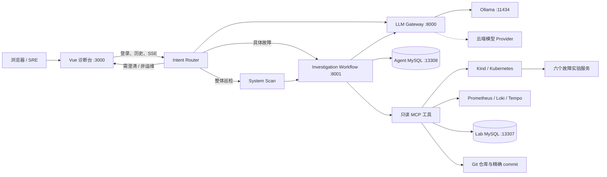

# SRE Agent Platform

面向本地故障实验的、证据驱动的 SRE 智能诊断平台。系统把多模型网关、只读诊断 Agent、可观测性工具、会话记忆、代码导航 State 和一套可重复注入故障的多语言微服务实验环境组合在一起，让一次诊断从“现象描述”走到“证据、根因与修复建议”。

> 当前定位是本地开发、教学与评测平台。Agent 只执行读取和分析，不自动修改集群、数据库或业务仓库。

## 核心能力

- 八阶段诊断工作流，通过 SSE 实时展示调查进度、工具调用摘要和最终报告。
- 前置 Intent Router 使用 Structured Output 将请求限定为具体故障、整体巡检、需要澄清或非运维问题；合法意图确认前不调用任何诊断工具。
- 统一 LLM Gateway，支持 Ollama、OpenAI、Claude 和 DeepSeek，业务 Agent 不依赖厂商 SDK。
- Prometheus、Loki、Tempo、MySQL、Kubernetes 和 Git 多源证据交叉验证。
- MySQL 持久化会话；上下文达到约 80% 预算后生成短 Summary、State、Evidence Reference，再让旧消息退出 Active Context，原始消息永久保留。
- Code State 只保存模块、symbol、路径、行号和 commit SHA 等导航信息；源码始终按 Git 版本精确读取。
- 10 个可重复的真实故障场景，覆盖慢 SQL、连接池耗尽、依赖超时、CPU、OOM、重试风暴和发布异常。
- 所有诊断工具默认只读，并在用户、会话、仓库、数据库表和 Kubernetes 权限层面限制访问范围。

## 系统架构



一次诊断遵循：确定范围 → 建立健康、指标和日志基线 → 生成候选根因 → 专项调查 → 跨源验证 → 输出带 Evidence Reference 的报告。证据不足时只报告候选根因，不把推测包装成事实。

## 意图识别与工作流分流

所有聊天请求先经过只使用 LLM 的 Intent Router。分类结果必须通过 Structured Output 和 Pydantic Schema 校验；在分类成功以前，系统不会调用 Kubernetes、Prometheus、Loki、Tempo、MySQL 或 Git 工具。

```json
{
  "intent": "SPECIFIC_INCIDENT",
  "target": "order-service",
  "symptom": "high_latency"
}
```

| Intent | 条件 | 后端行为 |
| --- | --- | --- |
| `SPECIFIC_INCIDENT` | 已提供具体服务和故障现象 | 进入 Investigation Workflow |
| `GENERAL_DIAGNOSIS` | 请求系统整体巡检 | 先执行全局 System Scan，再进入分析与调查 |
| `NEED_CLARIFICATION` | 服务、现象或范围不足 | 要求用户补充信息，不调用工具 |
| `OUT_OF_SCOPE` | 非运维或非故障排查问题 | 返回能力边界提示，不调用工具 |

JSON 格式错误先进行有限 Repair；字段或类型错误会携带安全的 Schema 错误让模型重试 2～3 次；仍失败则使用预设模板回填。模板依然无效时安全降级为 `NEED_CLARIFICATION`，不会让不可信分类进入工具 Runtime。

## 仓库结构

| 目录 | 作用 | 文档 |
| --- | --- | --- |
| `sre-agent-backend/sre-agent` | FastAPI Agent、工作流、MCP、会话记忆和 Code State | [Agent README](sre-agent-backend/sre-agent/README.md) |
| `sre-agent-backend/sre-gateway` | 模型路由、Gateway Token、用量与审计日志 | [Gateway README](sre-agent-backend/sre-gateway/README.md) |
| `sre-agent-frontend` | Vue 3 诊断控制台 | [Frontend README](sre-agent-frontend/README.md) |
| `sre-broken-system` | 多语言故障实验工作区 | [Lab README](sre-broken-system/README.md) |
| `sre-broken-system/sre-lab-infra` | Kind、Kubernetes、可观测性和场景脚本 | [Infra README](sre-broken-system/sre-lab-infra/README.md) |

业务实验由 Java、Go、Python 和 TypeScript 六个服务构成；每个服务都有独立 README 和独立 Git 历史，用于对比运行版本和源码变更。

## 本地端口

| 组件 | 地址 |
| --- | --- |
| Web UI | `http://127.0.0.1:3000` |
| SRE Agent API | `http://127.0.0.1:8001` |
| LLM Gateway | `http://127.0.0.1:8000` |
| Ollama | `http://127.0.0.1:11434` |
| 实验服务 | `18080`～`18083`；其余服务在集群内访问 |
| Prometheus / Loki / Tempo | `19090` / `13100` / `13200` |
| Lab MySQL / Agent MySQL | `13307` / `13308` |

## 快速开始

### 1. 环境要求

- Windows 10/11 + PowerShell 7
- Docker Desktop、`kubectl`、`kind`
- Git、Python 3.12+、Node.js 22+
- 足够运行 Kind、六个服务、可观测性组件和本地模型的内存

`kind` 也可放在 `sre-broken-system/tools/kind.exe`。

### 2. 启动模型和 Agent 数据库

先在 `sre-agent-backend/sre-agent/.env` 中配置应用 MySQL、初始登录账号和 Gateway 参数。敏感值不要提交到 Git。

```powershell
Set-Location sre-agent-backend
$env:OLLAMA_MODEL = "qwen3:4b"
docker compose -f compose.yml up -d mysql ollama ollama-model-init
```

### 3. 启动 Gateway 并创建调用 Token

```powershell
Set-Location sre-gateway
python -m venv .venv
.\.venv\Scripts\python.exe -m pip install -r requirements.txt
.\.venv\Scripts\python.exe -m uvicorn app.main:app --host 127.0.0.1 --port 8000
```

另开终端调用 `POST http://127.0.0.1:8000/v1/auth/tokens` 创建 Token；明文 `gw_sk_...` 只在响应中返回一次。将它写入 Agent 的 `GATEWAY_API_KEY`，并将 `GATEWAY_MODEL` 设置为 `ollama/qwen3:4b` 或其他已安装模型。

### 4. 部署故障实验集群

```powershell
Set-Location ..\..\sre-broken-system\sre-lab-infra
.\scripts\start-lab.ps1
```

脚本会创建 `sre-lab` Kind 集群、构建 GOOD/BAD 镜像、初始化数据，并部署可观测性栈与六个业务服务。

### 5. 启动 Agent 与前端

以下两个新终端都从仓库根目录开始执行：

```powershell
# 终端 A
Set-Location sre-agent-backend\sre-agent
python -m pip install -r requirements.txt
python -m uvicorn app.main:app --host 127.0.0.1 --port 8001

# 终端 B
Set-Location sre-agent-frontend
npm install
npm run dev
```

打开 `http://127.0.0.1:3000`，使用 Agent `.env` 中的初始账号登录，然后输入例如“为什么订单查询最近变慢了？”。

## 故障场景

```powershell
Set-Location sre-broken-system\sre-lab-infra
.\scripts\run-scenario.ps1 -Scenario SRE-001
.\scripts\reset-lab.ps1
```

| ID | 场景 | 主要服务 |
| --- | --- | --- |
| SRE-001 | 真实慢 SQL 与全表扫描 | order-service |
| SRE-002 | 数据库连接池耗尽 | order-service |
| SRE-003 | 下游依赖超时 | inventory-service |
| SRE-004 | CPU 饱和 | user-service |
| SRE-005 | 内存泄漏与 OOMKilled | payment-service |
| SRE-006 | 无退避重试风暴 | inventory / recommendation |
| SRE-007 | 全量发布性能回归 | order-service |
| SRE-008 | 单 Pod 性能劣化 | order-service |
| SRE-009 | GOOD/BAD 混合版本 | order-service |
| SRE-010 | 错误存活探针与重启 | order-service |

场景机制、预期证据和建议问题见 [场景手册](sre-broken-system/sre-lab-infra/docs/SCENARIOS.md)，完整操作见 [Runbook](sre-broken-system/sre-lab-infra/docs/RUNBOOK.md)。

## 会话记忆与代码导航

正常阶段会保留 Recent History、Tool Calls 和 Tool Results。达到模型上下文预算约 80% 时，系统生成短 Conversation Summary、Context State、Evidence 与 Reference，校验和落库成功后才让旧上下文退出 Active Context。原始消息继续保存在 Conversation Store，可按当前用户和会话权限回查。

代码场景不复制源码到 Evidence Store。首次识别仓库时只建立 Code State 导航；后续先检索相关模块和 symbol，再由 Git 工具读取对应 commit 的少量代码。新 commit 通过 `git diff old..new` 增量更新受影响组件。

## 安全边界

- 浏览器只持有 Agent 登录 Token，不接触 Gateway、模型厂商或 Kubernetes 凭证。
- 每个请求携带白名单 `project_id`；服务端按 `project → namespace → repository → allowed_paths → enabled_tools` 授权，模型不能选择其他项目、namespace 或任意路径。
- Kubernetes MCP 以只读、单集群和受限工具集运行，独立 ServiceAccount/Role 仅允许 `get/list/watch/logs`；数据库工具只允许白名单 SELECT/EXPLAIN。
- Conversation Memory 和 Code State 查询使用固定表与固定 SQL，模型不能传入任意表名或 SQL。
- Git 工具仅允许白名单仓库内的 read、search 和 diff；路径 `resolve()` 后必须仍位于项目 allowed paths，阻止 `../` 和软链接越界。
- 所有 Tool 使用逐工具最小 Schema，额外参数直接拒绝；当前不存在任意 Shell、代码执行、文件写入或集群写入 Tool。
- 每个 Task 创建一次性 Workspace；未来 CodeExecuteTool 固定在 `network none`、CPU/内存/PID 限制、drop capabilities、只读根文件系统和硬超时的 Docker Sandbox 中运行。
- 每次工具调用写入 MySQL Audit Log，包含 user/project/task、脱敏参数、状态、耗时和时间，便于追溯。

## 测试

```powershell
# Agent
Set-Location sre-agent-backend\sre-agent
python -m pytest -q

# Gateway
Set-Location ..\sre-gateway
python -m pytest -q

# Frontend
Set-Location ..\..\sre-agent-frontend
npm run build
```

端到端评测可在 Agent 目录运行 `python evals/run_evals.py --case SRE-001`。

## 更多文档

- [系统架构](sre-broken-system/sre-lab-infra/docs/ARCHITECTURE.md)
- [运行手册](sre-broken-system/sre-lab-infra/docs/RUNBOOK.md)
- [诊断工作流](sre-broken-system/sre-lab-infra/docs/WORKFLOWS.md)
- [MCP 工具说明](sre-broken-system/sre-lab-infra/docs/MCP_TOOLS.md)
- [评测方法](sre-broken-system/sre-lab-infra/docs/EVALUATION.md)

## License

本项目使用仓库根目录 [LICENSE](LICENSE) 中声明的许可证。
