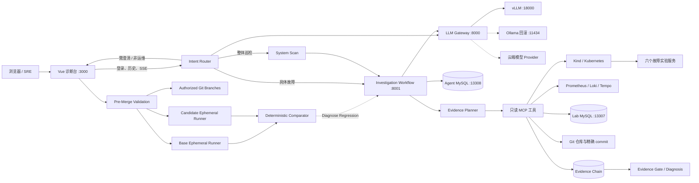
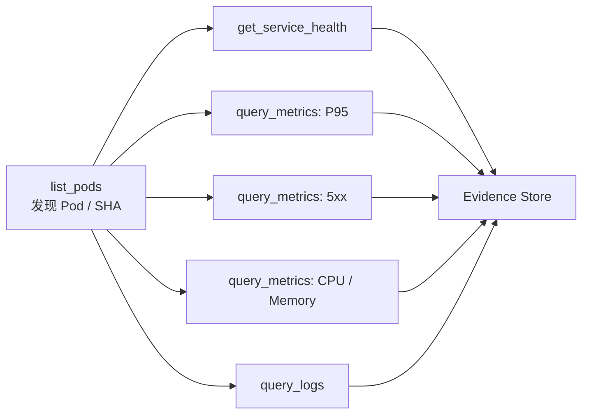
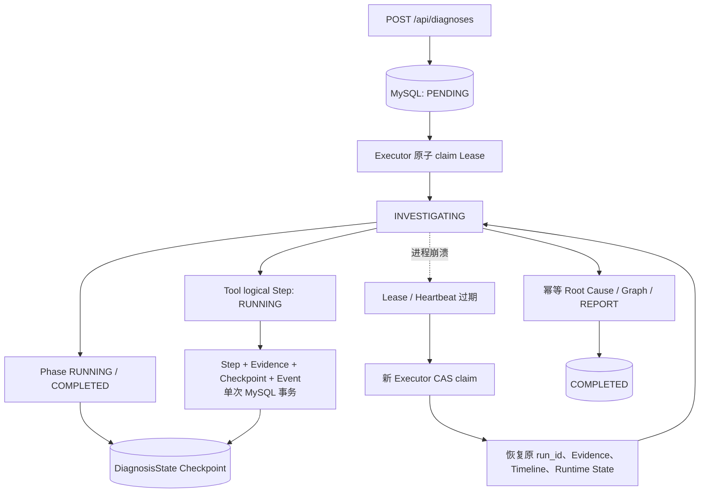
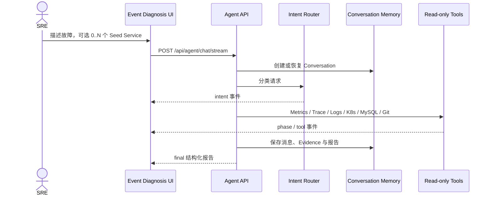
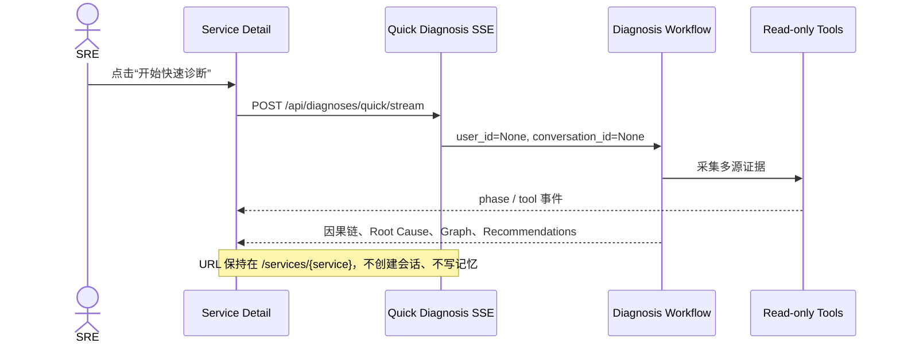
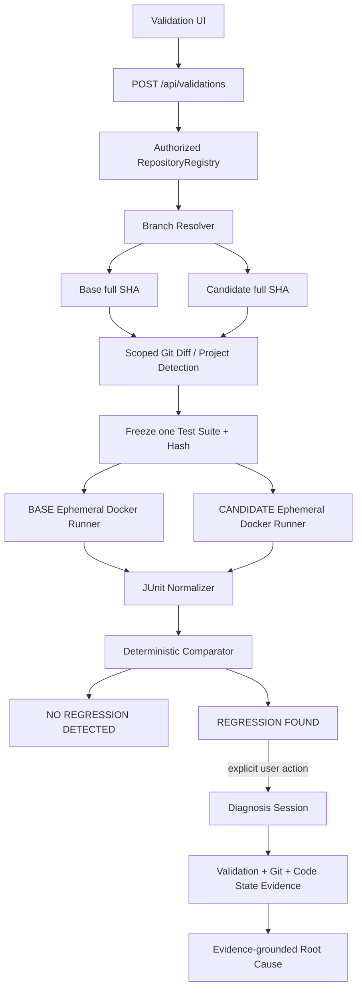

# SRE Agent Platform

面向本地故障实验的、证据驱动的 SRE 智能诊断平台。系统把多模型网关、只读诊断 Agent、可观测性工具、会话记忆、代码导航 State 和一套可重复注入故障的多语言微服务实验环境组合在一起，让一次诊断从“现象描述”走到“证据、因果链、根因与修复建议”。前端采用黑白极简的 Observability Console 风格，以“服务浏览 + 服务诊断”为核心，不把整个产品简化成传统聊天机器人。

> 当前定位是本地开发、教学与评测平台。Agent 只执行读取和分析，不自动修改集群、数据库或业务仓库。

## 目录

- [推荐阅读路径](#推荐阅读路径)
- [核心能力](#核心能力)
- [关键概念](#关键概念)
- [当前可验证基线](#当前可验证基线)
- [系统架构](#系统架构)
- [诊断工作流内部实现](#诊断工作流内部实现)
- [Durable Diagnosis 与 Crash Recovery](#durable-diagnosis-与-crash-recovery)
- [Diagnosis Runtime Self-Check](#diagnosis-runtime-self-check)
- [两种诊断模式](#两种诊断模式)
- [前端页面与领域模型](#前端页面与领域模型)
- [意图识别与工作流分流](#意图识别与工作流分流)
- [仓库结构](#仓库结构)
- [本地端口](#本地端口)
- [快速开始](#快速开始)
- [详细配置](#详细配置)
- [启动后完整健康检查](#启动后完整健康检查)
- [API 使用说明](#api-使用说明)
- [MySQL 数据与模块化 SQL](#mysql-数据与模块化-sql)
- [故障场景](#故障场景)
- [会话记忆与代码导航](#会话记忆与代码导航)
- [安全边界](#安全边界)
- [测试与验收](#测试与验收)
- [停止与环境复原](#停止与环境复原)
- [AI-assisted CI / Pre-Merge Validation](#ai-assisted-ci--pre-merge-validation)
- [常见问题](#常见问题)

## 推荐阅读路径

README 同时服务于体验者、开发者和运维者，不需要第一次就从头读到尾：

| 角色/目标 | 建议阅读顺序 |
| --- | --- |
| 第一次启动项目 | 当前可验证基线 → 仓库结构 → 本地端口 → 快速开始 → 启动后完整健康检查 |
| 了解产品与 UI | 核心能力 → 两种诊断模式 → 前端页面与领域模型 → 意图识别与工作流分流 |
| 理解 Agent 实现 | 系统架构 → 诊断工作流内部实现 → Durable Diagnosis → Runtime Self-Check |
| 做故障实验与评测 | 故障场景 → 测试与验收 → 停止与环境复原 → 场景 Runbook |
| 接入或排查模型 | 详细配置 → Gateway API → vLLM/Ollama 配置 → 常见问题 |
| 使用合并前验证 | Pre-Merge Validation → Runner 安全模型 → API 示例 → 运维排查顺序 |
| 二次开发 | 仓库结构 → API 使用说明 → MySQL 与模块化 SQL → 安全边界 → 测试与验收 |

文档中的 PowerShell 命令默认在 Windows PowerShell 7 或 PyCharm Terminal 执行；路径以本仓库当前默认位置 `D:\SRE-Agent-platform` 为例。仓库迁移到其他目录时，只需替换 `Set-Location` 的绝对路径，应用配置本身不依赖该盘符。

## 核心能力

- 八阶段诊断工作流，通过 SSE 实时展示调查进度、工具调用摘要和最终报告。
- Service Catalog 只承担服务浏览；服务详情可就地执行一次性快速诊断，不跳转聊天页、不写入会话记忆。
- Event Diagnosis 保留完整聊天机器人能力，支持创建新对话、历史查询、不选服务、单选服务或多选服务。
- 前置 Intent Router 使用 Structured Output 将请求限定为具体故障、整体巡检、需要澄清或非运维问题；合法意图确认前不调用任何诊断工具。
- 统一 LLM Gateway，默认使用 vLLM，并支持 Ollama 回滚、OpenAI、Claude 和 DeepSeek，业务 Agent 不依赖厂商 SDK。
- Prometheus、Loki、Tempo、MySQL、Kubernetes 和 Git 多源证据交叉验证。
- MySQL 持久化会话；上下文达到约 80% 预算后生成短 Summary、State、Evidence Reference，再让旧消息退出 Active Context，原始消息永久保留。
- Code State 只保存模块、symbol、路径、行号和 commit SHA 等导航信息；源码始终按 Git 版本精确读取。
- 10 个可重复的真实故障场景，覆盖慢 SQL、连接池耗尽、依赖超时、CPU、OOM、重试风暴和发布异常。
- 独立 Pre-Merge Validation 聚合：冻结 Base/Candidate Commit、隔离执行相同测试、结构化识别新回归，并可把 CI 证据转交 Diagnosis。
- 所有诊断工具默认只读，并在用户、会话、仓库、数据库表和 Kubernetes 权限层面限制访问范围。

## 关键概念

| 概念 | 含义 | 不等同于 |
| --- | --- | --- |
| Service | 可浏览、可观测、可作为诊断起点的业务或基础设施服务 | 单个故障；一个 Service 可以同时有多个 Finding/Incident |
| Finding / Issue | 一条具体异常现象，例如 P95 升高、Pod Restart、慢 SQL | 已确认根因；Finding 可能只是同一 Incident 的症状 |
| Incident | Agent 聚合后的一组相关 Finding，可跨多个 Service | 单一 Service 的 `problem` 字段 |
| Seed Service | 用户开始诊断时给出的一个或多个起始服务 | 调查边界；Agent 可以沿依赖拓扑扩展范围 |
| Root Cause | 通过直接证据、因果链与 Evidence Gate 支撑的疑似或确认原因 | 仅凭日志关键词生成的结论 |
| Evidence | 带来源、时间、目标和引用关系的工具结果 | 任意模型文本或无法追溯的数据 |
| Diagnosis Session | 可持久化、可恢复、可追问的事件调查 | Service Detail 中无记忆的一次性 Quick Diagnosis |
| Validation Run | 对冻结的 Base/Candidate Commit 执行同一测试套件并比较 | Diagnosis Session 或自动 Merge 流程 |
| Regression | Candidate 相比 Base 新出现的结构化失败 | Base 已存在的失败、环境失败或单次性能抖动 |
| Service Catalog | 服务、仓库、依赖和授权边界的可信配置 | 自动发现的实时健康数据；实时状态来自可观测性工具 |

## 当前可验证基线

以下运行时评测数据来自 2026-09-04 的本地真实 Kind、Prometheus、Loki、Tempo、MySQL、Git、Gateway 和 Agent 链路；代码回归测试于 2026-09-05 重新执行。原始逐次结果保存在 [latest.json](sre-agent-backend/sre-agent/evals/results/latest.json)，每一个失败、工具错误、耗时和 Evidence 状态都会被保留。

| 验证项 | 当前结果 | 说明 |
| --- | ---: | --- |
| 固定场景 | 10 个 | `SRE-001`～`SRE-010` |
| 每场景重复次数 | 3 次 | 共 30 次真实诊断 |
| 通过次数 | 30 / 30 | `overall_pass_rate = 1.0` |
| Service Accuracy | 100% | 根因服务定位与 Evaluator 契约一致 |
| Root Cause Accuracy | 100% | 根因关键词与机制匹配 |
| Evidence Completion | 100% | Required Evidence 均被真实工具证据覆盖 |
| 平均 Tool Calls | 9.60 | 不包含 `llm_*` 内部记录 |
| 平均诊断耗时 | 4.242 秒 | 30 次端到端 API 调用平均值 |
| P95 诊断耗时 | 5.212 秒 | 按全部 30 次运行统计 |
| Infrastructure Failure | 0 | 基础设施失败与 Agent 失败分开统计 |
| Timeout / Insufficient Evidence | 0 / 0 | 本轮固定场景评测结果 |
| Tool Failure Rate | 2.08% | SRE-004/SRE-008 的非关键数据源失败被隔离，报告仍由完整证据确认 |
| Structured Output Retry | 0 | 本轮确定性证据规则无需格式重试 |
| Agent 测试 | 164 passed | 包含原有诊断回归及 40 个 Pre-Merge Validation 专项测试 |
| Gateway 测试 | 27 passed | 包含路由、鉴权、MySQL SQL 与 vLLM/Ollama Adapter |
| Frontend 构建 | passed | Vite 生产构建成功 |

`average_token_usage = 0` 并不表示评测器漏记 Token。本轮十个固定场景都由结构化运行时证据和确定性 Synthesis Rule 完成，没有为了得到答案额外调用生成式模型；如果某次诊断进入 LLM Planner/Synthesis，Gateway 返回的 Token 会正常进入报告。

SRE-008 和 SRE-009 还有额外的 Pod 级严格契约：`affected_pod` 必须非空；SRE-009 必须返回少数 BAD canary Pod 的完整 40 位 Git SHA，并把源码位置定位到 `OrderRepository.java`。只返回 Deployment 多数版本或缩写 SHA 会被 Evaluator 判定为失败。

## 系统架构



一次诊断遵循：确定范围 → 建立通用基线 → Planner 根据当前 Evidence 选择下一步 → 保存父子 Evidence Chain → Evidence Gate 校验引用与直接证据 → 输出报告。Workflow 不包含固定服务、SQL、Trace ID 或 Case 答案；证据不足时明确返回 `insufficient_evidence`。

## 诊断工作流内部实现

### 阶段与状态迁移

一次 Investigation 的公开阶段按以下顺序推进：

```text
START
  └─ SYSTEM_SCAN（仅整体巡检）
       └─ TRIAGE
            └─ BASELINE
                 └─ ANALYZE
                      └─ INVESTIGATE
                           └─ VERIFY
                                └─ REPORT
                                     └─ END
```

- `TRIAGE`：从可信 Service Catalog 解析服务、语言、仓库、依赖、时间窗口和问题类型。
- `BASELINE`：先发现 Pod 和运行版本，再读取 Health、P95、5xx、CPU/Memory 与日志基线。
- `ANALYZE`：把 Tool Result 统一归一化成有界、可引用的 Evidence。
- `INVESTIGATE`：Planner 只依据当前 Evidence 选择下一步，不读取 Evaluator Expected Answer。
- `VERIFY`：检查引用、直接证据、空结果和矛盾；Evidence Gate 是 `confirmed` 的唯一入口。
- `REPORT`：输出服务、Pod、版本、源码位置、因果链、置信度、Evidence 和建议。

### 依赖感知并发

并发不是把所有 Tool 一次性扔进事件循环。工作流先建立数据依赖，再只并发彼此独立的只读操作：



| 操作组 | 调度方式 | 原因 |
| --- | --- | --- |
| System Scan 的 Deployment 与 Pod 清单 | 并发 | 二者都是独立只读发现操作 |
| Pod Discovery | 串行前置 | 后续操作需要 Pod、镜像和 Git SHA 运行态事实 |
| Health、P95、5xx、Resource、Logs | 并发 | 参数已确定，数据源相互独立 |
| Trace ID → Trace Detail | 串行 | 后一步依赖前一步发现的真实 Trace ID |
| Slow Query → EXPLAIN | 串行 | EXPLAIN 必须使用实际日志/Trace 中发现且可安全解释的 SQL |
| Pod Version → Git Diff / Source | 串行 | Git 读取必须绑定 Pod 正在运行的完整 commit |

`max_steps` 在任务调度前预留预算，因此并发扇出不会竞态突破工具步数。每个 Tool 都独立写 Timeline：其中一个数据源异常只产生带 `error` 的 Tool Record，不会取消同组其他请求或丢弃已经收集的 Evidence。

### 整轮截止时间与安全降级

`TOOL_TIMEOUT_SECONDS` 限制单个 Tool，`DIAGNOSIS_DEADLINE_SECONDS` 限制整轮 Workflow。二者用途不同：

- 单工具超时：记录该 Tool 失败并继续其他证据源；
- 整轮 deadline：停止继续调查，保留已有 Evidence，追加 `workflow_deadline` Timeline；
- 截止时间触发后仍会发送合法 `final` SSE；
- 没有通过 Evidence Gate 时只能返回 `insufficient_evidence`，不会伪造 `confirmed`；
- 会话报告持久化完成后，上下文压缩在后台执行，不把本地模型冷启动时间算入同步诊断耗时；
- 单轮快速诊断不触发 Conversation Compaction，第二个用户回合以后才具备压缩资格。

### Planner 代码边界

Planner 已拆分成可独立测试的模块，同时保留 `app.workflow.planner.EvidencePlanner` 兼容导入：

| 文件 | 职责 |
| --- | --- |
| `app/workflow/planning/models.py` | Planner 内部结构和类型 |
| `app/workflow/planning/decision_rules.py` | 下一工具选择、Trace/SQL/Pod/Git 决策 |
| `app/workflow/planning/synthesis_rules.py` | OOM、慢 SQL、连接池、探针、发布回归等证据规则 |
| `app/workflow/planning/structured.py` | Structured Output 解析、Repair 与有限重试 |
| `app/workflow/planning/planner.py` | 对外 Planner 编排入口 |
| `app/workflow/runtime_extractor.py` | 从 Tool Result 提取 Pod、SHA、Trace 和运行版本 |
| `app/workflow/evidence_gate.py` | confirmed 门槛和最终 DiagnosisReport 构建 |
| `app/workflow/planner.py` | 旧导入路径兼容 Facade |

业务工作流、Synthesis Rule 和评测器是三层边界。Case ID 与 Expected Answer 只允许出现在 `evals/`，不能进入 Planner、Workflow、Prompt、Service Catalog 或 Tool 参数。

## Durable Diagnosis 与 Crash Recovery

持久化 Diagnosis 不再把 `asyncio.Task` 当作任务本身。Task 只是当前 FastAPI 进程中的临时 Executor；即使进程被 `kill -9`、容器 OOM、主机重启或滚动发布终止，MySQL 中的 Session、Checkpoint、Step、Evidence 和 Event 仍是唯一事实来源。事件诊断使用 Durable Runtime，`POST /api/diagnoses/quick/stream` 继续使用 No-op Runtime，不创建 Session、Checkpoint 或 Conversation。



### Session 状态与 Workflow 游标分层

业务状态仍只有 `PENDING / INVESTIGATING / COMPLETED / FAILED / CANCELLED`，其中后三者是 terminal state。工作流阶段不塞进业务状态，而由 `current_phase` 和 `phase_status` 独立记录：

```text
current_phase = INVESTIGATE
phase_status  = RUNNING
checkpoint_json = DiagnosisState.model_dump(mode="json")
checkpoint_seq = 17
attempt_no = 2
```

Checkpoint 直接序列化现有 `DiagnosisState`，包含原 `run_id`、服务、症状、Pod、运行 commit、依赖、Evidence、Timeline、Candidates、Synthesis 和 Token 计数，不保存模型隐藏思维链。恢复使用 `DiagnosisState.model_validate_json()`；同一 Diagnosis 的 `run_id` 保持不变，只有 `attempt_no` 表示物理进程执行次数。

Checkpoint 至少在以下边界提交：

- Phase 开始与完成；
- 每个 Tool 完成后；
- Tool 产生的 Evidence 更新后；
- Planner 每轮的关键 Runtime State 更新后；
- Pod 版本、运行 commit 等恢复所需字段变化后。

如果 `TRIAGE` 已完成，恢复从 `BASELINE_OBSERVATION` 开始；如果 `INVESTIGATE` 正在运行，则 Planner 直接消费已恢复的 Evidence 和 Timeline。数据库里已经是 `COMPLETED` 的 Tool 从持久结果回填，不再次访问外部系统；遗留 `RUNNING` Tool 会复用原 Step、Evidence ID 和父 Evidence 血缘重新执行。

### Logical Idempotency

新 Tool Step 的 `idempotency_key` 是以下内容规范化后的 SHA-256：

```text
phase
tool_name
json.dumps(arguments, sort_keys=True, separators=(",", ":"), ensure_ascii=False)
sorted(parent_evidence_ids)
```

数据库唯一键为 `(diagnosis_id, idempotency_key)`。稳定 Evidence ID 由 `diagnosis_id + idempotency_key` 派生；Conversation 中的 `tool_call`、`tool_result` 和最终报告也使用稳定 Message ID UPSERT。因此重启不会生成第二份 logical Step、Evidence、Conversation Result 或 completed Event。Baseline 并发 Tool 的 `sequence_no` 由 Session 的 `next_step_sequence` 在 `SELECT ... FOR UPDATE` 事务中分配，不再使用存在竞态的 `MAX(sequence_no) + 1`。

最终报告同样可重入：Root Cause 使用 UPSERT，Graph 重建结果稳定，REPORT Step 使用固定 key `final-report`，`diagnosis.completed` 使用固定 event key，Conversation Report 使用 `run_id` 派生的稳定 Message ID。即使进程在 Graph/Root Cause 已写入但 Session 尚未完成时退出，新 Executor 也可以安全重放 REPORT。

### Lease、Heartbeat 与 CAS

每个进程启动时生成 `hostname:pid:uuid` 形式的 `executor_id`。只有原子 claim 更新影响一行时才取得执行权；新进程不会抢占仍有效的 Lease。执行期间 Heartbeat 默认每 10 秒刷新一次，Lease 默认 60 秒；Checkpoint、Heartbeat、Tool 开始/完成和最终状态都校验 `lease_owner + state_version`。CAS 失败说明另一个 Executor 已经取得更新所有权，当前 Executor 必须停止写入，不能覆盖更新的 Checkpoint。

FastAPI graceful shutdown 会取消本进程 Task，但不会把业务状态改为 `CANCELLED`。它写入 `diagnosis.interrupted`、释放 Lease，并让 Session 保持 `INVESTIGATING`；下一进程启动后可恢复。`CANCELLED` 仅保留给明确的业务取消。启动顺序固定为：

```text
初始化模块 SQL
  → Level 1 basic self-check
  → 扫描 PENDING / stale INVESTIGATING
  → 原子 claim
  → load checkpoint
  → append diagnosis.recovered:<attempt>
  → resume
```

最大执行尝试默认 3 次；达到上限后 Session 进入 `FAILED`，错误为 `maximum recovery attempts exceeded`，并释放 Lease。

### Crash Window 的准确语义

平台不宣称真实外部 Tool Exactly Once。Tool 全部是 Kubernetes/Prometheus/Loki/Tempo/MySQL/Git 只读查询：如果外部调用成功后、MySQL 提交前进程崩溃，新 Executor 无法判断调用是否发生，允许再次读取。因此语义是：

```text
External read-only Tool = at-least-once in crash window
Logical persisted Step / Evidence / Event = idempotent, exactly-once effect
```

一个 Tool completion 的 Step、Evidence、Checkpoint 和 completed/failed Event 在同一短 MySQL 事务中提交；不使用覆盖整个 Diagnosis 的长事务，也没有引入 Celery、Kafka、RabbitMQ 或 Redis Queue。

## Diagnosis Runtime Self-Check

`GET /api/system/self-check?level=1|2|3` 是必须登录的只读 Runtime 自检。它只读取 Application MySQL、当前 Executor 状态和配置，不调用 LLM、Kubernetes、Prometheus、Loki、Tempo、Git 或 Lab MySQL，不消耗 Token，也不会创建或修改 Diagnosis。普通 `/health` 仍只返回 `{"status":"ok"}`，供 liveness probe 使用。

| Level | 检查范围 | 主要内容 |
| --- | --- | --- |
| 1 | Runtime Health | Application MySQL、durable 字段/索引、`executor_id`、Heartbeat 子系统可用性 |
| 2 | Durable State | PENDING/INVESTIGATING 的 Lease、Heartbeat、Checkpoint 可反序列化、run_id、Phase、版本计数、attempt |
| 3 | Data Consistency | Session → Step → Evidence → Root Cause → Graph → Event 引用完整性 |

重点 issue code 包括 `STALE_LEASE`、`MISSING_ACTIVE_LEASE`、`STALE_HEARTBEAT`、`INVALID_CHECKPOINT`、`CHECKPOINT_RUN_ID_MISMATCH`、`CHECKPOINT_PHASE_MISMATCH`、`INTERRUPTED_RUNNING_STEP`、`ORPHAN_RUNNING_STEP`、`MISSING_STEP_EVIDENCE`、`EVIDENCE_WITHOUT_LOGICAL_STEP`、`MISSING_ROOT_CAUSE_EVIDENCE`、`DANGLING_GRAPH_EDGE`、`COMPLETED_WITHOUT_REPORT_STEP`、`TERMINAL_SESSION_HOLDS_LEASE` 和 `DURABLE_SCHEMA_INCOMPLETE`。

- `HEALTHY`：没有发现 issue；
- `DEGRADED`：只有可恢复或提示性 Warning，例如 stale lease、缺失活跃 Lease、即将过期的 Lease；
- `UNHEALTHY`：存在 Error/Critical，例如损坏 Checkpoint、terminal Session 持 Lease、悬空 Step/Evidence/Graph、必要 Schema 缺失。

Self-Check 只发现并报告，Recovery 才负责 claim、加载和续跑；两者不混合。HTTP 自检按当前登录用户过滤 Diagnosis，避免泄露其他用户的 Session ID；启动前的 Level 1 检查只验证运行条件。无法完全覆盖的边界包括外部只读 Tool 成功但事务尚未提交的瞬间，以及检查快照完成后立即发生的并发状态变化；前者通过 at-least-once + logical idempotency 处理，后者由 Lease/CAS 在真正写入时裁决。

## 两种诊断模式

平台明确区分“持续事件分析”和“服务页快速诊断”。两种模式复用同一套只读 Evidence Workflow，但生命周期、持久化行为和 UI 完全不同。

| 对比项 | 事件诊断 Event Diagnosis | 服务快速诊断 Quick Diagnosis |
| --- | --- | --- |
| 入口 | 左侧导航“事件诊断” | Service Detail 的“开始快速诊断” |
| 服务范围 | 可以不选、单选或多选 | 当前 Service 或 Pod 是唯一初始对象 |
| 诊断边界 | Seed 只是起点，可沿依赖证据动态扩展 | 初始对象只是起点，同样允许扩展 |
| 对话形式 | 保留用户与 Agent 多轮消息 | 不显示聊天框，只显示诊断结果 |
| 会话历史 | 保存到 `conversations` / `conversation_messages` | 不创建 Conversation |
| 记忆功能 | 启用 Conversation Memory | 禁用 |
| 上下文压缩 | 达到阈值后异步压缩 | 不启用 |
| Intent Router | 每轮请求均先识别意图 | 已由当前资源确定任务类型，不走聊天意图交互 |
| 输出 | 普通回复、进度、工具摘要和结构化报告 | 进度、完整因果链、根因、置信度、图和建议 |
| 典型用途 | 复杂 Incident、多轮追问、跨服务持续调查 | 值班人员从服务页快速查看当前异常链 |

### 事件诊断的数据流



`selected_services` 只是调查起点集合，不是硬性权限边界。例如用户选择 `order-service` 和 `payment-service` 后，证据仍可以继续扩展到 `payment-db`、Pod 或其他依赖资源。真正的权限边界由服务端 `ToolPolicy`、Service Catalog、Kubernetes Namespace 和仓库白名单控制。

### 服务快速诊断的数据流



## 前端页面与领域模型

### 1. 服务目录 `/services`

服务目录仅展示运行态势，不再包含大段“从服务开始定位问题”介绍区或问题输入框。页面包含：

- All / Healthy / Warning / Critical 数量筛选；
- 服务名、简介、综合健康状态；
- P95 Latency、Error Rate、CPU、Memory；
- 运行数据更新时间；
- 服务名、Owner 或职责关键词搜索。

综合状态不是单一 `problem` 字段，而是服务当前多个 Finding 中最高 Severity 的聚合结果。没有活动异常时为 `Healthy`，存在 Warning Finding 时为 `Warning`，存在 Critical Finding 时为 `Critical`。

### 2. 服务详情 `/services/{service}`

服务详情包含 Metrics、Pod、最近部署、上下游依赖和 Service Graph。“开始快速诊断”会在当前页面插入只读结果区，展示：

- Stateless Quick Diagnosis 标识；
- 当前进度和正在执行的公开阶段；
- Suspected Root Cause 与 Confidence；
- 从症状到根因的完整因果链；
- Affected Services 与 Root Cause Service；
- Service Dependency Graph；
- 已执行的工具与 Evidence 摘要；
- Recommendations。

快速诊断区域没有聊天输入、创建新对话、历史对话、记忆或上下文压缩入口。

### 3. 事件诊断 `/diagnosis`

事件诊断是独立的多轮工作区：

- “创建新对话”显式创建一个空 Conversation；
- 左侧历史列表从 MySQL 查询当前用户最近的会话；
- 服务选择器允许 0、1 或多个 Service；
- 空选择表示由 Agent 根据问题和全局观测数据识别起点；
- 聊天消息显示意图、公开阶段、工具摘要和结构化报告；
- Tool Call / Tool Result 不被渲染成空白 AI 气泡；
- 每次续问复用同一个 `conversation_id`，因此可以引用前文结论。

### 4. Service、Finding、Incident 和 Root Cause

平台的数据关系不是 `Service -> single problem`，而是：

```text
Service
├── Findings[]                 # 一个服务可以同时存在多个异常现象
└── Incidents[]                # 一个服务可以被多个 Incident 影响

Incident
├── involved_services[]        # 一个事件可以跨多个服务
├── findings[]                 # 多个 Finding 可聚合为同一事件
├── evidence[]                 # Metrics / Logs / Trace / K8s / DB / Git
├── suspected_root_cause
├── root_cause_service
├── confidence
└── recommendations[]
```

例如，`payment-db` 连接池耗尽可能同时产生 `payment-service P95 升高`、`Error Rate 升高`、`健康检查失败` 和 `Pod Restart`。这些是四个 Finding，但可以被聚合为同一个 Incident，而不是四个互不相关的故障。

### 5. 合并前验证 `/validations`

该页面服务于 Shift Left Reliability，不属于聊天界面。创建区要求先选授权 Repository，再从后端返回的真实 Branch 列表中选择 Base 与 Candidate；两者相同或最终解析到同一个 Commit 时无法启动。用户可以组合运行仓库已有测试、临时上传测试、持久化测试集版本和 AI Generated Tests，并从冻结 Candidate Commit 中显式选择 AI 参考样本。

运行与结果区展示：

- Validation ID、状态和可恢复的持久事件；
- Base/Candidate Branch 及冻结后的完整 Commit SHA；
- 两侧 Build/Test 状态、耗时和统一 Test 数量；
- Regression、Existing Failure、Possible Fix 数量；
- Comparison Confidence 和每个 Test 的来源；
- Failure Type、Message、Stack Trace Summary 与 Related Changes；
- 持久化测试集的全部历史版本、文件内容与版本说明；
- 本次冻结的测试集版本、AI 参考路径、AI 生成源码和两侧实际执行用例；
- 仅在确认回归时出现的 `Diagnose Regression` 操作。

页面刷新后，任务状态和历史来自 MySQL，而不是浏览器内存。创建请求由前端生成新的 `Idempotency-Key`；同一次网络重试应复用原 Key。用户取消只会终止 Validation Runner，不会修改 Git 仓库或触发部署。

## 意图识别与工作流分流

所有聊天请求先经过只使用 LLM 的 Intent Router。分类结果必须通过 Structured Output 和 Pydantic Schema 校验；在分类成功以前，系统不会调用 Kubernetes、Prometheus、Loki、Tempo、MySQL 或 Git 工具。

```json
{
  "intent": "SPECIFIC_INCIDENT",
  "target": "order-service",
  "symptom": "high_latency"
}
```

| Intent | 条件 | 后端行为 |
| --- | --- | --- |
| `SPECIFIC_INCIDENT` | 已提供具体服务和故障现象 | 进入 Investigation Workflow |
| `GENERAL_DIAGNOSIS` | 请求系统整体巡检 | 先执行全局 System Scan，再进入分析与调查 |
| `NEED_CLARIFICATION` | 服务、现象或范围不足 | 要求用户补充信息，不调用工具 |
| `OUT_OF_SCOPE` | 非运维或非故障排查问题 | 返回能力边界提示，不调用工具 |

JSON 格式错误先进行有限 Repair；字段或类型错误会携带安全的 Schema 错误让模型重试 2～3 次；仍失败则使用预设模板回填。模板依然无效时安全降级为 `NEED_CLARIFICATION`，不会让不可信分类进入工具 Runtime。

## 仓库结构

```text
SRE-Agent-platform/
├── README.md
├── sre-agent-frontend/                 # Vue 3 + Vite 黑白 SRE Console
│   ├── src/
│   ├── package.json
│   └── .env.example
├── sre-agent-backend/
│   ├── compose.yml                     # MySQL、vLLM、Ollama 统一基础设施
│   ├── compose.gpu.yml                 # Ollama GPU 覆盖配置
│   ├── data/mysql/                     # 应用 MySQL 持久数据，不提交 Git
│   ├── sre-gateway/
│   │   ├── app/auth/                   # Gateway Token
│   │   ├── app/gateway/                # Provider 路由和 Usage
│   │   ├── app/operation_log/          # 操作审计
│   │   └── tests/
│   └── sre-agent/
│       ├── app/auth/                   # 用户登录与 Token
│       ├── app/conversation/           # 会话与消息
│       ├── app/conversation_memory/    # 压缩状态与 Evidence Reference
│       ├── app/diagnosis/              # Incident / Diagnosis Session
│       ├── app/validation/             # 合并前验证、Runner、Comparator 与 CI Evidence
│       ├── app/workflow/               # Evidence Workflow 与 Planner
│       ├── app/resources/              # Service / Pod 查询接口
│       ├── app/audit/                  # Tool Audit
│       ├── docker/validation-python/   # 固定 Python Validation Runner 镜像
│       ├── config/                     # Service/Tool 安全策略
│       ├── evals/                      # SRE-001～010 与结果
│       └── tests/
└── sre-broken-system/
    ├── order-service/                  # Java
    ├── inventory-service/              # Go
    ├── payment-service/                # Node.js / TypeScript
    ├── user-service/                   # Python
    ├── recommendation-service/         # Python
    ├── notification-service/           # Go
    └── sre-lab-infra/                  # Kind、Observability、场景脚本
```

| 目录 | 作用 | 文档 |
| --- | --- | --- |
| `sre-agent-backend/sre-agent` | FastAPI Agent、工作流、MCP、会话记忆和 Code State | [Agent README](sre-agent-backend/sre-agent/README.md) |
| `sre-agent-backend/sre-gateway` | 模型路由、Gateway Token、用量与审计日志 | [Gateway README](sre-agent-backend/sre-gateway/README.md) |
| `sre-agent-frontend` | Vue 3 诊断控制台 | [Frontend README](sre-agent-frontend/README.md) |
| `sre-broken-system` | 多语言故障实验工作区 | [Lab README](sre-broken-system/README.md) |
| `sre-broken-system/sre-lab-infra` | Kind、Kubernetes、可观测性和场景脚本 | [Infra README](sre-broken-system/sre-lab-infra/README.md) |

业务实验由 Java、Go、Python 和 TypeScript 六个服务构成，每个实验服务目录都维护独立 Git 历史。Service Catalog 将服务映射到这些受控仓库；如果 Catalog 配置了白名单 HTTPS 远程仓库，RepositoryRegistry 会刷新只读缓存中的远端 Branch。当前各本地实验仓库通常只有 `main`，因此实际演示 Pre-Merge Validation 前需要由用户在目标服务仓库准备一个真实 Candidate Branch；平台不会自行创建、修改或推送分支。

## 本地端口

| 组件 | 地址 |
| --- | --- |
| Web UI | `http://127.0.0.1:3000` |
| SRE Agent API | `http://127.0.0.1:8001` |
| LLM Gateway | `http://127.0.0.1:8000` |
| vLLM | `http://127.0.0.1:18000` |
| Ollama（迁移期回滚） | `http://127.0.0.1:11434` |
| 实验服务 | `18080`～`18083`；其余服务在集群内访问 |
| Prometheus / Loki / Tempo | `19090` / `13100` / `13200` |
| Lab MySQL / Agent MySQL | `13307` / `13308` |

## 快速开始

平台不是单进程应用，推荐严格按依赖顺序启动：

```text
Docker Desktop
├── Application MySQL :13308
├── vLLM :18000 或 Ollama :11434
└── Kind SRE Lab
    ├── 六个 Broken Services
    ├── Lab MySQL :13307
    └── Prometheus / Loki / Tempo

Gateway :8000
└── Agent :8001
    └── Frontend :3000
```

先启动 MySQL 和推理 Provider，再启动 Gateway；Agent 依赖 Gateway、应用 MySQL和可观测性数据源；前端最后启动。若顺序颠倒，进程不一定立即退出，但登录、模型请求或诊断会返回连接错误。

### 1. 环境要求

- Windows 10/11 + PowerShell 7
- Docker Desktop、`kubectl`、`kind`
- Git、Python 3.12+、Node.js 22+
- 支持 GPU 容器的 NVIDIA GPU/驱动，以及足够运行 Kind、六个服务、可观测性组件和本地模型的显存与内存

`kind` 也可放在 `sre-broken-system/tools/kind.exe`。

```powershell
git clone https://github.com/taxidriver4ever/SRE-Agent-platform.git
Set-Location SRE-Agent-platform
```

六个 Broken Service 与 Infra 已作为主仓库普通目录交付，不再依赖缺失 remote 的 Gitlink，因此普通 `git clone` 即可取得启动 Demo 所需源码。

### 2. 配置后端环境变量

后端基础设施统一由 `sre-agent-backend/compose.yml` 编排。MySQL 数据固定保存到 `sre-agent-backend/data/mysql`，不会在 Agent 或 Gateway 项目目录中生成 SQLite 或数据库数据文件。

Agent 的真实用户名、密码和数据库密码只写在 `sre-agent-backend/sre-agent/.env`。项目不会生成包含真实凭据的 `.env.example`。至少需要配置：

```dotenv
GATEWAY_BASE_URL=http://127.0.0.1:8000
GATEWAY_API_KEY=
GATEWAY_MODEL=vllm/qwen3-4b
GATEWAY_TIMEOUT_SECONDS=180
GATEWAY_MAX_TOKENS=512

SRE_INITIAL_USERNAME=请设置登录用户名
SRE_INITIAL_PASSWORD=请设置高强度登录密码

APPLICATION_MYSQL_HOST=127.0.0.1
APPLICATION_MYSQL_PORT=13308
APPLICATION_MYSQL_USER=sre_agent
APPLICATION_MYSQL_PASSWORD=请设置数据库密码
APPLICATION_MYSQL_DATABASE=sre_agent
APPLICATION_MYSQL_TEST_DATABASE=sre_agent_test
GATEWAY_MYSQL_TEST_DATABASE=sre_gateway_test
APPLICATION_MYSQL_ROOT_PASSWORD=请设置Root密码
```

Gateway 使用独立 `.env`，但连接同一个 MySQL 实例：

```powershell
Set-Location sre-agent-backend\sre-gateway
Copy-Item .env.example .env
```

然后填写 `GATEWAY_MYSQL_PASSWORD`，它必须与 Agent `.env` 的 `APPLICATION_MYSQL_PASSWORD` 一致。vLLM 的 `VLLM_API_KEY` 也必须与 Compose 启动时使用的值一致。

### 3. 启动 Agent MySQL

```powershell
Set-Location D:\SRE-Agent-platform\sre-agent-backend
docker compose -f compose.yml up -d mysql
docker compose -f compose.yml ps
```

首次启动时，MySQL 容器会创建 Agent、Gateway 和测试数据库。Agent 与 Gateway 启动时还会分别执行各业务模块自己的 `sql/schema.sql`，因此不需要手动复制一份集中式大 SQL。

检查 MySQL：

```powershell
docker exec sre-agent-mysql mysqladmin ping -h 127.0.0.1 `
  -uroot -p"你的 APPLICATION_MYSQL_ROOT_PASSWORD"
```

### 4. 启动推理后端

#### 方案 A：vLLM（默认）

```powershell
Set-Location D:\SRE-Agent-platform\sre-agent-backend
$env:VLLM_API_KEY = "请替换为随机本地密钥"
$env:VLLM_MODEL = "Qwen/Qwen3-4B-AWQ"
$env:VLLM_SERVED_MODEL_NAME = "qwen3-4b"
docker compose -f compose.yml up -d vllm
Invoke-RestMethod http://127.0.0.1:18000/health
```

vLLM 需要 Docker Desktop 能够把 NVIDIA GPU 暴露给容器。第一次启动需要下载模型，健康检查在模型加载完成前可能持续显示 `starting`。

#### 方案 B：Ollama（回滚或无 vLLM 环境）

```powershell
Set-Location D:\SRE-Agent-platform\sre-agent-backend
$env:OLLAMA_MODEL = "qwen3:4b"
docker compose -f compose.yml up -d ollama ollama-model-init
Invoke-RestMethod http://127.0.0.1:11434/api/tags
```

随后将 Agent `.env` 中的模型改为：

```dotenv
GATEWAY_MODEL=ollama/qwen3:4b
```

模型不是写死在 Gateway 中的。Gateway 根据每次请求 JSON 的 `model` 字段选择 Provider；本地 Provider 必须带 `vllm/` 或 `ollama/` 前缀。

### 5. 启动 Gateway 并创建调用 Token

```powershell
Set-Location D:\SRE-Agent-platform\sre-agent-backend\sre-gateway
python -m venv .venv
.\.venv\Scripts\python.exe -m pip install -r requirements.txt
.\.venv\Scripts\python.exe -m uvicorn app.main:app --host 127.0.0.1 --port 8000
```

另开 PowerShell 创建 Gateway Token：

```powershell
$gatewayToken = Invoke-RestMethod `
  -Method Post `
  -Uri http://127.0.0.1:8000/v1/auth/tokens

$gatewayToken.token
```

明文 `gw_sk_...` 只在创建响应中返回一次。将其写入 Agent `.env`：

```dotenv
GATEWAY_API_KEY=gw_sk_请替换为刚生成的Token
```

验证 Token：

```powershell
Invoke-RestMethod http://127.0.0.1:8000/v1/auth/check `
  -Headers @{ Authorization = "Bearer $($gatewayToken.token)" }
```

### 6. 部署故障实验集群

```powershell
Set-Location D:\SRE-Agent-platform\sre-broken-system\sre-lab-infra
.\scripts\start-lab.ps1
```

脚本会创建 `sre-lab` Kind 集群、构建 GOOD/BAD 镜像、初始化数据，并部署可观测性栈与六个业务服务。

### 7. 启动 Agent

```powershell
Set-Location D:\SRE-Agent-platform\sre-agent-backend\sre-agent
python -m venv .venv
.\.venv\Scripts\python.exe -m pip install -r requirements.txt
.\.venv\Scripts\python.exe -m uvicorn app.main:app --host 127.0.0.1 --port 8001
```

若 PyCharm 报 `ModuleNotFoundError: No module named 'fastapi'`，说明运行配置选错了解释器。请将 Project Interpreter 设置为：

```text
D:\SRE-Agent-platform\sre-agent-backend\sre-agent\.venv\Scripts\python.exe
```

并使用以下任一运行方式：

- Module name：`uvicorn`，Parameters：`app.main:app --host 127.0.0.1 --port 8001`；
- Script path：`sre-agent-backend/sre-agent/app/main.py`；
- Working directory：`D:\SRE-Agent-platform\sre-agent-backend\sre-agent`。

检查健康状态：

```powershell
Invoke-RestMethod http://127.0.0.1:8001/health
```

### 8. 启动前端

```powershell
Set-Location D:\SRE-Agent-platform\sre-agent-frontend
Copy-Item .env.example .env.local
npm install
npm run dev
```

打开 `http://127.0.0.1:3000`，使用 Agent `.env` 中的 `SRE_INITIAL_USERNAME` 和 `SRE_INITIAL_PASSWORD` 登录。

启动后建议按以下顺序验收：

1. 服务目录能加载 Service Card；
2. 进入 `order-service` 后 Metrics、依赖图和部署信息可显示；
3. 点击“开始快速诊断”后 URL 不离开 Service Detail；
4. 页面出现“无对话 · 无记忆”和因果链；
5. 进入“事件诊断”，能够创建新对话；
6. 可选择两个服务，也可点击“不选择服务”；
7. 发送问题后能收到 `intent`、`phase`、`tool` 和 `final` SSE 事件；
8. 刷新后历史对话仍能从 MySQL 恢复。

### 9. 准备并验证 Pre-Merge Validation Runner

Pre-Merge Validation 不在 Agent 宿主 Python 环境里执行用户代码。首次使用前构建固定 Python Runner；Maven Runner 使用版本固定的官方镜像，第一次使用时 Docker 会按需拉取：

```powershell
Set-Location D:\SRE-Agent-platform\sre-agent-backend\sre-agent

docker build `
  -t sre-validation-python:3.12 `
  .\docker\validation-python

docker pull maven:3.9.9-eclipse-temurin-21
```

以最终安全参数做最小 Smoke Test：

```powershell
docker run --rm `
  --network none `
  --cpus 1 `
  --memory 512m `
  --pids-limit 64 `
  --cap-drop ALL `
  --security-opt no-new-privileges:true `
  --read-only `
  --tmpfs /tmp:rw,noexec,nosuid,size=64m `
  sre-validation-python:3.12 `
  python -m pytest --version
```

预期输出包含 `pytest 8.3.5`。随后在前端进入“合并前验证”。如果 Branch 下拉框只有 `main`，说明当前授权仓库没有可比较的 Candidate Branch；平台不会替用户创建分支。请先在 Git 工作流中准备并同步真实 Candidate Branch，再刷新页面。

推荐首次验证只开启 Repository Tests。确认 Base/Candidate 均能在断网 Runner 中构建后，再加入 Uploaded Tests；最后才启用 AI Generated Tests。这样可以把依赖镜像问题、用户测试问题和模型生成问题清晰分层。

## 详细配置

### Agent 关键环境变量

| 变量 | 默认值/示例 | 说明 |
| --- | --- | --- |
| `GATEWAY_BASE_URL` | `http://127.0.0.1:8000` | Gateway 根地址 |
| `GATEWAY_API_KEY` | `gw_sk_...` | Agent 调用 Gateway 的 Token |
| `GATEWAY_MODEL` | `vllm/qwen3-4b` | `provider/model` 路由名 |
| `GATEWAY_TIMEOUT_SECONDS` | `180` | 单次模型请求超时 |
| `GATEWAY_MAX_TOKENS` | `512` | 结构化诊断输出预算，服务端限制为 256～1200 |
| `AGENT_MAX_ITERATIONS` | `8` | 通用 ReAct API 最大轮数 |
| `KUBERNETES_NAMESPACE` | `sre-lab` | 允许读取的实验 Namespace |
| `PROMETHEUS_BASE_URL` | `http://127.0.0.1:19090` | Metrics 数据源 |
| `LOKI_BASE_URL` | `http://127.0.0.1:13100` | Logs 数据源 |
| `TEMPO_BASE_URL` | `http://127.0.0.1:13200` | Trace 数据源 |
| `MYSQL_HOST` / `MYSQL_PORT` | `127.0.0.1:13307` | 实验业务 MySQL，只读 |
| `APPLICATION_MYSQL_HOST` / `PORT` | `127.0.0.1:13308` | Agent 与 Gateway 的应用 MySQL |
| `SRE_INITIAL_USERNAME` | 无默认值 | 前端初始登录用户名，必填 |
| `SRE_INITIAL_PASSWORD` | 无默认值 | 前端初始登录密码，必填 |
| `AUTH_TOKEN_TTL_HOURS` | `24` | Agent 登录 Token 有效时间 |
| `SERVICE_CATALOG_PATH` | `.../service-catalog.yaml` | 后端可信服务目录 |
| `SRE_TOOL_POLICY_PATH` | `config/tool-policy.yaml` | 项目与工具权限白名单 |
| `MODEL_CONTEXT_WINDOW` | `32768` | 模型上下文窗口 |
| `CONTEXT_COMPACTION_RATIO` | `0.80` | 触发会话压缩的预算比例 |
| `CONTEXT_RESERVED_OUTPUT_TOKENS` | `4096` | 为下一次输出预留的 Token |
| `TOOL_TIMEOUT_SECONDS` | `15` | 单工具调用超时 |
| `DIAGNOSIS_DEADLINE_SECONDS` | `240` | 整轮诊断硬截止时间；范围限制为 0.01～3600 秒 |
| `DIAGNOSIS_MAX_ATTEMPTS` | `3` | Durable Diagnosis 最大恢复执行次数 |
| `DIAGNOSIS_LEASE_TTL_SECONDS` | `60` | Executor Lease 有效时间 |
| `DIAGNOSIS_HEARTBEAT_INTERVAL_SECONDS` | `10` | 活跃 Diagnosis 心跳周期 |
| `TOOL_OUTPUT_LIMIT` | `12000` | 单工具结果最大字符数 |
| `SRE_DEFAULT_PROJECT_ID` | `sre-lab` | 服务端默认项目策略 ID |
| `SRE_REPOSITORY_PATH` | `D:\SRE-Agent-platform\sre-broken-system` | 本地只读业务仓库根目录 |
| `SRE_REPOSITORY_CACHE_PATH` | `.repository-cache` | 远程只读仓库缓存目录 |
| `PROMETHEUS_BEARER_TOKEN` | 空 | 可选，只由服务端注入 Metrics 请求头 |
| `LOKI_BEARER_TOKEN` | 空 | 可选，只由服务端注入 Logs 请求头 |
| `SRE_VALIDATION_WORKSPACE_ROOT` | 系统临时目录 | Validation 临时工作区父目录；API 不可覆盖 |
| `SRE_VALIDATION_ARTIFACT_ROOT` | 系统临时目录 | 完整 stdout/stderr/test JSON 的服务端保存位置 |
| `SRE_VALIDATION_MAVEN_IMAGE` | `maven:3.9.9-eclipse-temurin-21` | Maven 固定 Runner 镜像 |
| `SRE_VALIDATION_PYTHON_IMAGE` | `sre-validation-python:3.12` | Python 固定 Runner 镜像 |
| `SRE_VALIDATION_CPUS` | `1.0` | 单个 Runner CPU 限制 |
| `SRE_VALIDATION_MEMORY_MB` | `1024` | 单个 Runner Memory 限制 |
| `SRE_VALIDATION_PIDS_LIMIT` | `128` | 单个 Runner PID 限制 |
| `SRE_VALIDATION_PREPARE_TIMEOUT_SECONDS` | `60` | Commit 导入和文件注入超时 |
| `SRE_VALIDATION_BUILD_TIMEOUT_SECONDS` | `300` | Build 阶段超时 |
| `SRE_VALIDATION_TEST_TIMEOUT_SECONDS` | `600` | Test 阶段超时 |
| `SRE_VALIDATION_OVERALL_TIMEOUT_SECONDS` | `900` | 单侧完整执行硬超时 |
| `SRE_VALIDATION_ALLOW_BUILD_NETWORK` | `false` | 管理员级网络开关；默认 Runner 完全断网 |

### Gateway 关键环境变量

| 变量 | 默认值/示例 | 说明 |
| --- | --- | --- |
| `GATEWAY_MYSQL_HOST` / `PORT` | `127.0.0.1:13308` | Gateway 应用数据库地址 |
| `GATEWAY_MYSQL_USER` | `sre_agent` | 应用 MySQL 用户 |
| `GATEWAY_MYSQL_PASSWORD` | 无默认值 | 必填，不能提交到 Git |
| `GATEWAY_MYSQL_DATABASE` | `sre_agent` | Gateway Schema 所在数据库 |
| `VLLM_BASE_URL` | `http://127.0.0.1:18000/v1` | OpenAI-compatible vLLM 地址 |
| `VLLM_API_KEY` | `EMPTY` | 本地占位默认值；正式环境必须替换 |
| `OLLAMA_BASE_URL` | `http://127.0.0.1:11434` | Ollama 地址 |
| `OPENAI_API_KEY` | 空 | 使用 `openai/*` 路由时必填 |
| `CLAUDE_API_KEY` | 空 | 使用 `claude/*` 路由时必填，兼容 `ANTHROPIC_API_KEY` |
| `DEEPSEEK_API_KEY` | 空 | 使用 `deepseek/*` 路由时必填 |
| `PROVIDER_TIMEOUT_SECONDS` | `180` | Gateway 等待模型 Provider 的超时 |

### Gateway 模型路由

| 请求中的 `model` | Provider | 实际模型名 |
| --- | --- | --- |
| `vllm/qwen3-4b` | vLLM | `qwen3-4b` |
| `ollama/qwen3:4b` | Ollama | `qwen3:4b` |
| `openai/gpt-4o-mini` | OpenAI | `gpt-4o-mini` |
| `claude/claude-sonnet-4` | Claude | `claude-sonnet-4` |
| `deepseek/deepseek-chat` | DeepSeek | `deepseek-chat` |

无前缀模型默认路由到 OpenAI。本地模型必须使用显式前缀，避免未知模型被意外发送到本机 Provider。

### 前端环境变量

| 变量 | 默认值 | 说明 |
| --- | --- | --- |
| `VITE_AGENT_API_BASE_URL` | `http://127.0.0.1:8001` | 浏览器唯一允许访问的后端 |
| `VITE_UI_PREVIEW` | `false` | 仅用于无后端 UI 评审，正式运行必须为 `false` |

修改 `.env.local` 后必须重启 Vite。浏览器不应直接访问 Gateway、vLLM、Ollama、MySQL 或 Kubernetes。

## 启动后完整健康检查

不要只看到前端页面就认为全链路已经可用。建议依次执行以下检查：

```powershell
# 1. Docker 基础设施
Set-Location D:\SRE-Agent-platform\sre-agent-backend
docker compose -f compose.yml ps

# 2. Gateway / Agent
Invoke-RestMethod http://127.0.0.1:8000/health
Invoke-RestMethod http://127.0.0.1:8001/health

# 3. 推理 Provider，按实际启用项检查
Invoke-RestMethod http://127.0.0.1:18000/health
Invoke-RestMethod http://127.0.0.1:11434/api/tags

# 4. SRE Lab 与可观测性
kubectl --context kind-sre-lab -n sre-lab get pods
Invoke-RestMethod http://127.0.0.1:19090/-/healthy
Invoke-RestMethod http://127.0.0.1:13100/ready
Invoke-RestMethod http://127.0.0.1:13200/ready
```

Kubernetes 输出中业务服务、MySQL、Alloy、Prometheus、Loki、Tempo 和 OTel Collector 应为 `Running` 且 `READY` 列为 `1/1`。刚执行故障场景时，某些 Pod Restart 或短暂 NotReady 是预期现象；执行 `reset-lab.ps1` 后应重新恢复。

随后验证认证与模型链路：

```powershell
# Gateway Token 是否有效
Invoke-RestMethod http://127.0.0.1:8000/v1/auth/check `
  -Headers @{ Authorization = "Bearer gw_sk_你的Token" }

# Agent 登录；账号从 Agent .env 读取，不要把密码直接写进脚本仓库
$loginBody = @{
  username = "你的用户名"
  password = "你的密码"
} | ConvertTo-Json

$login = Invoke-RestMethod -Method Post `
  -Uri http://127.0.0.1:8001/api/auth/login `
  -ContentType application/json `
  -Body $loginBody

Invoke-RestMethod http://127.0.0.1:8001/api/auth/me `
  -Headers @{ Authorization = "Bearer $($login.access_token)" }
```

最终打开 `http://127.0.0.1:3000`，确认服务目录不是 Preview Mock 数据，并执行一次 Service Detail 快速诊断和一次 Event Diagnosis。这样才能同时覆盖前端、Agent 鉴权、Gateway、Provider、Tool Runtime 和可观测性数据源。

## API 使用说明

### 鉴权约定

Agent API 除 `/health` 和 `/api/auth/login` 外均要求登录 Bearer Token。Gateway 使用独立的 `gw_sk_...` Token，两者不能混用。

```powershell
$agentEnv = Get-Content `
  D:\SRE-Agent-platform\sre-agent-backend\sre-agent\.env -Raw |
  ConvertFrom-StringData

$login = Invoke-RestMethod `
  -Method Post `
  -Uri http://127.0.0.1:8001/api/auth/login `
  -ContentType application/json `
  -Body (@{
    username = $agentEnv.SRE_INITIAL_USERNAME
    password = $agentEnv.SRE_INITIAL_PASSWORD
  } | ConvertTo-Json)

$agentHeaders = @{ Authorization = "Bearer $($login.access_token)" }
```

### Agent API 一览

| 方法 | 路径 | 用途 |
| --- | --- | --- |
| `POST` | `/api/auth/login` | 用户名密码登录 |
| `GET` | `/api/auth/me` | 校验并恢复当前用户 |
| `POST` | `/api/auth/logout` | 撤销当前登录 Token |
| `GET` | `/api/services` | 读取可信 Service Catalog 和运行快照 |
| `GET` | `/api/services/{name}` | 读取单个服务 |
| `GET` | `/api/services/{name}/pods` | 读取服务关联 Pod |
| `GET` | `/api/pods/{name}` | 读取 Pod 详情 |
| `GET` | `/api/conversations` | 当前用户会话摘要列表 |
| `POST` | `/api/conversations` | 显式创建新对话 |
| `GET` | `/api/conversations/{id}` | 读取完整可见历史 |
| `POST` | `/api/agent/chat` | 同步事件诊断 |
| `POST` | `/api/agent/chat/stream` | 事件诊断 SSE |
| `GET` | `/api/agent/evidence/{run_id}/{evidence_id}` | 权限内回读原始 Evidence |
| `POST` | `/api/diagnoses/quick/stream` | Service/Pod 无记忆快速诊断 SSE |
| `POST` | `/api/diagnoses` | 创建持久化 Diagnosis Session |
| `GET` | `/api/diagnoses` | Diagnosis Session 历史 |
| `GET` | `/api/diagnoses/{id}` | 完整 Diagnosis 聚合 |
| `GET` | `/api/diagnoses/{id}/steps` | 调查 Timeline |
| `GET` | `/api/diagnoses/{id}/evidence` | Evidence Store |
| `GET` | `/api/diagnoses/{id}/graph` | Incident Graph |
| `GET` | `/api/diagnoses/{id}/root-cause` | Root Cause、Confidence 与建议 |
| `GET` | `/api/diagnoses/{id}/events` | 可断线续传的持久化 SSE |
| `GET` | `/api/system/self-check?level=1|2|3` | 登录后执行只读 Diagnosis Runtime 自检 |
| `GET` | `/api/repositories/{repository}/branches` | 查询授权仓库的真实 Branch 下拉选项 |
| `GET` | `/api/repositories/{repository}/test-files?ref=...` | 查询 Candidate Commit 中可作为 AI 样本的测试文件 |
| `GET` | `/api/repositories/{repository}/interfaces?base_ref=...&candidate_ref=...` | 从冻结 Commit 发现模块/接口并标记 ADDED、MODIFIED、REMOVED、UNCHANGED |
| `POST` | `/api/validation-test-suites` | 创建持久化测试集及不可变 v1 |
| `GET` | `/api/validation-test-suites` | 按用户/Repository 查询测试集和版本 |
| `GET` | `/api/validation-test-suites/{id}` | 查看全部历史版本与文件内容 |
| `POST` | `/api/validation-test-suites/{id}/versions` | 用完整文件快照创建不可变新版本 |
| `POST` | `/api/validation-test-suites/{id}/metadata` | 修改测试集名称和说明，不改变历史版本 |
| `POST` | `/api/validation-test-suites/{id}/archive` | 软归档测试集并保留历史引用 |
| `POST` | `/api/interface-test-suites/generate` | 为一个接口创建/更新 Test Suite，并自动启动相同输入的 Base/Candidate 回归 |
| `POST` | `/api/validations` | 创建并冻结 Base/Candidate Validation |
| `GET` | `/api/validations` | 当前用户 Validation 历史 |
| `GET` | `/api/validations/{id}` | Execution、Test、Regression 和 Evidence 详情 |
| `GET` | `/api/validations/{id}/events` | 可续传 Validation SSE |
| `POST` | `/api/validations/{id}/diagnose` | 从确认回归创建关联 Diagnosis Session |
| `POST` | `/api/validations/{id}/cancel` | 取消尚未终态的 Validation |
| `POST` | `/v1/agent/run` | 兼容的无状态 ReAct API |

### 事件诊断：不选择服务

```powershell
$body = @{
  message = "最近订单创建大量超时，请从全局观测数据中定位原因"
  conversation_id = $null
  project_id = "sre-lab"
  selected_services = @()
} | ConvertTo-Json

Invoke-RestMethod `
  -Method Post `
  -Uri http://127.0.0.1:8001/api/agent/chat `
  -Headers $agentHeaders `
  -ContentType application/json `
  -Body $body
```

### 事件诊断：多服务 Seed

```json
{
  "message": "检查订单超时和支付错误是否属于同一个 Incident",
  "conversation_id": null,
  "project_id": "sre-lab",
  "selected_services": ["order-service", "payment-service"]
}
```

`selected_services` 最多 20 个，服务名必须存在于后端 Service Catalog。重复值会去重。后续追问应回传第一轮 SSE `conversation` 事件中的 `conversation_id`。

### 快速诊断：Service

请求：

```json
{
  "question": "快速诊断 order-service 当前异常，并沿依赖链定位根因",
  "target": {
    "type": "SERVICE",
    "namespace": "sre-lab",
    "name": "order-service"
  },
  "project_id": "sre-lab"
}
```

端点：

```text
POST /api/diagnoses/quick/stream
Content-Type: application/json
Authorization: Bearer <Agent Login Token>
```

该接口不会返回 `conversation_id`，也不会创建 Conversation 或 Diagnosis Session。最终事件格式为：

```json
{
  "type": "final",
  "result": {
    "report": {
      "decision_summary": "...",
      "root_cause_chain": ["order-service latency", "payment timeout", "DB pool exhausted"],
      "confidence": 0.86
    },
    "graph": {
      "nodes": [],
      "edges": []
    },
    "root_cause": {
      "title": "...",
      "description": "...",
      "root_resource": {"type": "SERVICE", "name": "payment-service"},
      "confidence": 0.86,
      "recommendations": []
    },
    "affected_services": ["order-service", "payment-service"]
  }
}
```

### SSE 事件协议

| `type` / Event | 适用接口 | 说明 |
| --- | --- | --- |
| `conversation` | Chat SSE | 服务端确认的会话 ID |
| `intent` | Chat SSE | `intent`、`target`、`symptom` |
| `phase` | Chat / Quick | 公开工作流阶段 |
| `tool` | Chat / Quick | 工具名、参数、耗时、结果摘要或错误 |
| `message` | Chat | 澄清或超出范围的普通回复 |
| `final` | Chat / Quick | 最终结构化报告 |
| `error` | Chat / Quick | SSE 建立后的可读错误 |
| `diagnosis.*` | Session Events | 持久化 Diagnosis 生命周期事件 |
| `step.*` | Session Events | 调查步骤开始、成功或失败 |
| `checkpoint.saved` | Session Events | Phase、Tool 或关键 Runtime State 已形成恢复点 |
| `diagnosis.interrupted` | Session Events | 进程关闭释放 Lease，业务状态不变成 CANCELLED |
| `diagnosis.recovered` | Session Events | 新 Executor 已 claim 并恢复原 logical run |
| `graph.updated` | Session Events | 后端更新 Incident Graph |
| `root_cause.generated` | Session Events | 生成结构化根因 |
| `validation.preparing/running/comparing/completed/failed/cancelled` | Validation Events | 合并前验证生命周期变化 |
| `execution.running/completed` | Validation Events | Base/Candidate Runner 开始及结构化完成结果 |

前端只展示公开阶段、工具输入摘要和外部可验证结果，不展示模型隐藏 Chain-of-Thought。

### Gateway API

| 方法 | 路径 | 鉴权 | 用途 |
| --- | --- | --- | --- |
| `POST` | `/v1/auth/tokens` | 无 | 创建 Gateway Token，明文只返回一次 |
| `GET` | `/v1/auth/check` | Gateway Bearer | 校验 Token |
| `POST` | `/v1/gateway/chat/completions` | Gateway Bearer | 非流式统一模型调用 |

Gateway 请求示例：

```json
{
  "model": "vllm/qwen3-4b",
  "messages": [
    {"role": "system", "content": "Return valid JSON."},
    {"role": "user", "content": "Classify this SRE incident."}
  ],
  "temperature": 0.1,
  "max_tokens": 512,
  "stream": false
}
```

当前 Gateway 只支持非流式调用，`stream: true` 会被请求 Schema 拒绝。Agent 对浏览器提供的 SSE 是 Agent 自己对工作流事件的流式封装，不代表 Gateway 在流式生成模型 Token。

## MySQL 数据与模块化 SQL

项目已完全移除应用 SQLite。应用数据保存在 Docker MySQL 8.4 中，宿主机目录为：

```text
D:\SRE-Agent-platform\sre-agent-backend\data\mysql
```

不要把这个目录移动到 `sre-agent` 或 `sre-gateway` 模块中，也不要提交到 Git。删除该目录会丢失登录 Token、历史对话、Diagnosis Session、Evidence、State 和 Gateway 日志；需要清空环境时应先停止 MySQL，并确认不需要这些数据。

建表语句按业务模块归属，全部放在对应模块的 `sql/` 文件夹中，并包含字段级和表级 `COMMENT`：

| 模块 | SQL 文件 | 主要数据表 |
| --- | --- | --- |
| Agent Auth | `sre-agent/app/auth/sql/schema.sql` | `users`、`auth_tokens` |
| Conversation | `sre-agent/app/conversation/sql/schema.sql` | `conversations`、`conversation_messages` |
| Conversation Memory | `sre-agent/app/conversation_memory/sql/schema.sql` | `conversation_compactions`、`conversation_memory_items` |
| Diagnosis | `sre-agent/app/diagnosis/sql/schema.sql`、`001_durable_execution.sql`、`002_tool_parent_evidence.sql` | Session、Step、Checkpoint、Lease、Evidence、Graph、Root Cause、Events 与模块迁移记录 |
| Pre-Merge Validation | `sre-agent/app/validation/sql/schema.sql` | Run、Execution、Result、Regression、Evidence、Test Suite/Version/File、AI Reference、Uploaded/Generated Test 与 Events |
| Code State | `sre-agent/app/code_state/sql/schema.sql` | `code_state_repositories`、`code_state_components` |
| Tool Audit | `sre-agent/app/audit/sql/schema.sql` | `tool_audit_logs` |
| Gateway Auth | `sre-gateway/app/auth/sql/schema.sql` | `gateway_tokens` |
| Gateway Usage | `sre-gateway/app/gateway/sql/schema.sql` | `gateway_usage_logs` |
| Gateway Operation Log | `sre-gateway/app/operation_log/sql/schema.sql` | `gateway_operation_logs` |

Core Database 层只提供连接、事务和 SQL 文件执行能力，不包含任何业务表 DDL。新增模块若需要持久化，应在该模块下建立 `sql/schema.sql`，并由模块自己的 `schema.py` 初始化。

### Diagnosis 状态机

```text
PENDING
├── INVESTIGATING
│   ├── COMPLETED
│   ├── FAILED
│   └── CANCELLED
├── FAILED
└── CANCELLED
```

单个 Tool 失败只会生成一个 `FAILED` Investigation Step，Orchestrator 会继续尝试其他证据源；只有无法继续完成整个诊断时，Session 才进入 `FAILED`。`current_phase / phase_status` 是独立执行游标，不扩张业务状态枚举；进程中断保持 `INVESTIGATING`，只有明确业务取消才使用 `CANCELLED`。

## 故障场景

```powershell
Set-Location sre-broken-system\sre-lab-infra
.\scripts\run-scenario.ps1 -Scenario SRE-001
.\scripts\reset-lab.ps1
```

| ID | 场景 | 主要服务 |
| --- | --- | --- |
| SRE-001 | 真实慢 SQL 与全表扫描 | order-service |
| SRE-002 | 数据库连接池耗尽 | order-service |
| SRE-003 | 下游依赖超时 | inventory-service |
| SRE-004 | CPU 饱和 | user-service |
| SRE-005 | 内存泄漏与 OOMKilled | payment-service |
| SRE-006 | 无退避重试风暴 | inventory / recommendation |
| SRE-007 | 全量发布性能回归 | order-service |
| SRE-008 | 单 Pod 性能劣化 | order-service |
| SRE-009 | GOOD/BAD 混合版本 | order-service |
| SRE-010 | 错误存活探针与重启 | order-service |

场景机制、预期证据和建议问题见 [场景手册](sre-broken-system/sre-lab-infra/docs/SCENARIOS.md)，完整操作见 [Runbook](sre-broken-system/sre-lab-infra/docs/RUNBOOK.md)。

## 会话记忆与代码导航

正常阶段会保留 Recent History、Tool Calls 和 Tool Results。达到模型上下文预算约 80% 时，系统生成短 Conversation Summary、Context State、Evidence 与 Reference，校验和落库成功后才让旧上下文退出 Active Context。原始消息继续保存在 Conversation Store，可按当前用户和会话权限回查。

代码场景不复制源码到 Evidence Store。首次识别仓库时只建立 Code State 导航；后续先检索相关模块和 symbol，再由 Git 工具读取对应 commit 的少量代码。新 commit 通过 `git diff old..new` 增量更新受影响组件。

## 安全边界

- 浏览器只持有 Agent 登录 Token，不接触 Gateway、模型厂商或 Kubernetes 凭证。
- 每个请求携带白名单 `project_id`；服务端按 `project → namespace → repository → allowed_paths → enabled_tools` 授权，模型不能选择其他项目、namespace 或任意路径。
- Kubernetes MCP 以只读、单集群和受限工具集运行，独立 ServiceAccount/Role 仅允许 `get/list/watch/logs`；数据库工具只允许白名单 SELECT/EXPLAIN。
- Conversation Memory 和 Code State 查询使用固定表与固定 SQL，模型不能传入任意表名或 SQL。
- Git 工具仅允许白名单仓库内的 read、search 和 diff；路径 `resolve()` 后必须仍位于项目 allowed paths，阻止 `../` 和软链接越界。
- 所有 Tool 使用逐工具最小 Schema，额外参数直接拒绝；当前不存在任意 Shell、代码执行、文件写入或集群写入 Tool。
- 每个 Task 创建一次性 Workspace；未来 CodeExecuteTool 固定在 `network none`、CPU/内存/PID 限制、drop capabilities、只读根文件系统和硬超时的 Docker Sandbox 中运行。
- 每次工具调用写入 MySQL Audit Log，包含 user/project/task、脱敏参数、状态、耗时和时间，便于追溯。

## 测试与验收

### 单元与集成测试

Agent 与 Gateway 测试依赖 `sre-agent-backend/compose.yml` 中的 MySQL。运行测试前确认 `sre-agent-mysql` 已启动且 `13308` 端口可用：

```powershell
# 基础设施
Set-Location D:\SRE-Agent-platform\sre-agent-backend
docker compose -f compose.yml up -d mysql

# Agent
Set-Location .\sre-agent
.\.venv\Scripts\python.exe -m pip install -r requirements-dev.txt
.\.venv\Scripts\python.exe -B -m pytest -q

# Gateway
Set-Location ..\sre-gateway
.\.venv\Scripts\python.exe -m pip install -r requirements.txt
.\.venv\Scripts\python.exe -m pip install "pytest>=8,<10"
.\.venv\Scripts\python.exe -B -m pytest -q -p no:cacheprovider

# Frontend
Set-Location ..\..\sre-agent-frontend
npm run build
```

Agent 的 `pytest.ini` 已关闭 `cacheprovider`。这是因为部分受限 Windows 工作区不允许 pytest 原子创建 `.pytest_cache`，关闭缓存只会失去 `lastfailed` 等本地便利功能，不改变测试收集、Fixture、断言或退出码；Agent 命令中无需再次手动传 `-p no:cacheprovider`。Gateway 尚未设置项目级 pytest 配置，因此上面的 Gateway 命令显式关闭缓存。

当前完整验证结果：

```text
Agent:   164 passed, 1 Starlette/httpx deprecation warning
Gateway:  27 passed, 1 Starlette/httpx deprecation warning
Frontend: vite production build passed
```

弃用警告来自 FastAPI TestClient 的上游兼容层，不影响当前运行和测试结论；升级 Starlette/httpx 时应单独处理，不能通过屏蔽失败或降低断言规避。

Pre-Merge Validation 的 40 个专项用例位于 `sre-agent-backend/sre-agent/tests/test_pre_merge_validation.py`。参数化安全用例会展开成多个 pytest Case，因此测试函数数量和 pytest 最终计数并不相同。覆盖范围如下：

| 测试层 | 已覆盖契约 |
| --- | --- |
| 请求模型 | Base/Candidate 不能相同；至少启用一种测试来源；Uploaded 模式必须提供文件 |
| Branch 安全 | 接受正常 feature/fix 分支；拒绝路径穿越、空格、危险前缀、`.lock`、`@{}` 和反斜杠注入 |
| Uploaded Test | 拒绝 `..`、生产源码路径、二进制内容和超限文件 |
| AI Test | 拒绝进程/网络 API；无效输出记录为 `AI_TEST_INVALID` 且任务不崩溃 |
| Comparator | 覆盖 New Regression、Existing Failure、Possible Fix、Build Regression、Timeout Inconclusive |
| 可比性 | Test Suite Hash 不同直接拒绝比较；AI Test 仅在 Base Pass/Candidate Fail 时确认回归 |
| 结果归一化 | JUnit failure/message/stack 信息不会在解析时丢失 |
| 持久化 | 用户隔离、创建幂等和启动恢复，活动任务不会永久停留在 RUNNING |
| 测试集管理 | 测试集用户隔离、不可变版本、历史版本保留、归档后禁止新任务引用 |
| 接口发现 | FastAPI Router 前缀、Spring Controller/Method Mapping、接口新增与实现修改分类 |
| 接口级生成 | 模块/接口归属、创建 v1、修改后追加 v2、自动回归冻结新版本、重复请求幂等 |
| AI 参考样本 | 读取 Candidate 当前 Branch Head、冻结完整 SHA，只返回受控测试目录，并实际传入全部 10 个显式样本 |
| Git 冻结 | Ref 解析为完整 SHA；未授权 Ref 被拒绝；Runner 执行冻结后的 Candidate SHA |
| Diagnosis 桥接 | 只有真实 Regression 才创建 Session，并携带 Validation/Git/测试 Evidence |
| Docker 边界 | 固定 argv、只读/资源/权限参数生效；Timeout 只清理当前任务拥有的容器 |

只运行这一组专项回归：

```powershell
Set-Location D:\SRE-Agent-platform\sre-agent-backend\sre-agent
.\.venv\Scripts\python.exe -B -m pytest tests\test_pre_merge_validation.py -q
```

如果只验证不需要 MySQL 的领域逻辑，可跳过项目级 `conftest.py`：

```powershell
Set-Location D:\SRE-Agent-platform\sre-agent-backend\sre-agent
.\.venv\Scripts\python.exe -B -m pytest --noconftest `
  tests\test_intent.py `
  tests\test_diagnosis_domain.py `
  -q -p no:cacheprovider
```

### 前端人工验收

| 场景 | 操作 | 预期结果 |
| --- | --- | --- |
| 服务目录纯浏览 | 打开 `/#/services` | 不出现问题诊断输入框 |
| 状态筛选 | 点击 Healthy / Warning / Critical | 卡片列表按状态过滤 |
| 快速诊断不跳转 | 服务详情点击“开始快速诊断” | URL 仍为 `/services/{name}` |
| 快速诊断无记忆 | 查看快速诊断标题 | 显示“无对话 · 无记忆” |
| 因果链 | 等待 Quick SSE 完成 | 显示 Root Cause Chain、Confidence 和 Graph |
| 无服务聊天 | 事件诊断点击“不选择服务”并发送问题 | Agent 通过 Intent/System Scan 识别范围 |
| 单服务聊天 | 只选择一个 Service | 该服务作为 Seed，不限制后续扩展 |
| 多服务聊天 | 选择两个或更多 Service | 请求携带去重后的 `selected_services[]` |
| 会话记忆 | 同一会话继续追问“刚才的根因证据是什么” | 后端使用相同 `conversation_id` |
| 历史恢复 | 刷新并点击历史对话 | 从 MySQL 恢复用户与助手消息 |
| Branch 安全下拉 | 进入“合并前验证”并选择 Repository | Branch 来自后端授权仓库，不能手工注入 Ref |
| Commit 冻结 | 创建 Validation 后查看详情 | Base/Candidate 均显示完整 40 位 SHA |
| 相同测试套件 | 查看两侧 Execution | `test_suite_hash` 和环境指纹一致 |
| 无回归 | Base/Candidate 测试均通过 | 状态 `COMPLETED`，摘要 `NO REGRESSION DETECTED` |
| 新回归 | Base Pass、Candidate Fail | 状态 `FAILED`，分类 `NEW_REGRESSION` |
| AI 回归 | AI Test 在 Base Pass、Candidate Fail | 独立标识 `AI_CONFIRMED_REGRESSION` |
| 回归诊断 | 点击 `Diagnose Regression` | 创建新 Diagnosis，并携带两侧 SHA、失败测试和 Changed Files |
| 主动取消 | 运行中调用 Cancel | 任务进入 `CANCELLED`，不再执行后续阶段 |

### 端到端评测

评测器本身不会注入故障。必须先激活一个场景，再只运行对应 Case，避免把一个场景的证据错误地用于另一个 Case。单项调试：

```powershell
Set-Location D:\SRE-Agent-platform\sre-broken-system\sre-lab-infra
.\scripts\run-scenario.ps1 -Scenario SRE-001

Set-Location D:\SRE-Agent-platform\sre-agent-backend\sre-agent
.\.venv\Scripts\python.exe evals\run_evals.py --case SRE-001 --runs 3

# 结束后恢复 GOOD 基线
Set-Location D:\SRE-Agent-platform\sre-broken-system\sre-lab-infra
.\scripts\reset-lab.ps1
```

严格全量复现需要逐场景注入、逐场景运行三次，再合并十个批次：

```powershell
$projectRoot = 'D:\SRE-Agent-platform'
$agentRoot = Join-Path $projectRoot 'sre-agent-backend\sre-agent'
$infraRoot = Join-Path $projectRoot 'sre-broken-system\sre-lab-infra'
$batchRoot = Join-Path $agentRoot 'evals\results\batches'
New-Item -ItemType Directory -Path $batchRoot -Force | Out-Null

foreach ($index in 1..10) {
  $caseId = 'SRE-{0:D3}' -f $index
  & (Join-Path $infraRoot 'scripts\run-scenario.ps1') -Scenario $caseId
  if ($LASTEXITCODE -ne 0) { throw "$caseId 场景注入失败" }

  & (Join-Path $agentRoot '.venv\Scripts\python.exe') `
    (Join-Path $agentRoot 'evals\run_evals.py') `
    --case $caseId `
    --runs 3 `
    --output (Join-Path $batchRoot "eval-$caseId.json")
  if ($LASTEXITCODE -ne 0) { throw "$caseId 评测失败" }
}

& (Join-Path $agentRoot '.venv\Scripts\python.exe') `
  (Join-Path $agentRoot 'evals\merge_results.py') `
  --input-directory $batchRoot `
  --output (Join-Path $agentRoot 'evals\results\latest.json')

& (Join-Path $infraRoot 'scripts\reset-lab.ps1')
```

Runner 只把 Case 的 `symptom + project_id` 发送给 Agent；Case ID、Expected Root Cause、Required Evidence 与 Forbidden Shortcuts 只存在于 Evaluator。基础设施连接失败会被分类为 `infrastructure`，证据、根因或状态不符合契约则分类为 `agent`，二者不会混成一个模糊失败率。

`run-scenario.ps1` 不会在请求刚发出时直接宣告场景成功。要求 MySQL Evidence 的 SRE-001、SRE-002、SRE-007、SRE-009 会等待 `mysql.slow_log` 真正可查询；SRE-008 会等待异常 Pod 的 Prometheus CPU rate 至少形成有效采样；SRE-010 会等待 Pod restart 已被 Kubernetes 观测。任何门槛在有限超时内未满足都会让场景脚本失败，评测不会把“故障尚未形成”误算成 Agent 错误。SQL 回归 Case 单独把 Lab `long_query_time` 收紧到 10ms，以消除低宿主机负载下真实全表扫描偶尔低于默认 50ms 的边界波动；其他 Case 仍使用默认阈值，避免无关 SQL 污染 Evidence。

本轮每 Case 结果如下；时间单位均为毫秒：

| Case | 通过 | 平均 Tool Calls | 平均耗时 | P95 | Tool Failure Rate |
| --- | ---: | ---: | ---: | ---: | ---: |
| SRE-001 | 3/3 | 9.00 | 3330.00 | 3499 | 0% |
| SRE-002 | 3/3 | 9.00 | 9634.33 | 21082 | 0% |
| SRE-003 | 3/3 | 8.00 | 2950.67 | 2976 | 0% |
| SRE-004 | 3/3 | 8.00 | 3022.00 | 3119 | 12.5% |
| SRE-005 | 3/3 | 9.00 | 3145.67 | 3196 | 0% |
| SRE-006 | 3/3 | 12.00 | 4161.67 | 4297 | 0% |
| SRE-007 | 3/3 | 11.00 | 3784.33 | 3888 | 0% |
| SRE-008 | 3/3 | 8.00 | 3231.33 | 3868 | 12.5% |
| SRE-009 | 3/3 | 12.00 | 4503.00 | 4756 | 0% |
| SRE-010 | 3/3 | 10.00 | 4661.00 | 5212 | 0% |

SRE-004 与 SRE-008 的 12.5% 是各自 Case 内 `tool_failures / tool_calls`，不是 Case 失败率。失败的非关键 Tool 已写入 Timeline，其他来源仍满足 Required Evidence 和 Evidence Gate，所以六次 Diagnosis 均为 `confirmed`。Evaluator 不会为追求 100% 把这类工具失败从结果中删除。SRE-002 首轮 21.082 秒反映连接池耗尽场景的真实资源争用，未被当作异常值删除；其余两轮分别为 3.852 秒和 3.969 秒。

### 并发与失败隔离专项验收

`tests/test_baseline_concurrency.py` 专门验证以下契约：

- Pod Discovery 一定早于依赖它的 Baseline 扇出；
- 五个模拟 80ms 的独立查询不再串行累计约 400ms；
- 同组一个 Tool 抛错时，其他 Evidence 仍可完成；
- 并发任务在调度前受 `max_steps` 限制；
- 整轮 deadline 后仍返回 `final + insufficient_evidence`；
- Planner Gateway 失败会进入 Timeline，不会逃逸成未处理异常。

本地隔离基准中，串行 Baseline 约 572.0ms，并发后约 182.6ms，约为 3.13 倍加速。该数字用于说明调度优化，不代替上面的 30 次真实端到端诊断耗时。

## 停止与环境复原

### 恢复故障实验环境

测试完成后先恢复 GOOD 镜像、正常副本数、探针和 Pod Fault Mode：

```powershell
Set-Location D:\SRE-Agent-platform\sre-broken-system\sre-lab-infra
.\scripts\reset-lab.ps1
kubectl --context kind-sre-lab -n sre-lab get pods
```

### 停止前端、Agent 与 Gateway

在各自 PowerShell 窗口按 `Ctrl+C`。如果是 PyCharm 启动，使用对应 Run Configuration 的 Stop。不要通过删除虚拟环境或强制结束 Docker Desktop 代替正常停止。

### 停止模型与应用 MySQL

```powershell
Set-Location D:\SRE-Agent-platform\sre-agent-backend

# 停止但保留容器、MySQL 数据和模型缓存
docker compose -f compose.yml stop

# 删除 Compose 容器和网络，但保留命名模型 Volume 与 data/mysql
docker compose -f compose.yml down
```

### 停止或删除 Kind Lab

仅停止 Docker Desktop 会保留 Kind 容器状态。若明确要删除整个实验集群：

```powershell
kind delete cluster --name sre-lab
```

该命令会删除 Lab 集群内的 Pod、临时场景和集群数据库；不能通过 `reset-lab.ps1` 恢复，只能重新运行 `start-lab.ps1`。应用 MySQL 数据仍保存在 `sre-agent-backend/data/mysql`，不会被 `kind delete` 删除。

### 清空应用 MySQL 数据的风险

`sre-agent-backend/data/mysql` 包含登录账号、Token、会话、Evidence、Diagnosis、Code State 和 Gateway 审计。只有在 MySQL 容器停止、目标绝对路径已确认且明确不再需要历史数据时才能删除。删除后不可恢复，下一次启动只会重新建空表；模型缓存和 Lab 数据不受影响。

## AI-assisted CI / Pre-Merge Validation

### 定位与领域边界

Pre-Merge Validation 回答“Candidate 相比 Base 是否引入了可复现的新回归”。它是独立的 `ValidationRun`，不是 `DiagnosisSession` 的别名。只有用户在结果页明确点击 `Diagnose Regression` 后，系统才创建 Diagnosis Session，并用 `VALIDATION / pre_merge_validation` Evidence Source 连接两个领域。

```text
ValidationRun
├── frozen base_ref -> base_commit_sha
├── frozen candidate_ref -> candidate_commit_sha
├── BASE ValidationExecution -> Build + TestCaseResult[]
├── CANDIDATE ValidationExecution -> Build + TestCaseResult[]
├── RegressionResult[]
├── ValidationEvidence[]
└── optional diagnosis_id
```

状态机为 `PENDING → PREPARING → RUNNING → COMPARING → COMPLETED | FAILED | CANCELLED`。`COMPLETED` 表示比较完成且未发现新回归；发现新测试回归、AI 确认回归、构建回归或无法可靠比较时进入 `FAILED`，但两侧原始结果仍完整保留。应用异常退出后，启动扫描会把遗留活动任务标记为明确失败，避免永久 RUNNING；创建和两侧 Execution 都有稳定幂等键。

### 完整执行流程

1. 前端只能选择 RepositoryRegistry/Service Catalog 中的授权仓库，不能提交任意 URL 或本机路径。
2. Branch API 只返回真实 `refs/heads/*` 与 `refs/remotes/origin/*`，拒绝 ref 注入字符、路径穿越、控制字符和伪造 SHA。
3. 创建时立即把 Base、Candidate 分支解析成完整 40 位 SHA。排队后分支即使移动，Runner 仍执行被冻结的 Commit。
4. ProjectDetector 分别检测两个 Commit。当前正式 Adapter 支持 Maven 和 Python；Gradle、Node 会被识别后明确拒绝，不猜测构建命令。
5. Git Diff、上传测试和受限 AI Tests 形成最终 Test Suite，并计算 `test_suite_hash`；Base/Candidate 必须使用同一 Hash。
6. 两个 Ephemeral Docker Runner 并行执行，Comparator 仅根据真实 Build/JUnit 结果分类。LLM 不能决定最终是否存在 Regression。



这里的核心是同一测试套件、同一环境、不同不可变 Commit。Validation 与 Runtime Diagnosis 共用 Evidence 思想，但不强制 CI 环境部署 Kubernetes、Prometheus、Loki 或 Tempo；运行时证据只有在对应测试环境确实存在时才作为补充。

### 状态、结果与失败语义

| 状态 | 含义 | 是否终态 | 推荐操作 |
| --- | --- | ---: | --- |
| `PENDING` | 已落库，等待后台 Executor claim | 否 | 等待或取消 |
| `PREPARING` | 解析受控子树、Diff、Uploaded/AI Test 和 Suite Hash | 否 | 查看 SSE |
| `RUNNING` | Base/Candidate Runner 正在执行 | 否 | 查看 Execution 事件或取消 |
| `COMPARING` | 两侧结果已落库，正在确定性比较 | 否 | 等待最终分类 |
| `COMPLETED` | 比较可靠完成且没有新回归 | 是 | 可以进入合并流程，但平台不会自动 Merge |
| `FAILED` | 发现回归、比较不可靠，或基础设施执行失败 | 是 | 先区分 `summary`、Regression 和 `error_message` |
| `CANCELLED` | 用户主动取消 | 是 | 使用新的 Idempotency-Key 重跑 |

`FAILED` 不等于“Agent 崩溃”。`REGRESSION FOUND` 属于 CI 质量门禁失败；`VALIDATION EXECUTION FAILED` 才代表准备、Docker 或持久化过程失败；`COMPARISON INCONCLUSIVE` 代表 Base/环境不足以支撑归因。UI 和调用方应优先读取 `summary`、`comparison_confidence` 与 `regressions[]`，不能只看 HTTP 状态或任务状态。

### 四种测试来源

| 来源 | 行为 | 约束 |
| --- | --- | --- |
| Repository Tests | 执行仓库已有测试 | 可关闭；关闭时仅从临时副本移除测试目录，不改 Git 工作树 |
| Uploaded Tests | 同一份测试注入两个 Commit | 最多 20 文件；单文件 256 KiB；总计 1 MiB |
| Managed Test Suite | 从用户持久化测试库选择多套测试，每套选择一个不可变版本 | 绑定用户、仓库和项目类型；编辑会创建新版本，历史 Validation 继续引用旧版本 |
| AI Generated Tests | 根据有界 Diff、文件列表和少量测试样例生成候选测试 | 最多 8 个；只允许新增 `.java/.py` test source；两侧执行同一份代码 |

Python 上传和持久化路径必须位于 `tests/`；Maven 必须位于 `src/test/java/` 或 `src/test/resources/`。所有 Managed/Uploaded 文件合并后仍统一受最多 20 文件、单文件 256 KiB、总计 1 MiB 限制；路径冲突且内容不同会明确拒绝。绝对路径、反斜杠、盘符、`..`、二进制内容、生产源码目录及构建/CI/Docker 文件都会被拒绝。AI Test 还会拒绝进程与网络 API，并进行 Python AST 或 Java 基本结构预校验；AI 生成路径不能覆盖 Managed/Uploaded Test。预校验失败记录为 `AI_TEST_INVALID`，不会静默丢弃或伪造成 Candidate 回归。

### 持久化测试集与版本

测试集属于当前登录用户，并绑定一个授权 Repository、`MAVEN/PYTHON` 项目类型和一个明确的 `module_name + interface_name` 目标。目标还保存 HTTP Method、Route、源码文件、Symbol 与稳定 `interface_id`，因此前端可以按“Repository → Module → Interface”分组，而不是把所有测试文件混成一个平铺列表。创建时生成 `v1`；修改文件时通过 Version API 提交该版本的完整文件快照，系统追加 `v2/v3/...`，不会原地覆盖旧版本。Validation 引用具体 `version_id`，因此测试集以后继续编辑也不会改变已运行任务的输入或审计结果。

前端“测试集与历史版本”区域支持：带模块/接口归属创建测试集、按模块和接口浏览、查看所有版本、展开源文件、修改名称/说明、基于当前文件创建不可变新版本及软归档。归档不会删除历史版本或破坏已有 Validation，但归档测试集不能再被新任务选择。

### 接口发现与一键生成回归

接口发现器只读取 Git Object，不 checkout、不写用户工作树。Python 项目解析 FastAPI 路由装饰器和 `APIRouter(prefix=...)`；Maven 项目解析 Spring `@GetMapping/@PostMapping/@PutMapping/@PatchMapping/@DeleteMapping/@RequestMapping` 及 Controller 级前缀。Base/Candidate 使用稳定的 Repository、源码路径、Symbol、Method、Route 计算 `interface_id`，函数实现指纹变化标记为 `MODIFIED`，新旧集合差异标记为 `ADDED/REMOVED`。

用户点击“生成测试集并回归”后，后端在一次受控工作流中完成：

1. 解析并冻结 Base/Candidate 完整 40 位 SHA，验证项目类型和 Repository 白名单。
2. 在冻结对比中重新定位用户选择的 `interface_id`；已删除接口禁止生成 Candidate 测试。
3. 读取 Candidate 中该接口的有界源码、Base → Candidate 有界 Diff 和目标 Suite 最新版本。
4. AI 只返回 Python/Java 测试源码；路径、语法、危险 API、文件数量、单文件和总大小再次由服务端校验。
5. 新接口创建 Suite `v1`；已有接口把生成结果与上一版本合并并追加 `v2/v3/...`。同路径更新只发生在新版本中，旧版本永远不改。
6. 自动创建 Validation，并只选择刚生成的 `version_id`；Base 和 Candidate 注入完全相同的文件快照。
7. 返回 Suite、Version 和 Validation 地址，前端持续读取 SSE，随后展示两侧实际执行用例与比较结果。

该操作同样要求 `Idempotency-Key`。服务端保存用户级操作指纹和 CREATED/VERSIONED 结果；重复提交不会再次创建版本。即使 Branch 后续移动，已完成幂等请求和历史 Validation 仍返回原来的冻结 Version/SHA。失败、处理中和 Key 被不同参数复用都会明确拒绝，不会静默重复执行。

### AI 参考样本与最新 Commit

选择 Candidate Branch 后，前端调用 Test Files API。后端先把该 Branch 解析为完整 SHA，再只列出冻结 Commit 中白名单测试目录的 `.py/.java` 文件。用户最多选择 10 个路径作为 AI `representative_tests`；未选择时后端自动选择最多 3 个。AI 同时接收 Base → Candidate 的有界 Diff、Candidate Code State 和这些样本，但最终仍只能生成受限测试源码。

白名单远程仓库会在 Branch 查询时执行受锁保护的 `fetch --prune`；刷新失败直接返回错误，不能拿旧缓存冒充最新。无远程绑定的本地实验仓库以当前本地 Branch Ref 为准。任务创建后 Base/Candidate SHA、测试集版本和 AI 样本路径全部冻结；Branch 后续移动必须用新的 `Idempotency-Key` 新建 Validation。

### Runner 安全模型

Validation 不接受 Shell 字符串。Adapter 只运行代码中固定的 argv：

```text
Maven build : mvn -B -DskipTests compile
Maven test  : mvn -B test
Python build: python -m compileall -q .
Python test : python -m pytest --junitxml=/workspace/validation-junit.xml
```

容器启用 `--rm`、CPU/Memory/PID 限制、`cap-drop=ALL`、`no-new-privileges`、只读根文件系统、受控 bind mount 和 tmpfs。网络默认 `none`；只有管理员通过 `.env` 明确启用依赖下载时才使用 bridge，API 用户和 LLM 无权改变。Prepare、Build、Test、Overall 都有独立超时；超时后仅删除该任务拥有的精确容器名。Git Commit 通过 `git archive` 导入临时目录，同时校验文件数、总大小、链接、设备文件和路径穿越。

Python Runner 镜像需要先构建：

```powershell
Set-Location D:\SRE-Agent-platform\sre-agent-backend\sre-agent
docker build -t sre-validation-python:3.12 .\docker\validation-python
```

Maven 默认使用 `maven:3.9.9-eclipse-temurin-21`。若项目依赖没有预置且网络关闭，Build 会失败或比较为 inconclusive；这是安全策略的真实结果，不会自动回退到宿主机执行代码。正式环境建议构建包含组织依赖缓存的不可变 Runner 镜像。

### 确定性比较规则

| Base | Candidate | 分类 |
| --- | --- | --- |
| Pass | Fail/Error | `NEW_REGRESSION` |
| Fail/Error | Fail/Error | `EXISTING_FAILURE` |
| Fail/Error | Pass | `POSSIBLE_FIX` |
| Pass | Pass | `UNCHANGED_PASS` |
| Base Build Pass | Candidate Build Fail | `BUILD_REGRESSION` |
| 任意一侧 Timeout | 无可靠结论 | `COMPARISON_INCONCLUSIVE` |
| AI Test Base Pass | AI Test Candidate Fail | `AI_CONFIRMED_REGRESSION` |
| AI Test 两侧均失败 | `INVALID_OR_EXISTING_BEHAVIOR` / `AI_TEST_INVALID` |

Comparator 先校验 `test_suite_hash`，再比较环境指纹。环境与 Suite 相同时为 `HIGH`；环境不同降为 `LOW`；超时或 Base 无法作为基线时为 `INCONCLUSIVE`。Maven Surefire/Failsafe 和 pytest JUnit XML 会被统一为 suite、name、status、duration、failure/message/stack summary。超长测试身份附加 SHA-256，以满足 MySQL 索引边界。

### API 与请求示例

所有接口要求登录 Bearer Token，并按 `user_id` 隔离：

```http
GET  /api/repositories/{repository}/branches
GET  /api/repositories/{repository}/test-files?ref={candidate_branch}
GET  /api/repositories/{repository}/interfaces?base_ref={base}&candidate_ref={candidate}
POST /api/validation-test-suites
GET  /api/validation-test-suites?repository={repository}
GET  /api/validation-test-suites/{suite_id}
POST /api/validation-test-suites/{suite_id}/versions
POST /api/validation-test-suites/{suite_id}/metadata
POST /api/validation-test-suites/{suite_id}/archive
POST /api/interface-test-suites/generate?project_id=sre-lab
POST /api/validations?project_id=sre-lab
GET  /api/validations?limit=50
GET  /api/validations/{validation_id}
GET  /api/validations/{validation_id}/events?after=0
POST /api/validations/{validation_id}/diagnose?project_id=sre-lab
POST /api/validations/{validation_id}/cancel
```

```json
{
  "repository": "payment-service",
  "base_ref": "main",
  "candidate_ref": "feature/connection-pool-fix",
  "run_existing_tests": true,
  "run_uploaded_tests": true,
  "generate_ai_tests": true,
  "test_suite_version_ids": ["<immutable-version-id>"],
  "ai_reference_test_paths": ["tests/test_existing_style.py"],
  "uploaded_tests": [{
    "path": "tests/test_connection_pool_regression.py",
    "content": "def test_pool_timeout():\n    assert True\n"
  }]
}
```

手工创建 Test Suite 时必须标明模块和接口：

```json
{
  "repository": "payment-service",
  "name": "payment create contract",
  "description": "支付创建接口的持久化回归测试",
  "project_type": "PYTHON",
  "change_note": "initial version",
  "target": {
    "module_name": "payment.api",
    "module_path": "app/api",
    "interface_name": "create_payment",
    "http_method": "POST",
    "route_path": "/api/payments",
    "source_file": "app/api/payment.py",
    "symbol": "create_payment"
  },
  "files": [{"path": "tests/test_create_payment.py", "content": "def test_create_payment():\n    assert True\n"}]
}
```

一键生成或更新接口测试集并启动回归：

```json
{
  "repository": "payment-service",
  "base_ref": "main",
  "candidate_ref": "feature/payment-api",
  "interface_id": "<interfaces API 返回的 64 位 id>",
  "suite_id": null,
  "run_existing_tests": true
}
```

首次调用返回 `action=CREATED` 和 `v1`；相同接口已有 Suite 时返回 `action=VERSIONED` 和新版本。前端会自动传入匹配的 `suite_id` 并打开自动创建的 Validation，API 仍会重新校验 Suite 所属用户、Repository、项目类型与接口 ID。

先查询授权仓库的真实分支，再创建任务。下面示例沿用“前端已登录，并把 Agent Token 保存为变量”的调用方式：

```powershell
$agentToken = '<从 /api/auth/login 获取的 access_token>'
$headers = @{ Authorization = "Bearer $agentToken" }

# 1. 只查询 Service Catalog 中已授权的仓库
Invoke-RestMethod `
  -Uri 'http://127.0.0.1:8001/api/repositories/payment-service/branches' `
  -Headers $headers

# 2. 一次逻辑创建只生成一个 Idempotency-Key；网络重试时必须复用它
$requestKey = [guid]::NewGuid().ToString()
$createHeaders = @{
  Authorization = "Bearer $agentToken"
  'Idempotency-Key' = $requestKey
  'Content-Type' = 'application/json'
}
$body = @{
  repository = 'payment-service'
  base_ref = 'main'
  candidate_ref = 'feature/connection-pool-fix'
  run_existing_tests = $true
  run_uploaded_tests = $false
  generate_ai_tests = $false
} | ConvertTo-Json -Depth 6

$created = Invoke-RestMethod `
  -Method Post `
  -Uri 'http://127.0.0.1:8001/api/validations?project_id=sre-lab' `
  -Headers $createHeaders `
  -Body $body

# 3. 查询持久化详情
Invoke-RestMethod `
  -Uri "http://127.0.0.1:8001/api/validations/$($created.id)" `
  -Headers $headers
```

创建成功返回 `202 Accepted`，响应包含 `id`、当前 `status`、`detail_url` 和 `events_url`。详情中的 `executions[]` 分别对应 Base/Candidate，且各自的 `tests[]` 保留用例级状态；`regressions[]` 是确定性比较结论；`evidence[]` 给出来源、摘要和 Artifact 引用。stdout/stderr 只在数据库保存有界摘要，完整内容不直接塞入列表响应。

建议每次逻辑创建发送 `Idempotency-Key`：网络重试复用原 Key，新一轮验证使用新 Key。如果同一个 Key 配合不同请求体，服务端会拒绝而不是覆盖旧任务。SSE 事件存入 MySQL，页面刷新后可用最后一个事件 ID 作为 `after` 续读，不依赖进程内队列：

```http
GET /api/validations/{validation_id}/events?after=42
Authorization: Bearer <agent-token>
Accept: text/event-stream
```

取消是尽力而为的：活动任务会进入 `CANCELLED` 并停止后续阶段；对已进入任意终态的任务调用取消会返回 `409`，且不会改写历史结果。`Diagnose Regression` 仅在已有确认回归时可用，没有 Regression 时返回 `409`；同一个 Validation 重复请求诊断会复用已经关联的 Diagnosis，不重复创建会话。

### 数据表、代码与配置

模块 SQL 在 `sre-agent-backend/sre-agent/app/validation/sql/schema.sql`，所有表和关键字段均有 COMMENT：

- `validation_runs`：冻结引用、状态、模式、计数、置信度和 Diagnosis 关联；
- `validation_executions`：两侧环境、阶段结果、摘要和 Artifact；
- `validation_test_results`：统一测试结果；
- `validation_regressions`：确定性比较分类；
- `validation_evidence`：Git、Runner、Build/Test、AI、Comparison 证据；
- `validation_uploaded_tests`、`validation_generated_tests`：受控测试源码；
- `validation_events`：可恢复 SSE 事件。
- `validation_test_suites`：用户、仓库、名称、项目类型、最新版本和归档状态；
- `validation_test_suite_versions`：不可变版本号、变更说明和完整内容 Hash；
- `validation_test_suite_files`：版本内经过校验的 UTF-8 文件；
- `validation_run_test_suite_versions`：任务与冻结版本的关联；
- `validation_ai_reference_samples`：冻结 Candidate Commit 中用户指定的 AI 参考路径；
- `validation_request_configs`：包含测试集版本和 AI 样本的完整幂等请求指纹。

| 表 | 关键关联/约束 | 设计目的 |
| --- | --- | --- |
| `validation_runs` | 用户 + Idempotency-Key 唯一；保存两侧完整 SHA | 防止重复创建，并保证分支移动后仍可复现 |
| `validation_executions` | 每个 Run 的 `BASE` / `CANDIDATE` 唯一 | 两侧结果严格分离，失败时仍保留已完成一侧 |
| `validation_test_results` | 关联 Execution；保存规范化 suite/name/status | 支持跨 Maven/pytest 的稳定逐项比较 |
| `validation_regressions` | 关联 Run 和两侧结果 | 保存分类而不是临时在页面中重新推断 |
| `validation_evidence` | 关联 Run，可引用 Artifact | 将 Git、Build、Test、AI、Comparison 形成可审计证据链 |
| `validation_uploaded_tests` | 关联 Run；保存校验后的相对路径和内容 | 确保 Base/Candidate 注入完全相同的用户测试 |
| `validation_generated_tests` | 关联 Run；记录校验结果与拒绝原因 | AI 输出无效时可解释，不静默丢失 |
| `validation_events` | Run 内事件序号单调递增 | 支持 SSE 断线续读、刷新恢复和历史审计 |
| `validation_test_suites` | 用户 + Repository + 名称唯一 | 提供可复用、可归档的测试集入口 |
| `validation_test_suite_versions` | Suite 内版本号唯一 | 编辑追加版本，历史内容不可变 |
| `validation_test_suite_files` | Version 内路径唯一 | 保存可审计的完整测试文件快照 |
| `validation_test_suite_targets` | Suite 一对一绑定稳定 Interface ID | 保存模块、接口、Method、Route、源码与 Symbol 归属 |
| `validation_run_test_suite_versions` | Run + Version 唯一 | 后续编辑不会改变历史任务测试输入 |
| `validation_ai_reference_samples` | Run + Candidate 测试路径唯一 | 记录 AI 生成时实际使用的显式样本 |
| `validation_request_configs` | 每个 Run 一条完整配置指纹 | 防止同一 Idempotency-Key 搭配不同测试配置 |
| `validation_interface_generation_requests` | 用户 + Idempotency-Key 唯一 | 防止一键生成重复追加版本，并关联最终 Suite/Version/Validation |

领域模型位于 `models.py`，接口发现位于 `interfaces.py`，编排位于 `service.py`，固定命令在 `project.py`，容器边界在 `runner.py`，分类在 `comparator.py`，文件安全和接口测试生成提示位于 `ai_tests.py`，MySQL 持久化在 `repository.py`，HTTP/SSE 在 `router.py`。

```text
SRE_VALIDATION_WORKSPACE_ROOT=<temp>/sre-pre-merge-validation
SRE_VALIDATION_ARTIFACT_ROOT=<temp>/sre-pre-merge-validation-artifacts
SRE_VALIDATION_MAVEN_IMAGE=maven:3.9.9-eclipse-temurin-21
SRE_VALIDATION_PYTHON_IMAGE=sre-validation-python:3.12
SRE_VALIDATION_CPUS=1.0
SRE_VALIDATION_MEMORY_MB=1024
SRE_VALIDATION_PIDS_LIMIT=128
SRE_VALIDATION_PREPARE_TIMEOUT_SECONDS=60
SRE_VALIDATION_BUILD_TIMEOUT_SECONDS=300
SRE_VALIDATION_TEST_TIMEOUT_SECONDS=600
SRE_VALIDATION_OVERALL_TIMEOUT_SECONDS=900
SRE_VALIDATION_ALLOW_BUILD_NETWORK=false
```

Workspace 执行后删除；完整 stdout/stderr/test JSON 作为 Artifact 保留，数据库只保存有界摘要和引用。需要长期审计时，应由管理员把 Artifact Root 指向受控磁盘并设置保留策略，API 不能指定目录。

### Test Suite Hash 与环境指纹

`test_suite_hash` 由实际参与执行的 Repository Tests 配置、冻结 Managed Test Suite Versions、Uploaded Tests 和通过校验的 AI Tests 共同计算。它不是 Git Commit SHA，也不代表某一侧源码内容；它证明的是“两侧是否使用同一份测试输入”。Comparator 在比较前强制校验两侧 Hash，不一致时不会把差异包装成代码回归。

环境指纹描述 Runner 镜像、项目类型和受控执行参数。相同 Suite Hash 且环境指纹一致时，比较置信度可以是 `HIGH`；环境不一致时即使发现差异也会降级；Timeout、Base 无有效结果或结果集合不可对齐时为 `INCONCLUSIVE`。因此，切换 Runner 镜像或依赖缓存后应新建 Validation，不能把旧 Base Execution 与新 Candidate Execution 拼接比较。

### Artifact 生命周期与运维建议

- Workspace 是一次性工作目录，任务结束后清理，不应作为审计存储。
- Artifact 目录保存完整日志和标准化测试文件，数据库仅保存安全、有界的摘要及引用。
- Artifact Root 必须由管理员配置到受控路径；请求方不能提交宿主机路径。
- 生产部署应增加磁盘配额、保留天数、过期清理和备份策略，并监控磁盘使用率。
- 清理 Artifact 前应确认对应 Validation 已超过审计保留期；删除 Artifact 不应级联删除数据库中的 Run、Regression 或 Event 元数据。
- 日志可能含项目内部路径和失败堆栈，应按源码同等级别控制读取权限，导出前完成敏感信息审查。

### 运维排查顺序

当 Validation 失败时，按以下顺序排查，能够避免把环境故障误判为代码回归：

1. 查看 `summary`，先区分 `REGRESSION FOUND`、`VALIDATION EXECUTION FAILED` 和 `COMPARISON INCONCLUSIVE`。
2. 检查 Base/Candidate 是否已经冻结为预期的 40 位 Commit SHA。
3. 对比两侧 `test_suite_hash`；不同则停止归因并检查测试准备流程。
4. 对比环境指纹、Runner 镜像和网络策略。
5. 查看 `executions[]` 的 Prepare、Build、Test 阶段，而不是只看最终状态。
6. 查看 `events` 中最早出现的失败事件，再按 Artifact 引用读取完整日志。
7. 只有 `regressions[]` 中存在确认的新回归时，才进入 `Diagnose Regression`。

### 前端与当前限制

左侧“合并前验证”页面提供 Repository、Base/Candidate Branch、Existing/Uploaded/Managed/AI Tests 配置。测试集工作台按模块/接口展示测试集、全部历史版本、文件内容和变更说明；接口变更地图显示 ADDED/MODIFIED/REMOVED/UNCHANGED，并支持一键生成/更新测试集后立即回归。Validation 创建区仍可多选任意版本并指定 Candidate 中的 AI 参考文件。结果展示冻结 SHA、冻结测试集版本及其模块/接口归属、AI 生成源码、两侧实际执行用例、Build/Test 状态、耗时、Regression/Existing Failure/Possible Fix 计数、置信度和逐项分类。仅有确认回归时显示 `Diagnose Regression`。

- 当前正式支持 Maven、Python；Gradle、Node 只检测不执行。
- 复杂 monorepo 需要新增经过审查的固定 Adapter，不能用任意 Shell 代替。
- AI Test 是候选生成，不是结果判断；LLM 不可用时 AI 模式明确失败，已有测试模式不依赖 AI。
- Docker 不可用、权限不足或镜像缺失时保留失败原因，不回退到宿主机。
- 平台不会自动 Merge、Push、修改 Candidate、创建提交、部署或执行自动修复。
- 当前没有通用 Pipeline DSL、Jenkins/GitHub Actions 替代层、多机 Runner 调度和自动扩缩容。
- 当前比较目标是功能回归；没有把单次耗时波动直接判定为性能回归。性能门禁需要独立的重复采样、噪声模型和阈值策略。

## 常见问题

### 1. PyCharm 启动时报 `No module named 'fastapi'`

原因是 PyCharm 使用了全局 Python，而依赖安装在模块虚拟环境。将解释器切换到对应模块的 `.venv\Scripts\python.exe`，并确认 Working Directory 是模块根目录。不要在 Gateway 目录使用 Agent 的 `.venv`，也不要反过来混用。

### 2. Agent 启动时报缺少 `SRE_INITIAL_PASSWORD` 或数据库密码

这些变量故意没有源码默认值。请填写 `sre-agent-backend/sre-agent/.env`，不要把用户名和密码写进 Python、Compose 或提交到 Git。修改 `.env` 后需要重启 Agent。

### 3. 测试报 `Can't connect to MySQL server on 127.0.0.1:13308`

先启动 Docker Desktop，再运行：

```powershell
Set-Location D:\SRE-Agent-platform\sre-agent-backend
docker compose -f compose.yml up -d mysql
docker compose -f compose.yml ps
```

若容器反复退出，检查 Agent `.env` 中 `APPLICATION_MYSQL_ROOT_PASSWORD`、`APPLICATION_MYSQL_USER` 和 `APPLICATION_MYSQL_PASSWORD` 是否为空。

### 4. Gateway 返回 `401 Unauthorized`

Agent 的 `GATEWAY_API_KEY` 不是登录 Token，也不是 `VLLM_API_KEY`。重新调用 `POST /v1/auth/tokens` 创建 `gw_sk_...`，写入 Agent `.env` 后重启 Agent。

### 5. Gateway 返回 `502` 或 `503`

- `503` 通常表示 Provider Key 或 Provider 配置缺失；
- `502` 通常表示 vLLM、Ollama 或云端 Provider 请求失败；
- 检查 `GATEWAY_MODEL` 是否带正确前缀；
- 检查 vLLM `/health` 或 Ollama `/api/tags`；
- 首次加载本地模型时适当等待，不要立即反复重启容器。

### 6. vLLM 容器无法启动

确认 NVIDIA 驱动、Docker Desktop GPU 支持和可用显存。显存不足时可降低 `VLLM_MAX_MODEL_LEN`、`VLLM_GPU_MEMORY_UTILIZATION`，或选择更小/量化模型。没有可用 GPU 时先使用 Ollama 回滚路径，或配置云端 Provider。

### 7. 前端无法连接 Agent

确认：

1. `http://127.0.0.1:8001/health` 可访问；
2. `.env.local` 中 `VITE_AGENT_API_BASE_URL` 正确；
3. 修改 `.env.local` 后已重启 `npm run dev`；
4. 浏览器 Network 中登录请求没有被 CORS 或防火墙拦截；
5. 正式模式下 `VITE_UI_PREVIEW=false`。

### 8. 服务卡片有数据，但 Pod、Metrics 或 Trace 为空

Service Catalog 描述的是可信服务拓扑，Pod 和可观测数据来自实际运行环境。检查 Kind 集群、端口转发、Prometheus/Loki/Tempo 以及 `sre-lab` Namespace。数据源为空时 Workflow 会记录 Evidence 缺失，并尝试其他来源，而不是伪造结果。

### 9. 事件诊断一直要求补充信息

Intent Router 判断问题缺少服务、现象或时间范围。可以补充“哪个服务”“发生了什么”“什么时候开始”“延迟、错误率或重启是否变化”，也可以选择一个或多个 Service 作为 Seed。

### 10. 点击服务快速诊断却没有历史记录

这是预期行为。Quick Diagnosis 是无状态、无 Conversation、无 Memory 的快速查看模式。需要保留历史或继续追问时，请使用左侧“事件诊断”。

### 11. 如何安全清理 MySQL 数据

先停止 MySQL，确认历史对话和日志不再需要，再删除 `sre-agent-backend/data/mysql`。该操作不可恢复；正常升级、重启或重建 Python 虚拟环境都不需要删除数据目录。

### 12. 合并前验证没有可选 Candidate Branch

Branch API 只返回授权仓库中真实存在的本地或 `origin/*` 分支。当前 checkout 如果只有 `main/origin/main`，页面就无法构造有效比较。请在正常 Git 流程中创建并推送 Candidate Branch，再刷新 Repository 下拉；不要把 Commit SHA、路径或 URL 填进 Branch 字段，也不要为了 Demo 修改主分支。

### 13. Validation 显示 Docker Runner unavailable

依次检查 Docker Desktop 是否运行、当前 Windows 用户是否能访问 Docker Engine、Runner 镜像是否存在：

```powershell
docker version
docker image inspect sre-validation-python:3.12
docker image inspect maven:3.9.9-eclipse-temurin-21
```

若 Python 镜像不存在，按“准备 Pre-Merge Validation Runner”重新构建。系统不会降级为直接在 Agent 宿主机运行用户代码，这是刻意保留的安全边界。

### 14. Base 和 Candidate 都 Build Failed

这通常不是 Candidate 回归，而是 Base 本身无法形成有效基线。默认 Runner 断网，如果 Maven/Python 项目需要下载尚未预置的依赖，两侧可能同时失败并得到 `COMPARISON_INCONCLUSIVE`。优先制作带组织依赖缓存的固定镜像；只有理解网络风险后，才由管理员在 Agent `.env` 设置 `SRE_VALIDATION_ALLOW_BUILD_NETWORK=true` 并重启 Agent。

### 15. AI Generated Test 被标记为 `AI_TEST_INVALID`

检查结果中的校验错误。常见原因包括目标路径不在 `src/test/` 或 `tests/`、生成了构建文件/生产源码、语法无效、调用进程或网络 API、文件过大。无效 AI Test 会被单独记录，其他有效测试仍继续执行；不要手工把无效结果改成回归。

### 16. Validation 长时间停留在 RUNNING

Build、Test 和 Overall 都有硬超时。先检查详情中的 Execution 和 Artifact 引用，再检查 Agent 日志及 Docker 容器：

```powershell
docker ps --filter "name=sre-validation-"
Invoke-RestMethod `
  -Headers $agentHeaders `
  http://127.0.0.1:8001/api/validations/<validation-id>
```

正常超时会转成 `TIMEOUT/COMPARISON_INCONCLUSIVE`。如果 Agent 进程在执行中崩溃，下次启动会把遗留活动任务收敛为 `FAILED`，不会永久 RUNNING；需要重新验证时使用新的 `Idempotency-Key` 创建任务。

## 更多文档

- [系统架构](sre-broken-system/sre-lab-infra/docs/ARCHITECTURE.md)
- [运行手册](sre-broken-system/sre-lab-infra/docs/RUNBOOK.md)
- [诊断工作流](sre-broken-system/sre-lab-infra/docs/WORKFLOWS.md)
- [MCP 工具说明](sre-broken-system/sre-lab-infra/docs/MCP_TOOLS.md)
- [评测方法](sre-broken-system/sre-lab-infra/docs/EVALUATION.md)

## License

本项目使用仓库根目录 [LICENSE](LICENSE) 中声明的许可证。
