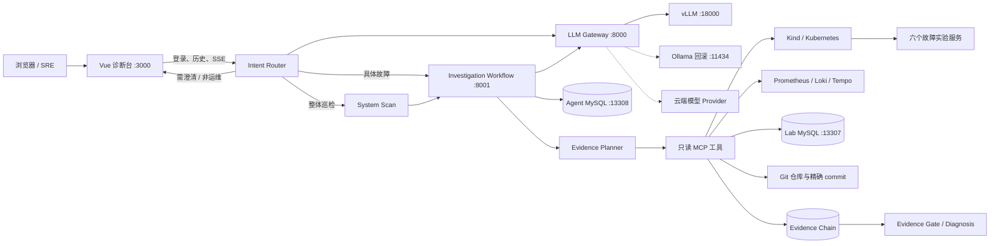
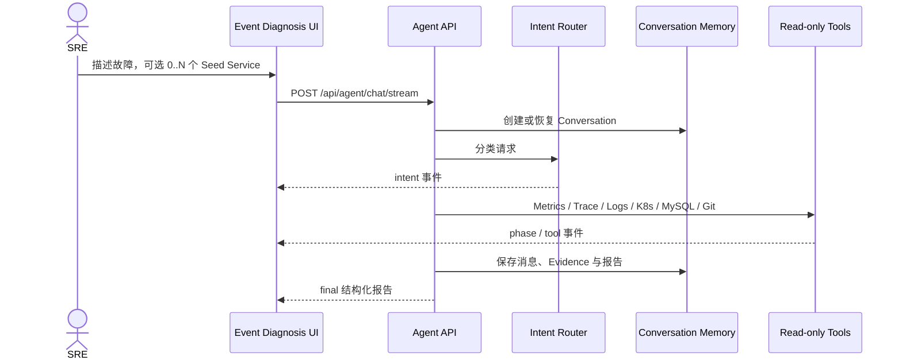
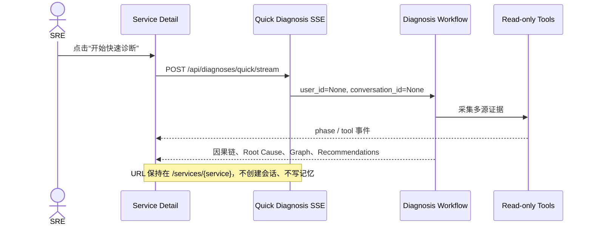

# SRE Agent Platform

面向本地故障实验的、证据驱动的 SRE 智能诊断平台。系统把多模型网关、只读诊断 Agent、可观测性工具、会话记忆、代码导航 State 和一套可重复注入故障的多语言微服务实验环境组合在一起，让一次诊断从“现象描述”走到“证据、因果链、根因与修复建议”。前端采用黑白极简的 Observability Console 风格，以“服务浏览 + 服务诊断”为核心，不把整个产品简化成传统聊天机器人。

> 当前定位是本地开发、教学与评测平台。Agent 只执行读取和分析，不自动修改集群、数据库或业务仓库。

## 目录

- [核心能力](#核心能力)
- [系统架构](#系统架构)
- [两种诊断模式](#两种诊断模式)
- [前端页面与领域模型](#前端页面与领域模型)
- [意图识别与工作流分流](#意图识别与工作流分流)
- [仓库结构](#仓库结构)
- [本地端口](#本地端口)
- [快速开始](#快速开始)
- [详细配置](#详细配置)
- [API 使用说明](#api-使用说明)
- [MySQL 数据与模块化 SQL](#mysql-数据与模块化-sql)
- [故障场景](#故障场景)
- [会话记忆与代码导航](#会话记忆与代码导航)
- [安全边界](#安全边界)
- [测试与验收](#测试与验收)
- [常见问题](#常见问题)

## 核心能力

- 八阶段诊断工作流，通过 SSE 实时展示调查进度、工具调用摘要和最终报告。
- Service Catalog 只承担服务浏览；服务详情可就地执行一次性快速诊断，不跳转聊天页、不写入会话记忆。
- Event Diagnosis 保留完整聊天机器人能力，支持创建新对话、历史查询、不选服务、单选服务或多选服务。
- 前置 Intent Router 使用 Structured Output 将请求限定为具体故障、整体巡检、需要澄清或非运维问题；合法意图确认前不调用任何诊断工具。
- 统一 LLM Gateway，默认使用 vLLM，并支持 Ollama 回滚、OpenAI、Claude 和 DeepSeek，业务 Agent 不依赖厂商 SDK。
- Prometheus、Loki、Tempo、MySQL、Kubernetes 和 Git 多源证据交叉验证。
- MySQL 持久化会话；上下文达到约 80% 预算后生成短 Summary、State、Evidence Reference，再让旧消息退出 Active Context，原始消息永久保留。
- Code State 只保存模块、symbol、路径、行号和 commit SHA 等导航信息；源码始终按 Git 版本精确读取。
- 10 个可重复的真实故障场景，覆盖慢 SQL、连接池耗尽、依赖超时、CPU、OOM、重试风暴和发布异常。
- 所有诊断工具默认只读，并在用户、会话、仓库、数据库表和 Kubernetes 权限层面限制访问范围。

## 系统架构



一次诊断遵循：确定范围 → 建立通用基线 → Planner 根据当前 Evidence 选择下一步 → 保存父子 Evidence Chain → Evidence Gate 校验引用与直接证据 → 输出报告。Workflow 不包含固定服务、SQL、Trace ID 或 Case 答案；证据不足时明确返回 `insufficient_evidence`。

## 两种诊断模式

平台明确区分“持续事件分析”和“服务页快速诊断”。两种模式复用同一套只读 Evidence Workflow，但生命周期、持久化行为和 UI 完全不同。

| 对比项 | 事件诊断 Event Diagnosis | 服务快速诊断 Quick Diagnosis |
| --- | --- | --- |
| 入口 | 左侧导航“事件诊断” | Service Detail 的“开始快速诊断” |
| 服务范围 | 可以不选、单选或多选 | 当前 Service 或 Pod 是唯一初始对象 |
| 诊断边界 | Seed 只是起点，可沿依赖证据动态扩展 | 初始对象只是起点，同样允许扩展 |
| 对话形式 | 保留用户与 Agent 多轮消息 | 不显示聊天框，只显示诊断结果 |
| 会话历史 | 保存到 `conversations` / `conversation_messages` | 不创建 Conversation |
| 记忆功能 | 启用 Conversation Memory | 禁用 |
| 上下文压缩 | 达到阈值后异步压缩 | 不启用 |
| Intent Router | 每轮请求均先识别意图 | 已由当前资源确定任务类型，不走聊天意图交互 |
| 输出 | 普通回复、进度、工具摘要和结构化报告 | 进度、完整因果链、根因、置信度、图和建议 |
| 典型用途 | 复杂 Incident、多轮追问、跨服务持续调查 | 值班人员从服务页快速查看当前异常链 |

### 事件诊断的数据流



`selected_services` 只是调查起点集合，不是硬性权限边界。例如用户选择 `order-service` 和 `payment-service` 后，证据仍可以继续扩展到 `payment-db`、Pod 或其他依赖资源。真正的权限边界由服务端 `ToolPolicy`、Service Catalog、Kubernetes Namespace 和仓库白名单控制。

### 服务快速诊断的数据流



## 前端页面与领域模型

### 1. 服务目录 `/services`

服务目录仅展示运行态势，不再包含大段“从服务开始定位问题”介绍区或问题输入框。页面包含：

- All / Healthy / Warning / Critical 数量筛选；
- 服务名、简介、综合健康状态；
- P95 Latency、Error Rate、CPU、Memory；
- 运行数据更新时间；
- 服务名、Owner 或职责关键词搜索。

综合状态不是单一 `problem` 字段，而是服务当前多个 Finding 中最高 Severity 的聚合结果。没有活动异常时为 `Healthy`，存在 Warning Finding 时为 `Warning`，存在 Critical Finding 时为 `Critical`。

### 2. 服务详情 `/services/{service}`

服务详情包含 Metrics、Pod、最近部署、上下游依赖和 Service Graph。“开始快速诊断”会在当前页面插入只读结果区，展示：

- Stateless Quick Diagnosis 标识；
- 当前进度和正在执行的公开阶段；
- Suspected Root Cause 与 Confidence；
- 从症状到根因的完整因果链；
- Affected Services 与 Root Cause Service；
- Service Dependency Graph；
- 已执行的工具与 Evidence 摘要；
- Recommendations。

快速诊断区域没有聊天输入、创建新对话、历史对话、记忆或上下文压缩入口。

### 3. 事件诊断 `/diagnosis`

事件诊断是独立的多轮工作区：

- “创建新对话”显式创建一个空 Conversation；
- 左侧历史列表从 MySQL 查询当前用户最近的会话；
- 服务选择器允许 0、1 或多个 Service；
- 空选择表示由 Agent 根据问题和全局观测数据识别起点；
- 聊天消息显示意图、公开阶段、工具摘要和结构化报告；
- Tool Call / Tool Result 不被渲染成空白 AI 气泡；
- 每次续问复用同一个 `conversation_id`，因此可以引用前文结论。

### 4. Service、Finding、Incident 和 Root Cause

平台的数据关系不是 `Service -> single problem`，而是：

```text
Service
├── Findings[]                 # 一个服务可以同时存在多个异常现象
└── Incidents[]                # 一个服务可以被多个 Incident 影响

Incident
├── involved_services[]        # 一个事件可以跨多个服务
├── findings[]                 # 多个 Finding 可聚合为同一事件
├── evidence[]                 # Metrics / Logs / Trace / K8s / DB / Git
├── suspected_root_cause
├── root_cause_service
├── confidence
└── recommendations[]
```

例如，`payment-db` 连接池耗尽可能同时产生 `payment-service P95 升高`、`Error Rate 升高`、`健康检查失败` 和 `Pod Restart`。这些是四个 Finding，但可以被聚合为同一个 Incident，而不是四个互不相关的故障。

## 意图识别与工作流分流

所有聊天请求先经过只使用 LLM 的 Intent Router。分类结果必须通过 Structured Output 和 Pydantic Schema 校验；在分类成功以前，系统不会调用 Kubernetes、Prometheus、Loki、Tempo、MySQL 或 Git 工具。

```json
{
  "intent": "SPECIFIC_INCIDENT",
  "target": "order-service",
  "symptom": "high_latency"
}
```

| Intent | 条件 | 后端行为 |
| --- | --- | --- |
| `SPECIFIC_INCIDENT` | 已提供具体服务和故障现象 | 进入 Investigation Workflow |
| `GENERAL_DIAGNOSIS` | 请求系统整体巡检 | 先执行全局 System Scan，再进入分析与调查 |
| `NEED_CLARIFICATION` | 服务、现象或范围不足 | 要求用户补充信息，不调用工具 |
| `OUT_OF_SCOPE` | 非运维或非故障排查问题 | 返回能力边界提示，不调用工具 |

JSON 格式错误先进行有限 Repair；字段或类型错误会携带安全的 Schema 错误让模型重试 2～3 次；仍失败则使用预设模板回填。模板依然无效时安全降级为 `NEED_CLARIFICATION`，不会让不可信分类进入工具 Runtime。

## 仓库结构

| 目录 | 作用 | 文档 |
| --- | --- | --- |
| `sre-agent-backend/sre-agent` | FastAPI Agent、工作流、MCP、会话记忆和 Code State | [Agent README](sre-agent-backend/sre-agent/README.md) |
| `sre-agent-backend/sre-gateway` | 模型路由、Gateway Token、用量与审计日志 | [Gateway README](sre-agent-backend/sre-gateway/README.md) |
| `sre-agent-frontend` | Vue 3 诊断控制台 | [Frontend README](sre-agent-frontend/README.md) |
| `sre-broken-system` | 多语言故障实验工作区 | [Lab README](sre-broken-system/README.md) |
| `sre-broken-system/sre-lab-infra` | Kind、Kubernetes、可观测性和场景脚本 | [Infra README](sre-broken-system/sre-lab-infra/README.md) |

业务实验由 Java、Go、Python 和 TypeScript 六个服务构成；每个服务都有独立 README 和独立 Git 历史，用于对比运行版本和源码变更。

## 本地端口

| 组件 | 地址 |
| --- | --- |
| Web UI | `http://127.0.0.1:3000` |
| SRE Agent API | `http://127.0.0.1:8001` |
| LLM Gateway | `http://127.0.0.1:8000` |
| vLLM | `http://127.0.0.1:18000` |
| Ollama（迁移期回滚） | `http://127.0.0.1:11434` |
| 实验服务 | `18080`～`18083`；其余服务在集群内访问 |
| Prometheus / Loki / Tempo | `19090` / `13100` / `13200` |
| Lab MySQL / Agent MySQL | `13307` / `13308` |

## 快速开始

### 1. 环境要求

- Windows 10/11 + PowerShell 7
- Docker Desktop、`kubectl`、`kind`
- Git、Python 3.12+、Node.js 22+
- 支持 GPU 容器的 NVIDIA GPU/驱动，以及足够运行 Kind、六个服务、可观测性组件和本地模型的显存与内存

`kind` 也可放在 `sre-broken-system/tools/kind.exe`。

```powershell
git clone https://github.com/taxidriver4ever/SRE-Agent-platform.git
Set-Location SRE-Agent-platform
```

六个 Broken Service 与 Infra 已作为主仓库普通目录交付，不再依赖缺失 remote 的 Gitlink，因此普通 `git clone` 即可取得启动 Demo 所需源码。

### 2. 配置后端环境变量

后端基础设施统一由 `sre-agent-backend/compose.yml` 编排。MySQL 数据固定保存到 `sre-agent-backend/data/mysql`，不会在 Agent 或 Gateway 项目目录中生成 SQLite 或数据库数据文件。

Agent 的真实用户名、密码和数据库密码只写在 `sre-agent-backend/sre-agent/.env`。项目不会生成包含真实凭据的 `.env.example`。至少需要配置：

```dotenv
GATEWAY_BASE_URL=http://127.0.0.1:8000
GATEWAY_API_KEY=
GATEWAY_MODEL=vllm/qwen3-4b
GATEWAY_TIMEOUT_SECONDS=180
GATEWAY_MAX_TOKENS=512

SRE_INITIAL_USERNAME=请设置登录用户名
SRE_INITIAL_PASSWORD=请设置高强度登录密码

APPLICATION_MYSQL_HOST=127.0.0.1
APPLICATION_MYSQL_PORT=13308
APPLICATION_MYSQL_USER=sre_agent
APPLICATION_MYSQL_PASSWORD=请设置数据库密码
APPLICATION_MYSQL_DATABASE=sre_agent
APPLICATION_MYSQL_TEST_DATABASE=sre_agent_test
GATEWAY_MYSQL_TEST_DATABASE=sre_gateway_test
APPLICATION_MYSQL_ROOT_PASSWORD=请设置Root密码
```

Gateway 使用独立 `.env`，但连接同一个 MySQL 实例：

```powershell
Set-Location sre-agent-backend\sre-gateway
Copy-Item .env.example .env
```

然后填写 `GATEWAY_MYSQL_PASSWORD`，它必须与 Agent `.env` 的 `APPLICATION_MYSQL_PASSWORD` 一致。vLLM 的 `VLLM_API_KEY` 也必须与 Compose 启动时使用的值一致。

### 3. 启动 Agent MySQL

```powershell
Set-Location D:\SRE-Agent-platform\sre-agent-backend
docker compose -f compose.yml up -d mysql
docker compose -f compose.yml ps
```

首次启动时，MySQL 容器会创建 Agent、Gateway 和测试数据库。Agent 与 Gateway 启动时还会分别执行各业务模块自己的 `sql/schema.sql`，因此不需要手动复制一份集中式大 SQL。

检查 MySQL：

```powershell
docker exec sre-agent-mysql mysqladmin ping -h 127.0.0.1 `
  -uroot -p"你的 APPLICATION_MYSQL_ROOT_PASSWORD"
```

### 4. 启动推理后端

#### 方案 A：vLLM（默认）

```powershell
Set-Location D:\SRE-Agent-platform\sre-agent-backend
$env:VLLM_API_KEY = "请替换为随机本地密钥"
$env:VLLM_MODEL = "Qwen/Qwen3-4B-AWQ"
$env:VLLM_SERVED_MODEL_NAME = "qwen3-4b"
docker compose -f compose.yml up -d vllm
Invoke-RestMethod http://127.0.0.1:18000/health
```

vLLM 需要 Docker Desktop 能够把 NVIDIA GPU 暴露给容器。第一次启动需要下载模型，健康检查在模型加载完成前可能持续显示 `starting`。

#### 方案 B：Ollama（回滚或无 vLLM 环境）

```powershell
Set-Location D:\SRE-Agent-platform\sre-agent-backend
$env:OLLAMA_MODEL = "qwen3:4b"
docker compose -f compose.yml up -d ollama ollama-model-init
Invoke-RestMethod http://127.0.0.1:11434/api/tags
```

随后将 Agent `.env` 中的模型改为：

```dotenv
GATEWAY_MODEL=ollama/qwen3:4b
```

模型不是写死在 Gateway 中的。Gateway 根据每次请求 JSON 的 `model` 字段选择 Provider；本地 Provider 必须带 `vllm/` 或 `ollama/` 前缀。

### 5. 启动 Gateway 并创建调用 Token

```powershell
Set-Location D:\SRE-Agent-platform\sre-agent-backend\sre-gateway
python -m venv .venv
.\.venv\Scripts\python.exe -m pip install -r requirements.txt
.\.venv\Scripts\python.exe -m uvicorn app.main:app --host 127.0.0.1 --port 8000
```

另开 PowerShell 创建 Gateway Token：

```powershell
$gatewayToken = Invoke-RestMethod `
  -Method Post `
  -Uri http://127.0.0.1:8000/v1/auth/tokens

$gatewayToken.token
```

明文 `gw_sk_...` 只在创建响应中返回一次。将其写入 Agent `.env`：

```dotenv
GATEWAY_API_KEY=gw_sk_请替换为刚生成的Token
```

验证 Token：

```powershell
Invoke-RestMethod http://127.0.0.1:8000/v1/auth/check `
  -Headers @{ Authorization = "Bearer $($gatewayToken.token)" }
```

### 6. 部署故障实验集群

```powershell
Set-Location D:\SRE-Agent-platform\sre-broken-system\sre-lab-infra
.\scripts\start-lab.ps1
```

脚本会创建 `sre-lab` Kind 集群、构建 GOOD/BAD 镜像、初始化数据，并部署可观测性栈与六个业务服务。

### 7. 启动 Agent

```powershell
Set-Location D:\SRE-Agent-platform\sre-agent-backend\sre-agent
python -m venv .venv
.\.venv\Scripts\python.exe -m pip install -r requirements.txt
.\.venv\Scripts\python.exe -m uvicorn app.main:app --host 127.0.0.1 --port 8001
```

若 PyCharm 报 `ModuleNotFoundError: No module named 'fastapi'`，说明运行配置选错了解释器。请将 Project Interpreter 设置为：

```text
D:\SRE-Agent-platform\sre-agent-backend\sre-agent\.venv\Scripts\python.exe
```

并使用以下任一运行方式：

- Module name：`uvicorn`，Parameters：`app.main:app --host 127.0.0.1 --port 8001`；
- Script path：`sre-agent-backend/sre-agent/app/main.py`；
- Working directory：`D:\SRE-Agent-platform\sre-agent-backend\sre-agent`。

检查健康状态：

```powershell
Invoke-RestMethod http://127.0.0.1:8001/health
```

### 8. 启动前端

```powershell
Set-Location D:\SRE-Agent-platform\sre-agent-frontend
Copy-Item .env.example .env.local
npm install
npm run dev
```

打开 `http://127.0.0.1:3000`，使用 Agent `.env` 中的 `SRE_INITIAL_USERNAME` 和 `SRE_INITIAL_PASSWORD` 登录。

启动后建议按以下顺序验收：

1. 服务目录能加载 Service Card；
2. 进入 `order-service` 后 Metrics、依赖图和部署信息可显示；
3. 点击“开始快速诊断”后 URL 不离开 Service Detail；
4. 页面出现“无对话 · 无记忆”和因果链；
5. 进入“事件诊断”，能够创建新对话；
6. 可选择两个服务，也可点击“不选择服务”；
7. 发送问题后能收到 `intent`、`phase`、`tool` 和 `final` SSE 事件；
8. 刷新后历史对话仍能从 MySQL 恢复。

## 详细配置

### Agent 关键环境变量

| 变量 | 默认值/示例 | 说明 |
| --- | --- | --- |
| `GATEWAY_BASE_URL` | `http://127.0.0.1:8000` | Gateway 根地址 |
| `GATEWAY_API_KEY` | `gw_sk_...` | Agent 调用 Gateway 的 Token |
| `GATEWAY_MODEL` | `vllm/qwen3-4b` | `provider/model` 路由名 |
| `GATEWAY_TIMEOUT_SECONDS` | `180` | 单次模型请求超时 |
| `GATEWAY_MAX_TOKENS` | `512` | 结构化诊断输出预算，服务端限制为 256～1200 |
| `AGENT_MAX_ITERATIONS` | `8` | 通用 ReAct API 最大轮数 |
| `KUBERNETES_NAMESPACE` | `sre-lab` | 允许读取的实验 Namespace |
| `PROMETHEUS_BASE_URL` | `http://127.0.0.1:19090` | Metrics 数据源 |
| `LOKI_BASE_URL` | `http://127.0.0.1:13100` | Logs 数据源 |
| `TEMPO_BASE_URL` | `http://127.0.0.1:13200` | Trace 数据源 |
| `MYSQL_HOST` / `MYSQL_PORT` | `127.0.0.1:13307` | 实验业务 MySQL，只读 |
| `APPLICATION_MYSQL_HOST` / `PORT` | `127.0.0.1:13308` | Agent 与 Gateway 的应用 MySQL |
| `SRE_INITIAL_USERNAME` | 无默认值 | 前端初始登录用户名，必填 |
| `SRE_INITIAL_PASSWORD` | 无默认值 | 前端初始登录密码，必填 |
| `AUTH_TOKEN_TTL_HOURS` | `24` | Agent 登录 Token 有效时间 |
| `SERVICE_CATALOG_PATH` | `.../service-catalog.yaml` | 后端可信服务目录 |
| `SRE_TOOL_POLICY_PATH` | `config/tool-policy.yaml` | 项目与工具权限白名单 |
| `MODEL_CONTEXT_WINDOW` | `32768` | 模型上下文窗口 |
| `CONTEXT_COMPACTION_RATIO` | `0.80` | 触发会话压缩的预算比例 |
| `CONTEXT_RESERVED_OUTPUT_TOKENS` | `4096` | 为下一次输出预留的 Token |
| `TOOL_TIMEOUT_SECONDS` | `15` | 单工具调用超时 |
| `TOOL_OUTPUT_LIMIT` | `12000` | 单工具结果最大字符数 |

### Gateway 模型路由

| 请求中的 `model` | Provider | 实际模型名 |
| --- | --- | --- |
| `vllm/qwen3-4b` | vLLM | `qwen3-4b` |
| `ollama/qwen3:4b` | Ollama | `qwen3:4b` |
| `openai/gpt-4o-mini` | OpenAI | `gpt-4o-mini` |
| `claude/claude-sonnet-4` | Claude | `claude-sonnet-4` |
| `deepseek/deepseek-chat` | DeepSeek | `deepseek-chat` |

无前缀模型默认路由到 OpenAI。本地模型必须使用显式前缀，避免未知模型被意外发送到本机 Provider。

### 前端环境变量

| 变量 | 默认值 | 说明 |
| --- | --- | --- |
| `VITE_AGENT_API_BASE_URL` | `http://127.0.0.1:8001` | 浏览器唯一允许访问的后端 |
| `VITE_UI_PREVIEW` | `false` | 仅用于无后端 UI 评审，正式运行必须为 `false` |

修改 `.env.local` 后必须重启 Vite。浏览器不应直接访问 Gateway、vLLM、Ollama、MySQL 或 Kubernetes。

## API 使用说明

### 鉴权约定

Agent API 除 `/health` 和 `/api/auth/login` 外均要求登录 Bearer Token。Gateway 使用独立的 `gw_sk_...` Token，两者不能混用。

```powershell
$agentEnv = Get-Content `
  D:\SRE-Agent-platform\sre-agent-backend\sre-agent\.env -Raw |
  ConvertFrom-StringData

$login = Invoke-RestMethod `
  -Method Post `
  -Uri http://127.0.0.1:8001/api/auth/login `
  -ContentType application/json `
  -Body (@{
    username = $agentEnv.SRE_INITIAL_USERNAME
    password = $agentEnv.SRE_INITIAL_PASSWORD
  } | ConvertTo-Json)

$agentHeaders = @{ Authorization = "Bearer $($login.access_token)" }
```

### Agent API 一览

| 方法 | 路径 | 用途 |
| --- | --- | --- |
| `POST` | `/api/auth/login` | 用户名密码登录 |
| `GET` | `/api/auth/me` | 校验并恢复当前用户 |
| `POST` | `/api/auth/logout` | 撤销当前登录 Token |
| `GET` | `/api/services` | 读取可信 Service Catalog 和运行快照 |
| `GET` | `/api/services/{name}` | 读取单个服务 |
| `GET` | `/api/services/{name}/pods` | 读取服务关联 Pod |
| `GET` | `/api/pods/{name}` | 读取 Pod 详情 |
| `GET` | `/api/conversations` | 当前用户会话摘要列表 |
| `POST` | `/api/conversations` | 显式创建新对话 |
| `GET` | `/api/conversations/{id}` | 读取完整可见历史 |
| `POST` | `/api/agent/chat` | 同步事件诊断 |
| `POST` | `/api/agent/chat/stream` | 事件诊断 SSE |
| `GET` | `/api/agent/evidence/{run_id}/{evidence_id}` | 权限内回读原始 Evidence |
| `POST` | `/api/diagnoses/quick/stream` | Service/Pod 无记忆快速诊断 SSE |
| `POST` | `/api/diagnoses` | 创建持久化 Diagnosis Session |
| `GET` | `/api/diagnoses` | Diagnosis Session 历史 |
| `GET` | `/api/diagnoses/{id}` | 完整 Diagnosis 聚合 |
| `GET` | `/api/diagnoses/{id}/steps` | 调查 Timeline |
| `GET` | `/api/diagnoses/{id}/evidence` | Evidence Store |
| `GET` | `/api/diagnoses/{id}/graph` | Incident Graph |
| `GET` | `/api/diagnoses/{id}/root-cause` | Root Cause、Confidence 与建议 |
| `GET` | `/api/diagnoses/{id}/events` | 可断线续传的持久化 SSE |
| `POST` | `/v1/agent/run` | 兼容的无状态 ReAct API |

### 事件诊断：不选择服务

```powershell
$body = @{
  message = "最近订单创建大量超时，请从全局观测数据中定位原因"
  conversation_id = $null
  project_id = "sre-lab"
  selected_services = @()
} | ConvertTo-Json

Invoke-RestMethod `
  -Method Post `
  -Uri http://127.0.0.1:8001/api/agent/chat `
  -Headers $agentHeaders `
  -ContentType application/json `
  -Body $body
```

### 事件诊断：多服务 Seed

```json
{
  "message": "检查订单超时和支付错误是否属于同一个 Incident",
  "conversation_id": null,
  "project_id": "sre-lab",
  "selected_services": ["order-service", "payment-service"]
}
```

`selected_services` 最多 20 个，服务名必须存在于后端 Service Catalog。重复值会去重。后续追问应回传第一轮 SSE `conversation` 事件中的 `conversation_id`。

### 快速诊断：Service

请求：

```json
{
  "question": "快速诊断 order-service 当前异常，并沿依赖链定位根因",
  "target": {
    "type": "SERVICE",
    "namespace": "sre-lab",
    "name": "order-service"
  },
  "project_id": "sre-lab"
}
```

端点：

```text
POST /api/diagnoses/quick/stream
Content-Type: application/json
Authorization: Bearer <Agent Login Token>
```

该接口不会返回 `conversation_id`，也不会创建 Conversation 或 Diagnosis Session。最终事件格式为：

```json
{
  "type": "final",
  "result": {
    "report": {
      "decision_summary": "...",
      "root_cause_chain": ["order-service latency", "payment timeout", "DB pool exhausted"],
      "confidence": 0.86
    },
    "graph": {
      "nodes": [],
      "edges": []
    },
    "root_cause": {
      "title": "...",
      "description": "...",
      "root_resource": {"type": "SERVICE", "name": "payment-service"},
      "confidence": 0.86,
      "recommendations": []
    },
    "affected_services": ["order-service", "payment-service"]
  }
}
```

### SSE 事件协议

| `type` / Event | 适用接口 | 说明 |
| --- | --- | --- |
| `conversation` | Chat SSE | 服务端确认的会话 ID |
| `intent` | Chat SSE | `intent`、`target`、`symptom` |
| `phase` | Chat / Quick | 公开工作流阶段 |
| `tool` | Chat / Quick | 工具名、参数、耗时、结果摘要或错误 |
| `message` | Chat | 澄清或超出范围的普通回复 |
| `final` | Chat / Quick | 最终结构化报告 |
| `error` | Chat / Quick | SSE 建立后的可读错误 |
| `diagnosis.*` | Session Events | 持久化 Diagnosis 生命周期事件 |
| `step.*` | Session Events | 调查步骤开始、成功或失败 |
| `graph.updated` | Session Events | 后端更新 Incident Graph |
| `root_cause.generated` | Session Events | 生成结构化根因 |

前端只展示公开阶段、工具输入摘要和外部可验证结果，不展示模型隐藏 Chain-of-Thought。

### Gateway API

| 方法 | 路径 | 鉴权 | 用途 |
| --- | --- | --- | --- |
| `POST` | `/v1/auth/tokens` | 无 | 创建 Gateway Token，明文只返回一次 |
| `GET` | `/v1/auth/check` | Gateway Bearer | 校验 Token |
| `POST` | `/v1/gateway/chat/completions` | Gateway Bearer | 非流式统一模型调用 |

Gateway 请求示例：

```json
{
  "model": "vllm/qwen3-4b",
  "messages": [
    {"role": "system", "content": "Return valid JSON."},
    {"role": "user", "content": "Classify this SRE incident."}
  ],
  "temperature": 0.1,
  "max_tokens": 512,
  "stream": false
}
```

当前 Gateway 只支持非流式调用，`stream: true` 会被请求 Schema 拒绝。Agent 对浏览器提供的 SSE 是 Agent 自己对工作流事件的流式封装，不代表 Gateway 在流式生成模型 Token。

## MySQL 数据与模块化 SQL

项目已完全移除应用 SQLite。应用数据保存在 Docker MySQL 8.4 中，宿主机目录为：

```text
D:\SRE-Agent-platform\sre-agent-backend\data\mysql
```

不要把这个目录移动到 `sre-agent` 或 `sre-gateway` 模块中，也不要提交到 Git。删除该目录会丢失登录 Token、历史对话、Diagnosis Session、Evidence、State 和 Gateway 日志；需要清空环境时应先停止 MySQL，并确认不需要这些数据。

建表语句按业务模块归属，全部放在对应模块的 `sql/` 文件夹中，并包含字段级和表级 `COMMENT`：

| 模块 | SQL 文件 | 主要数据表 |
| --- | --- | --- |
| Agent Auth | `sre-agent/app/auth/sql/schema.sql` | `users`、`auth_tokens` |
| Conversation | `sre-agent/app/conversation/sql/schema.sql` | `conversations`、`conversation_messages` |
| Conversation Memory | `sre-agent/app/conversation_memory/sql/schema.sql` | `conversation_compactions`、`conversation_memory_items` |
| Diagnosis | `sre-agent/app/diagnosis/sql/schema.sql` | Session、Step、Evidence、Graph、Root Cause、Events |
| Code State | `sre-agent/app/code_state/sql/schema.sql` | `code_state_repositories`、`code_state_components` |
| Tool Audit | `sre-agent/app/audit/sql/schema.sql` | `tool_audit_logs` |
| Gateway Auth | `sre-gateway/app/auth/sql/schema.sql` | `gateway_tokens` |
| Gateway Usage | `sre-gateway/app/gateway/sql/schema.sql` | `gateway_usage_logs` |
| Gateway Operation Log | `sre-gateway/app/operation_log/sql/schema.sql` | `gateway_operation_logs` |

Core Database 层只提供连接、事务和 SQL 文件执行能力，不包含任何业务表 DDL。新增模块若需要持久化，应在该模块下建立 `sql/schema.sql`，并由模块自己的 `schema.py` 初始化。

### Diagnosis 状态机

```text
PENDING
├── INVESTIGATING
│   ├── COMPLETED
│   ├── FAILED
│   └── CANCELLED
├── FAILED
└── CANCELLED
```

单个 Tool 失败只会生成一个 `FAILED` Investigation Step，Orchestrator 会继续尝试其他证据源；只有无法继续完成整个诊断时，Session 才进入 `FAILED`。

## 故障场景

```powershell
Set-Location sre-broken-system\sre-lab-infra
.\scripts\run-scenario.ps1 -Scenario SRE-001
.\scripts\reset-lab.ps1
```

| ID | 场景 | 主要服务 |
| --- | --- | --- |
| SRE-001 | 真实慢 SQL 与全表扫描 | order-service |
| SRE-002 | 数据库连接池耗尽 | order-service |
| SRE-003 | 下游依赖超时 | inventory-service |
| SRE-004 | CPU 饱和 | user-service |
| SRE-005 | 内存泄漏与 OOMKilled | payment-service |
| SRE-006 | 无退避重试风暴 | inventory / recommendation |
| SRE-007 | 全量发布性能回归 | order-service |
| SRE-008 | 单 Pod 性能劣化 | order-service |
| SRE-009 | GOOD/BAD 混合版本 | order-service |
| SRE-010 | 错误存活探针与重启 | order-service |

场景机制、预期证据和建议问题见 [场景手册](sre-broken-system/sre-lab-infra/docs/SCENARIOS.md)，完整操作见 [Runbook](sre-broken-system/sre-lab-infra/docs/RUNBOOK.md)。

## 会话记忆与代码导航

正常阶段会保留 Recent History、Tool Calls 和 Tool Results。达到模型上下文预算约 80% 时，系统生成短 Conversation Summary、Context State、Evidence 与 Reference，校验和落库成功后才让旧上下文退出 Active Context。原始消息继续保存在 Conversation Store，可按当前用户和会话权限回查。

代码场景不复制源码到 Evidence Store。首次识别仓库时只建立 Code State 导航；后续先检索相关模块和 symbol，再由 Git 工具读取对应 commit 的少量代码。新 commit 通过 `git diff old..new` 增量更新受影响组件。

## 安全边界

- 浏览器只持有 Agent 登录 Token，不接触 Gateway、模型厂商或 Kubernetes 凭证。
- 每个请求携带白名单 `project_id`；服务端按 `project → namespace → repository → allowed_paths → enabled_tools` 授权，模型不能选择其他项目、namespace 或任意路径。
- Kubernetes MCP 以只读、单集群和受限工具集运行，独立 ServiceAccount/Role 仅允许 `get/list/watch/logs`；数据库工具只允许白名单 SELECT/EXPLAIN。
- Conversation Memory 和 Code State 查询使用固定表与固定 SQL，模型不能传入任意表名或 SQL。
- Git 工具仅允许白名单仓库内的 read、search 和 diff；路径 `resolve()` 后必须仍位于项目 allowed paths，阻止 `../` 和软链接越界。
- 所有 Tool 使用逐工具最小 Schema，额外参数直接拒绝；当前不存在任意 Shell、代码执行、文件写入或集群写入 Tool。
- 每个 Task 创建一次性 Workspace；未来 CodeExecuteTool 固定在 `network none`、CPU/内存/PID 限制、drop capabilities、只读根文件系统和硬超时的 Docker Sandbox 中运行。
- 每次工具调用写入 MySQL Audit Log，包含 user/project/task、脱敏参数、状态、耗时和时间，便于追溯。

## 测试与验收

### 单元与集成测试

Agent 与 Gateway 测试依赖 `sre-agent-backend/compose.yml` 中的 MySQL。运行测试前确认 `sre-agent-mysql` 已启动且 `13308` 端口可用：

```powershell
# 基础设施
Set-Location D:\SRE-Agent-platform\sre-agent-backend
docker compose -f compose.yml up -d mysql

# Agent
Set-Location .\sre-agent
.\.venv\Scripts\python.exe -B -m pytest -q -p no:cacheprovider

# Gateway
Set-Location ..\sre-gateway
.\.venv\Scripts\python.exe -B -m pytest -q -p no:cacheprovider

# Frontend
Set-Location ..\..\sre-agent-frontend
npm run build
```

如果只验证不需要 MySQL 的领域逻辑，可跳过项目级 `conftest.py`：

```powershell
Set-Location D:\SRE-Agent-platform\sre-agent-backend\sre-agent
.\.venv\Scripts\python.exe -B -m pytest --noconftest `
  tests\test_intent.py `
  tests\test_diagnosis_domain.py `
  -q -p no:cacheprovider
```

### 前端人工验收

| 场景 | 操作 | 预期结果 |
| --- | --- | --- |
| 服务目录纯浏览 | 打开 `/#/services` | 不出现问题诊断输入框 |
| 状态筛选 | 点击 Healthy / Warning / Critical | 卡片列表按状态过滤 |
| 快速诊断不跳转 | 服务详情点击“开始快速诊断” | URL 仍为 `/services/{name}` |
| 快速诊断无记忆 | 查看快速诊断标题 | 显示“无对话 · 无记忆” |
| 因果链 | 等待 Quick SSE 完成 | 显示 Root Cause Chain、Confidence 和 Graph |
| 无服务聊天 | 事件诊断点击“不选择服务”并发送问题 | Agent 通过 Intent/System Scan 识别范围 |
| 单服务聊天 | 只选择一个 Service | 该服务作为 Seed，不限制后续扩展 |
| 多服务聊天 | 选择两个或更多 Service | 请求携带去重后的 `selected_services[]` |
| 会话记忆 | 同一会话继续追问“刚才的根因证据是什么” | 后端使用相同 `conversation_id` |
| 历史恢复 | 刷新并点击历史对话 | 从 MySQL 恢复用户与助手消息 |

### 端到端评测

端到端评测可在 Agent 目录运行：

```powershell
# 单项调试
python evals/run_evals.py --case SRE-001
# 固定全量 SRE-001～SRE-010，并写入 evals/results/latest.json
python evals/run_evals.py
```

Runner 只把 Case 的 `symptom` 发送给 Agent；Expected Answer、Required Evidence 与 Forbidden Shortcuts 只存在于 Evaluator。报告保留所有失败 Case，并统计 Service Accuracy、Root Cause Accuracy、Evidence Completion、平均 Tool Calls、平均耗时和平均 Token Usage。README 只展示成功完成的真实全量结果，不填造 100% 数据。

## 常见问题

### 1. PyCharm 启动时报 `No module named 'fastapi'`

原因是 PyCharm 使用了全局 Python，而依赖安装在模块虚拟环境。将解释器切换到对应模块的 `.venv\Scripts\python.exe`，并确认 Working Directory 是模块根目录。不要在 Gateway 目录使用 Agent 的 `.venv`，也不要反过来混用。

### 2. Agent 启动时报缺少 `SRE_INITIAL_PASSWORD` 或数据库密码

这些变量故意没有源码默认值。请填写 `sre-agent-backend/sre-agent/.env`，不要把用户名和密码写进 Python、Compose 或提交到 Git。修改 `.env` 后需要重启 Agent。

### 3. 测试报 `Can't connect to MySQL server on 127.0.0.1:13308`

先启动 Docker Desktop，再运行：

```powershell
Set-Location D:\SRE-Agent-platform\sre-agent-backend
docker compose -f compose.yml up -d mysql
docker compose -f compose.yml ps
```

若容器反复退出，检查 Agent `.env` 中 `APPLICATION_MYSQL_ROOT_PASSWORD`、`APPLICATION_MYSQL_USER` 和 `APPLICATION_MYSQL_PASSWORD` 是否为空。

### 4. Gateway 返回 `401 Unauthorized`

Agent 的 `GATEWAY_API_KEY` 不是登录 Token，也不是 `VLLM_API_KEY`。重新调用 `POST /v1/auth/tokens` 创建 `gw_sk_...`，写入 Agent `.env` 后重启 Agent。

### 5. Gateway 返回 `502` 或 `503`

- `503` 通常表示 Provider Key 或 Provider 配置缺失；
- `502` 通常表示 vLLM、Ollama 或云端 Provider 请求失败；
- 检查 `GATEWAY_MODEL` 是否带正确前缀；
- 检查 vLLM `/health` 或 Ollama `/api/tags`；
- 首次加载本地模型时适当等待，不要立即反复重启容器。

### 6. vLLM 容器无法启动

确认 NVIDIA 驱动、Docker Desktop GPU 支持和可用显存。显存不足时可降低 `VLLM_MAX_MODEL_LEN`、`VLLM_GPU_MEMORY_UTILIZATION`，或选择更小/量化模型。没有可用 GPU 时先使用 Ollama 回滚路径，或配置云端 Provider。

### 7. 前端无法连接 Agent

确认：

1. `http://127.0.0.1:8001/health` 可访问；
2. `.env.local` 中 `VITE_AGENT_API_BASE_URL` 正确；
3. 修改 `.env.local` 后已重启 `npm run dev`；
4. 浏览器 Network 中登录请求没有被 CORS 或防火墙拦截；
5. 正式模式下 `VITE_UI_PREVIEW=false`。

### 8. 服务卡片有数据，但 Pod、Metrics 或 Trace 为空

Service Catalog 描述的是可信服务拓扑，Pod 和可观测数据来自实际运行环境。检查 Kind 集群、端口转发、Prometheus/Loki/Tempo 以及 `sre-lab` Namespace。数据源为空时 Workflow 会记录 Evidence 缺失，并尝试其他来源，而不是伪造结果。

### 9. 事件诊断一直要求补充信息

Intent Router 判断问题缺少服务、现象或时间范围。可以补充“哪个服务”“发生了什么”“什么时候开始”“延迟、错误率或重启是否变化”，也可以选择一个或多个 Service 作为 Seed。

### 10. 点击服务快速诊断却没有历史记录

这是预期行为。Quick Diagnosis 是无状态、无 Conversation、无 Memory 的快速查看模式。需要保留历史或继续追问时，请使用左侧“事件诊断”。

### 11. 如何安全清理 MySQL 数据

先停止 MySQL，确认历史对话和日志不再需要，再删除 `sre-agent-backend/data/mysql`。该操作不可恢复；正常升级、重启或重建 Python 虚拟环境都不需要删除数据目录。

## 更多文档

- [系统架构](sre-broken-system/sre-lab-infra/docs/ARCHITECTURE.md)
- [运行手册](sre-broken-system/sre-lab-infra/docs/RUNBOOK.md)
- [诊断工作流](sre-broken-system/sre-lab-infra/docs/WORKFLOWS.md)
- [MCP 工具说明](sre-broken-system/sre-lab-infra/docs/MCP_TOOLS.md)
- [评测方法](sre-broken-system/sre-lab-infra/docs/EVALUATION.md)

## License

本项目使用仓库根目录 [LICENSE](LICENSE) 中声明的许可证。
