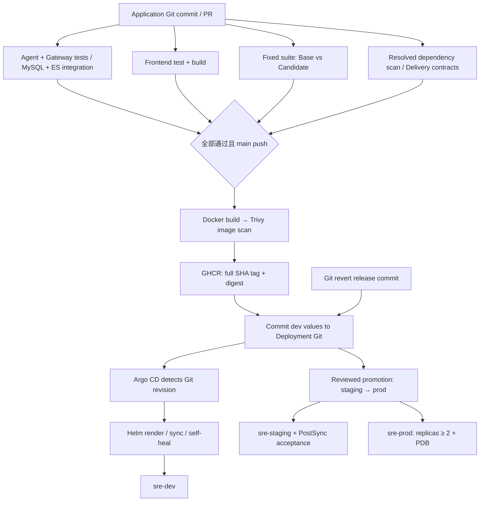

# CI / GitOps 渐进式改造

## 现状分析与保留边界

改造前，`ci.yml` 在 GitHub-hosted Runner 执行 Agent/Gateway pytest 与前端测试构建；
`cd.yml` 接收成功的 main CI，构建三个 GHCR 镜像，再通过 self-hosted Runner 调用
`deploy-local-k8s.sh`，依次 apply、set image、检查 rollout，失败时 rollout undo。
`deploy/k8s` 固定 namespace=sre，只有 readiness/liveness，镜像使用 SHA 占位符。

保留三个 Dockerfile、非 root 镜像、端口、REST/SSE、业务功能、MySQL 可靠性机制、
现有 ValidationComparator/JUnit 标准化器、只读诊断 RBAC、Compose 和独立故障实验栈。
实验栈中的 MySQL、可观测性、good/bad 镜像与故障注入不是平台生产发布状态，仍由
原 Lab 脚本管理。当前改造不把模型、数据库或故障注入迁入应用 Chart。

先实现 Helm，再解耦 CI、增加可导出的 GitOps 仓库与 Argo Application，最后补齐
环境隔离、扫描、验收和回滚验证。没有引入额外消息队列或调度平台。

## 两个仓库与唯一部署状态

```text
Application Repository (当前仓库)
├── sre-agent-backend/{sre-agent,sre-gateway}/
├── sre-agent-frontend/
├── .github/{workflows/ci.yml,CODEOWNERS}
├── scripts/ci/{agent_regression,update_gitops,validate_delivery}.py
├── scripts/export_gitops.py
└── deploy/gitops-template/     仅初始化模板，不是实际环境状态

Deployment Repository (导出后独立 Git 仓库)
├── charts/sre-platform/
│   ├── Chart.yaml
│   ├── values.yaml
│   ├── values.schema.json
│   └── templates/{workloads,rbac,nginx,ingress,smoke}.yaml
├── environments/{dev,staging,prod}/values.yaml
├── argocd/{project,dev-application,staging-application,prod-application}.yaml
├── scripts/{bootstrap-kind.sh,promote.py}
└── .github/workflows/validate.yml
```

应用仓库只保存可移植初始化模板和修改 Git 的工具。Argo CD 的 repoURL 必须指向
独立 Deployment Repository，不能指向本仓库模板。导出后该仓库的 values 是唯一
环境状态；不要反复导出覆盖它。Chart 后续升级通过该仓库的普通评审提交合入。
为避免复制三套相同逻辑，`workloads.yaml` 遍历三个组件生成 Deployment/Service/
ConfigMap/PDB/HPA，仍允许各组件独立覆盖参数。



## 新 CI：PR 与 main 的区别

PR 只有读权限，运行 Agent 单元/组件测试、独立 MySQL/ES 集成、Gateway 测试、
前端 Vitest/build、Agent Base/Candidate 回归、Helm/交付契约和 Trivy 依赖扫描。
不会构建发布镜像、写部署仓库或访问集群。未使用 pull_request_target。

main push 必须通过上述所有 Job，然后三个镜像分别 build/load、容器运行时检查、Trivy 扫描、push。
Trivy 对 CRITICAL（包括尚未修复项）返回非零并阻断后续；不会用 continue-on-error
掩盖漏洞。依赖扫描对两个后端安装后的 freeze 清单和前端 package-lock 扫描，
避免仅扫描无确定版本的范围声明。镜像扫描覆盖实际构建制品的 OS/library 包。

镜像 Tag 是完整 40 位 SHA，不发布 latest。重跑同一 SHA 时复用既有镜像并重新扫描，
不覆盖 Tag；OCI revision 必须匹配被测试 SHA。推送后记录 digest 到同次 Workflow
Artifact，部署引用 `repository:SHA@sha256:...`，兼顾可读性和真实不可变性。
有一个组件失败就不更新 GitOps（可能已推送的其他组件只是未发布制品）。

GitOps Job 只修改 `environments/dev/values.yaml`，校验三份 digest 的来源 SHA，
生成 `chore(deploy): update platform images to <SHA>` 提交。串行写入，检查 main
最新 SHA，非快进失败后重新读取部署仓库重试，禁止 force-push。该新鲜度检查减少
旧流水线覆盖新版本；GitHub 并发组不提供严格队列顺序，不能据此承诺零延迟发布。

### 必需 GitHub 配置

| 配置 | 用途 |
| --- | --- |
| Variable `GITOPS_REPOSITORY` | 独立仓库 `owner/name`，没有隐含的真实仓库默认值 |
| Variable `GITOPS_BRANCH` | 默认 main；必须与 Argo targetRevision 一致 |
| Secret `GITOPS_TOKEN` | 只授予部署仓库 Contents read/write 的 fine-grained PAT；可换成 GitHub App 短期令牌 |
| 内置 `GITHUB_TOKEN` | 镜像 Job 的 packages:write；其他 Job 仅 contents:read |

没有 KUBECONFIG、Kubernetes Token 或 Argo admin 密钥进入 Actions。
在两个仓库启用 main 保护、Required checks；对 CI、回归套件、Chart 启用 Code Owner
review，避免通过修改门禁自身来绕过门禁。本仓库 CODEOWNERS 只是声明，分支保护需
在 GitHub 实际启用。部署仓库 prod/staging 变更建议通过 PR；机器人仅写 dev 文件，
但 PAT 的 Contents 权限并非文件级权限，进一步隔离需仓库规则/独立 promotion 分支。

## Agent Regression 的真实接入

PR Base 是 `pull_request.base.sha`，Candidate 是被 CI 检出的 PR merge commit；
main Base 是该次 push 的 before SHA，Candidate 是当前 SHA。无有效 Base 时阻断，
不能伪造“通过”。执行器复制同一份固定测试到仓库外的运行目录，分别用两版 app 模块
运行，记录套件 hash、相同解释器/依赖 fingerprint、JUnit 和日志。

当前固定套件复用 7 个 Planner/Synthesis 规则契约，并补充 2 个 Evidence Gate 契约。
复用 `ValidationComparator` 分类 NEW_REGRESSION、POSSIBLE_FIX、UNCHANGED_PASS。
新回归、执行异常、超时、空报告、用例集合变化或跳过用例均阻断。既有失败由比较器
标为 EXISTING_FAILURE，普通完整 pytest 仍负责当前版本的绝对通过门槛。

这是无真实模型/集群依赖的确定性 Agent 规则回归，不冒充十个故障场景的完整评测。
Live `evals/run_evals.py` 保留供 staging/授权 Lab 执行。不同依赖声明目前使用 Candidate
解析出的同一环境比较，是个人项目简化；后续可锁定工具链镜像并分别评估依赖升级。

## Helm、Secrets、环境与部署健康

所有组件支持 repository/tag/digest、replicaCount、resources、config/env、Service
类型/端口、三种 Probe、RollingUpdate、终止宽限期。支持可选 Ingress/TLS、HPA/PDB、
ServiceAccount 与命名空间内只读 Role。跨环境 Role 名包含部署 Namespace，避免相互覆盖。
非 Agent Pod 不自动挂载 SA Token；容器只读根文件系统，空卷通过 fsGroup 获得写权限。
Nginx ConfigMap 根据 Agent Service 端口渲染，保留 REST/SSE 代理行为。

dev 默认一个副本；staging 两个副本并开启 PostSync；prod 至少两个副本、PDB 和资源限制。
三个 Namespace 分别 sre-dev/staging/prod；Agent/Gateway 使用分别命名的数据库，History
使用不同索引。示例仍共享 Lab 只读观测端点，不能称为完整租户/网络隔离。
业务 project_id 保留现有前端和 Service Catalog 的 `sre-lab` 契约；环境隔离由不同数据库、
索引和 Namespace 实现，不擅自改成前端尚不支持的新 project_id。

ConfigMap 仅放非敏感配置，禁止明显凭据名写入 config 或 env.value。Secret 不由 Chart
生成；通过 existingSecret/env.valueFrom 引用，由本地操作者预置。不能把模式检查当作
通用 DLP。具体 Secret 键、数据库准备与 token 初始化见部署仓库 README。

RollingUpdate 使用 maxUnavailable=0/maxSurge=1。startup 允许慢启动，readiness 控制
流量，liveness 负责进程重启；复用现有 /health 和 /healthz。它们目前是 lifespan/进程
健康，不是所有外部依赖健康；ES History 降级不能导致核心诊断被判不健康。

staging PostSync 检查三服务 HTTP、前端代理登录/读取诊断列表的真实数据库链路，
以及已部署 Agent 的证据不足门槛。失败保留 Job 供排查，不自动把失败记为成功。
这不是浏览器自动化或十个故障注入场景的替代品。

## Kind 上从零接入及发布演练

1. 保留现有 Kind、模型和数据库。新机器可运行 `bash scripts/setup-local-k8s.sh`。
2. 创建空的私有或公共 Deployment Repository，记录 `owner/name`。应用仓库执行：

   ```bash
   python -m pip install PyYAML==6.0.2
   python scripts/export_gitops.py --destination ../sre-agent-deploy --repository OWNER/sre-agent-deploy --sha FULL_40_CHAR_PUBLISHED_SHA --registry ghcr.io/owner
   ```

   导出只创建本地 Git 仓库和 origin，不创建 GitHub 仓库、不推送。SHA 应对应已存在制品，
   首次启动可先配置远端/Secrets 后合并 CI，让 CI 发布镜像；不要提前注册空制品 Application。
   `export` 拒绝覆盖已存在目录。

3. 在独立仓库审核非敏感地址、数据库用户、values 和 repoURL；按其 README 预置六个
   数据库、每环境 Secrets、Gateway token、可选 GHCR pull Secret 和 Argo 私库读凭据。
   旧数据不会自动拷贝或删除。Windows Docker Desktop Kind 可通过 host.docker.internal
   连接宿主 MySQL；Linux Kind 必须改成集群可达的实际地址，不能假设该域名存在。
4. 提交并推送部署仓库初始内容；在应用仓库配置上述 GITOPS_REPOSITORY/GITOPS_TOKEN。
5. 独立仓库运行 `bash scripts/bootstrap-kind.sh`，安装固定版本 Argo CD 并建立 Namespace/
   AppProject。脚本仅允许 Kind context，不从应用 CI 调用。依赖齐备后注册 dev Application。
6. 提交应用改动经 PR 合并 main，观察 CI/tests/scan → GHCR → dev values commit →
   Argo Synced/Healthy → Pod Ready。无需 CI 执行集群命令。
7. 在部署仓库运行 `python scripts/promote.py --from-env dev --to-env staging`，审核提交后
   push/PR；确认 staging PostSync 通过，再 staging → prod。promote 只复制相同 SHA/digest，
   不重建镜像、不复制数据库/环境配置。初始导出无 digest 时会拒绝 promotion，先等 CI 发布。

## 回滚、追踪与边界验证

部署仓库执行 `git revert <release-commit>`、push，Argo CD 同步上一组 values。
通过 Application `status.sync.revision` 找到 GitOps commit，再由 values 中的 SHA/digest
找到源 commit、CI run 和镜像。Pod annotation/env/OCI revision 保存源 SHA；Pod imageID
保存实际内容标识，Deployment 的 revision history 可用于排查滚动发布。

自动同步不等于自动回滚；Argo revision rollback 需要先禁用自动同步，并把 Git 状态
一起修正，否则 self-heal 会重施新版本。Git revert 不逆转数据库迁移或已执行的业务写入。
PDB 只约束自愿驱逐；单节点 Kind 的多副本不等同于高可用。

验证 CI 边界与 Chart：

```bash
python -m pytest scripts/ci/tests -q
python scripts/ci/validate_delivery.py
actionlint .github/workflows/ci.yml deploy/gitops-template/.github/workflows/validate.yml
```

边界检查解析工作流，禁止集群 CLI、self-hosted、KUBECONFIG 和特权 PR 触发；检查当前
直接调用的仓库脚本。它不是任意代码静态分析器，第三方 Action 应固定、评审和限制权限。
Helm 检查真实渲染三环境、Probe、RBAC、PDB、镜像 SHA，以及 mutable Tag/明文密码拒绝路径。

## 文件清单及修改原因

| 类型 | 文件 | 原因 |
| --- | --- | --- |
| 修改 | `.github/workflows/ci.yml` | 将集成、回归、扫描、不可变发布和 GitOps 更新串成门禁，移除集群依赖 |
| 修改 | `.dockerignore` | 排除本地扫描工具、缓存、运行目录和 GitOps checkout，避免进入构建上下文 |
| 修改 | 两个后端 `Dockerfile`、`sre-agent-frontend/Dockerfile` | 修复实际镜像扫描发现的 CRITICAL：Python 3.12 / Node 22 切换到 Trixie，Nginx 更新至 1.30.5；运行时基础镜像固定 digest；修正 Agent 容器源码目录层级 |
| 新增 | `.github/CODEOWNERS` | 指定 CI/回归/模板变更的审核归属 |
| 删除 | `.github/workflows/cd.yml` | 去除 self-hosted 集群部署路径 |
| 修改 | `scripts/deploy-local-k8s.sh` | fail-closed 的废弃提示，防止继续命令式发布 |
| 修改 | `scripts/setup-local-k8s.sh` | 只准备 Kind，不再应用平台业务 YAML |
| 新增 | `scripts/export_gitops.py` | 安全导出独立仓库，拒绝覆盖现有状态 |
| 新增 | `scripts/ci/update_gitops.py` | 校验 SHA/digest，只修改一个环境的三个镜像 |
| 新增 | `scripts/ci/agent_regression.py`、`test_agent_gate.py` | 同套件实际运行两版本，复用现有比较器和证据门槛 |
| 新增 | `scripts/ci/validate_delivery.py`、`tests/*.py` | CI 边界、Helm 渲染、失败门禁、幂等更新测试 |
| 新增 | `deploy/gitops-template/charts/sre-platform/Chart.yaml`、`values.yaml`、`values.schema.json` | Chart 元数据、参数和不可变镜像校验 |
| 新增 | `templates/workloads.yaml`、`rbac.yaml` | 三组件 Deployment/Service/ConfigMap/PDB/HPA 与只读权限 |
| 新增 | `templates/nginx.yaml`、`ingress.yaml`、`smoke.yaml` | 可配置代理、Ingress 和 staging PostSync |
| 新增 | `environments/{dev,staging,prod}/values.yaml` | 副本、数据库、索引、PDB 与验收隔离模板 |
| 新增 | `argocd/project.yaml`、三个 `*-application.yaml` | 限定源仓库和允许资源，三环境自动同步 |
| 新增 | 部署模板 `scripts/bootstrap-kind.sh`、`promote.py` | 操作者引导与相同制品晋级 |
| 新增 | 部署模板 `.github/workflows/validate.yml`、`.gitignore`、`README.md` | 独立仓库自校验、排除私密文件、运维步骤 |
| 删除 | `deploy/k8s/{agent,gateway,frontend}-{deployment,service}.yaml`、`configmap.yaml`、`namespace.yaml`、`rbac.yaml`、`secret.example.yaml` | 由 Helm/Secret 引用取代，避免两套应用 Desired State |
| 修改 | `README.md` | 移除旧直连发布和 rollout undo 操作指导 |
| 修改 | `docs/history-search-architecture.md`、`observability-migration.md` | 标明旧部署配置已迁移，保留历史验证记录 |
| 新增 | 本文 | 汇总架构、发布回滚、验证、未接通事项和企业化扩展 |

表中 templates/environments/argocd 相对 `deploy/gitops-template/`。本次没有修改业务 API、
数据库可靠性实现或故障实验服务。Dockerfile 升级受影响基础镜像并固定摘要，Agent
WORKDIR 调整为 `/opt/sre-agent-platform/sre-agent-backend/sre-agent`，保持配置模块依赖的
源码目录层级，修复原 `/app` 布局导致 `parents[4]` 在启动时越界的问题。
Python 3.12、Node 22 主版本与业务启动命令不变；CI 新增镜像内配置/依赖导入、Node/Git
执行和 Nginx 配置检查，在发布之前拦截此类打包错误。

## 本地验证记录（2026-09-26）

* 交付脚本测试：15 项通过，覆盖回归/修复分类、缺失/重复用例阻断、GitOps 更新幂等、
  非法参数拒绝、promotion 保留环境配置、导出拒绝覆盖已有目录。
  另建干净 Python 3.12 环境，按 CI 的 requirements-dev 重新安装依赖后，同样 15 项通过
  （3.15 秒）；本机 pip 缓存权限问题通过改用项目内缓存解决。
* Helm 3.17.3：三环境 lint/实际 render 成功，dev 13、staging 14、prod 16 个资源；
  HPA/Ingress 与自定义 Agent Service 端口通过；空 Tag/latest/明文凭据均被拒绝。
* Kubernetes 服务端 dry-run：三套应用资源均通过。为避免创建 Namespace，验证时将应用
  Namespace 临时渲染成已有 default；跨命名空间只读 Role 在已有 sre-lab。没有 apply 实际资源。
* actionlint 1.7.12：应用 CI 与独立部署仓库验证 Workflow 通过；Bash 引导脚本语法通过。
* Agent 固定套件：冻结当前 HEAD 的 app 作为 Base，与工作树 Candidate 实际运行，9 项
  UNCHANGED_PASS。临时副本故意破坏 Evidence Gate 时产生 NEW_REGRESSION、退出 1；
  反向对比产生 POSSIBLE_FIX、退出 0。合成突变仅用于验证门禁，没有写回业务代码。
* 独立本地 Git 仓库：导出、变更三镜像、提交、git revert 演练成功，dev values 字节级恢复。
  这是本地合成发布演练，没有向示例 origin 推送，也没有安装 Argo CD。
* 前端当前测试 7 项通过，Vite build 成功。
* Trivy 0.69.3 实际下载漏洞库，扫描本地 Agent 环境的 freeze 与前端 package-lock（含开发
  依赖），CRITICAL 为 0；CI 会重新解析两后端依赖，并对实际发布镜像重新扫描。
* 实际 Docker 构建和扫描发现旧 Nginx Alpine 镜像含 2 个 CRITICAL 包记录
  （libcrypto3/libssl3，CVE-2026-31789），旧 Gateway Bookworm 镜像含 5 个
  CRITICAL 包记录（SQLite/Perl/zlib）。未忽略未修复漏洞，也未降低扫描门禁；改用已扫描的
  Trixie Python 基础镜像和 Nginx 1.30.5 Alpine，并固定多平台 manifest digest。
  修复后的前端、Gateway、Agent 完整镜像扫描均为 0 CRITICAL，退出码均为 0。
  Agent 目录修正后已重新构建并扫描最终制品。扫描结果反映本次漏洞库快照，不代表未来不会
  新增漏洞；本地使用 `gitops-verify` 测试标签，没有冒充已发布的 Git SHA 制品。
* 新前端镜像在 UID 101、只读根文件系统、移除 capabilities 下通过 nginx -t、healthz、
  静态页面、SPA fallback、/api 与 /v1 代理、SSE payload 验证。使用 Helm 渲染的 Nginx
  配置，临时上游与测试容器已清理。SSE 测试验证响应内容，不代替长时间断线重连测试。
* 使用独立临时 MySQL 8.4、三个最终镜像和 staging 渲染配置完成联合启动检查；后端以
  UID 10001 运行，三个组件均使用只读根文件系统、移除 capabilities。复用渲染后的
  PostSync Python 脚本，验证三个健康端点、前端登录、MySQL 认证、诊断列表和 Evidence
  Gate。Docker 网络仅替换前端 Service 80 → 容器 8080 的端口映射；本次关闭 History
  后台同步和 SkyWalking 上报，不声称已验证外部可观测性与模型链路。
  Agent Node v22.23.3、npm 10.9.9、Git 2.47.3 执行成功。测试容器及临时网络已清理，
  没有接触原数据库或业务集群。CI 新增的容器运行时命令也已在三个镜像中实测通过。
* 未执行 GitHub 托管流水线、GHCR 发布、远程 GitOps push、Argo 实际同步、staging PostSync
  或生产 rollback；远程仓库地址、受限 Token、数据库和环境 Secret 需要配置后才能验收。
  原有后端完整 pytest 保留在 CI；本轮本地重点验证交付改动，没有把上一轮后端测试数字
  当成本轮全量结果。

## 2026-09-26 CI 失败修复

GitHub Run `36238638523`（应用提交 `8d64daa`）的 Agent 单元/组件测试为
222 passed、7 failed。7 项均来自未随 GitOps 迁移更新的 `tests/test_cicd_config.py`：
旧测试仍要求只有三个 CI Job、存在 `cd.yml` / `deploy/k8s`，并执行命令式部署回滚。
现已更新为 GitOps 契约：所有质量门禁成功且 main push 才能发布，CRITICAL 扫描先于
push，完整 SHA/digest 可追踪，仅更新 dev，Helm 保留探针/滚动更新/生产 PDB，凭据使用
外部 Secret，旧部署脚本保持 fail-closed。没有删除失败测试来绕过门禁。

两个 Workflow 均固定为 `ubuntu-24.04`，避免 `ubuntu-latest` 自动迁移到 Ubuntu 26。
Actions 使用官方核验版本并固定完整提交 SHA：checkout 7.0.1、setup-python 7.0.0、
setup-node 7.0.0、upload-artifact 7.0.1、download-artifact 8.0.1、setup-helm 5.0.1、
trivy-action 0.36.0、docker/login 4.6.0、setup-buildx 4.4.1、build-push 7.4.0。
已核对直接 JavaScript Action 的 Node 24 元数据及 Trivy 内部 cache/setup-trivy 依赖。
扫描 CLI 仍为 Trivy 0.69.3，应用 Python/Node 版本与业务逻辑不变。

本地验证已通过 Workflow actionlint、三环境 Helm lint/render、15 项交付脚本测试，
以及 Agent 全量 266 项测试（293.36 秒，包含独立 MySQL 8.4 / Elasticsearch 8.17.3
的真实集成测试）。10 个固定 Action 的官方元数据及所有传入参数均已核对。
Windows 默认 pytest 临时目录存在权限限制，本地验证使用项目内独立 `--basetemp`；
这一参数不改变 GitHub Linux Runner 配置。修复提交需要推送后才能确认新一轮远端 CI 结果。
参考：[失败运行](https://github.com/taxidriver4ever/SRE-Agent-platform/actions/runs/36238638523)、
[setup-python Node 24 说明](https://github.com/actions/setup-python)、
[Trivy Action 0.36.0](https://github.com/aquasecurity/trivy-action/releases/tag/v0.36.0)。

## 当前简化与未来升级

* Kind 三 Namespace 模拟环境；企业集群可独立集群/网络策略、Backing services、身份与资源配额。
* 当前 PAT + Kubernetes Secret；可升级 GitHub App 短期令牌、External Secrets/Vault、密钥轮转与审计。
* 当前标准 RollingUpdate；可按真实需求增加渐进式发布、SLO 验收，仍由 Git 控制期望状态。
* Python 依赖目前按范围安装，源 SHA 相同不保证首次构建字节相同；SHA 重用策略和 digest 保护
  已发布制品。运行时基础镜像已固定 digest；下一步锁定 Python 依赖及前端构建工具镜像、
  引入 SBOM/签名/证明与可复现工具链。
* CRITICAL 扫描可能阻断当前依赖或基础镜像，应升级具体受影响版本；不自动放宽门禁。
* 当前离线 9 契约 + staging API 验收；后续扩展录制 Evidence 回放、真实模型和浏览器 E2E、
  十场景评测，避免把环境故障错误归类为模型回归。
* Chart schema/渲染校验并不代替 Kubernetes API、实际 rollout 或灾备演练；分支保护和 Argo
  访问策略需要在远端配置后实测。未配置远端地址/凭据不能宣称交付闭环已在线运行。

## 参考依据

Helm 参数由 Argo CD 渲染、再由 Argo CD 管理资源，而非由应用 CI 执行 Helm upgrade，见
[Argo CD Helm 文档](https://argo-cd.readthedocs.io/en/latest/user-guide/helm/)。自动同步与回滚
限制见 [Automated Sync](https://argo-cd.readthedocs.io/en/stable/user-guide/auto_sync/)。
扫描门禁参数见 [Trivy Action](https://github.com/aquasecurity/trivy-action)。
## Lab 增量交付

六个故障服务已新增独立 Lab CI、Chart、dev values 与 `sre-lab-dev` Application。
平台路径和 Application 名称保持兼容；具体接入、不可变版本追踪及故障操作见
[Lab GitOps 交付说明](lab-gitops.md)。本文原有平台发布/推广流程继续有效。
