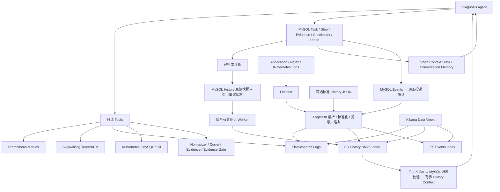

# History Search 与统一采集改造

> CI/CD 后续调整：文中旧 `deploy/k8s/configmap.yaml` 已迁移至 GitOps Helm values；当前部署入口见 [GitOps 交付说明](gitops-delivery.md)。

## 修改前分析和实施方案

当前 `conversation_memory/models.py` 定义 ShortContextState 和 MemoryItemDraft。会话原文在 MySQL `conversation_messages`，压缩快照在 `conversation_compactions`，会话内记忆在 `conversation_memory_items`。它们不是跨诊断案例库，保留现有读取、压缩边界和归属检查。

Diagnosis Task 是 `diagnosis_sessions`；Step、Evidence、事件、根因分别由 `app/diagnosis/repository.py` 保存。Checkpoint、Lease、Heartbeat、CAS 已有事务边界，完成事务同时写 `diagnosis.completed`。本次不改变这些边界。

保留：现有 MySQL Repository、Short Context、任务恢复、Evidence Gate、Prometheus 和 SkyWalking，只读 MCP 权限。已有 Redis 属于实验应用，不把任务状态迁入 Redis。

新增：`app/history` 模块，以完成任务的持久化结果生成 MySQL History 快照；快照中的索引状态作为轻量重试队列。后台定期补齐缺失快照，因此进程在任务提交后崩溃也不会永久漏同步。ES 只保存搜索投影，固定 ID 幂等 PUT；检索结果再次通过 MySQL 校验用户、项目和存在性。

修改：Workflow 在 TRIAGE 后获取一次有界历史参考，将它与 Short Context 和当前 Evidence 分开交给 Planner。历史参考使用统一 Evidence 外壳但 `supports_conclusion=false`，不进入当前事故的 Evidence Gate。ES 查询失败返回空历史并记录 warning。

采集：现有 Filebeat → Logstash → ES；增加日志/History/Event 三路归一化、脱敏与独立索引。Agent 生成的标准 History JSON 直接由后台写 ES，MySQL 事件按逐条持久确认投递 Logstash。自增 ID 不代表提交顺序，因此不使用会漏掉晚提交事件的单一高水位游标。无需新增消息队列或向量库。

删除：Filebeat 直写 ES 的活动配置；不删除任何原始 MySQL 数据或历史审计结果。

实现顺序：模型和 Mapping → MySQL 投影及 ES Adapter → Retrieval/Context → Logstash → Compose/K8s → 测试及报告。

## 当前架构

MySQL is the source of truth for diagnosis tasks and historical records.

Elasticsearch acts as a search index for logs and historical diagnosis cases.

History retrieval failures do not affect the core diagnosis workflow.



Redis 保留为实验应用已有组件；当前 Agent 的 Short Context 在 MySQL，不新增 Redis 状态副本。外部导入的 ES History 若没有对应的 MySQL History 原始记录，不会进入 Agent 上下文。

## 修改文件及原因

| 文件（相对于仓库根目录） | 原因 |
| --- | --- |
| `sre-agent-backend/sre-agent/app/history/models.py` | 有界 HistoryItem / HistoryQuery，时区和 Top-K 校验 |
| `app/history/sql/schema.sql`、`schema.py`（以下 app 路径均在 sre-agent 下） | 新增 MySQL History 原始快照、索引重试状态、事件逐条确认表 |
| `app/history/repository.py` | 从已有完成任务补齐快照、失败重试、重建、归属复核；不写任务状态 |
| `app/history/elasticsearch.py`、`mapping.json` | 独立 ES Adapter、固定查询/幂等 PUT、显式 Mapping、响应上限 |
| `app/history/service.py`、`sanitize.py` | 检索降级、有界 Context、历史 Evidence 外壳及搜索副本脱敏 |
| `app/history/worker.py` | 生命周期受控的轻量后台投递；无 Kafka/Celery |
| `app/main.py`、`app/core/config.py` | 复用 ApplicationDatabase 与 Settings，组装与关闭 Worker |
| `app/workflow/diagnosis.py`、`models.py`、`planning/planner.py` | TRIAGE 后获取历史，向 Planner 分别提供 Short Context、当前 Evidence 和 Relevant History |
| `scripts/sync_history.py` | 可控批数的补同步与 MySQL→ES 重建入口 |
| `tests/test_history_search.py`、`tests/mysql_support.py`、`tests/conftest.py` | 专用 MySQL 隔离、协议/可靠性/真实 ES 集成测试，普通测试关闭自动 Worker |
| `sre-broken-system/sre-lab-infra/observability/logstash/*` | 三路 Pipeline、字段白名单、脱敏、异常记录过滤、持久队列和模板 |
| `observability/filebeat-docker.yml`、`filebeat-kubernetes.yml` | 改投 Logstash；K8s 元数据提供无 JSON 日志的容器身份 |
| 原 `observability/normalize.js` | 删除，清洗职责集中至 Logstash Ruby Filter |
| 根 `compose.yaml`、`.env.example`、Agent `config/observability.env.example` | 增加 Logstash 和搜索相关环境配置，保留原服务 |
| Infra `k8s/observability/stack.yaml`、`scripts/deploy-lab.ps1`、`deploy/k8s/configmap.yaml` | Logstash Service/PVC/ConfigMap、Filebeat 只读元数据权限、Agent 连接配置 |
| 根/Agent README、Infra Architecture、本文件 | 同步职责、调用链、启动和维护方法 |

## History Retrieval 完整调用链

1. 原 Diagnosis 完成事务提交 MySQL 的 Task 和唯一 completed Event。
2. Worker 每 30 秒最多补齐 20 个缺少 History 的已完成任务。History 复用 task_id、user_id、project_id、问题、根因、Evidence 摘要和时间；snapshot 与 pending 状态同事务提交。conclusion_status 复用现有 Evidence Gate 从 Checkpoint 计算，不能直接采用 LLM synthesis 的初步 confirmed 标记；旧的不完整 Checkpoint 保守标为 insufficient_evidence。
3. Worker 用 `PUT /{configured-index}/_doc/{history_id}` 建索引。成功才标记 indexed；失败保留 pending、增加 retry_count、记录异常类型（不记录凭据或响应正文），指数退避最长 1 小时。
4. 新任务 TRIAGE 确定服务后，在 BASELINE 前检索一次。认证 user_id、项目来自服务端 Scope；默认最近 365 天、Top-5，范围可配置，排除当前 Task。
5. ES 固定 bool/filter：user_id、project_id、service；可选 category/tags/time；symptom/root_cause/summary 使用 multi_match 与 BM25，按相关性、时间排序。仅取前 K 个 ID，不扫描全索引。
6. MySQL 再次校验用户、项目、完成状态、服务、时间、分类和存在性，按 ES 顺序装配案例。删除原任务后，即使 ES 文档尚存也不会返回。
7. HistoryContextBuilder 默认最多 4000 字符、最多 10 条，按完整案例裁剪；不复制完整日志/Tool Result。历史 Evidence 标记 `supports_conclusion=false`，独立存入 `long_term_history`。
8. Planner 分别接收 short_context、当前 evidence、relevant_history 和当前问题；提示词禁止历史文本中的指令或历史 ID/SQL 直接驱动当前工具调用。最终 Evidence Gate 仍只接受当前任务证据。

Short Context 的压缩和持久化规则保留。新增字段有默认值，旧 Checkpoint 可以继续反序列化。ES/Logstash 不参与任务 CAS/Lease/Heartbeat/完成事务。

## Mapping 与索引隔离

History 默认 `sre-agent-history-v1`。`history_id/task_id/user_id/project_id/service/category/severity/tags/conclusion_status/evidence_ids` 使用 keyword；`symptom/root_cause/summary` 使用 text；`timestamp` 使用 date；`evidence_summary` 保留但不索引。`dynamic=strict`，单分片零副本适用于本地开发。权威定义为 `app/history/mapping.json`；Logstash 导入模板保持相同 Mapping。

日志继续用 `sre-logs-*`，事件用 `sre-agent-events-*`，三类数据分开。ES 本地开发无鉴权；生产配置应限定日志读取与专用 History 索引写权限，并为 Kibana 用户配置相应数据访问控制。自定义索引前缀时同步修改对应模板的 index_patterns。

## Logstash Pipeline

Beats 输入默认 5044；HTTP JSON 输入默认 8080。Compose 仅环回暴露为 15044、18090；K8s 使用 ClusterIP。Filebeat 处理 Docker/CRI 边界及 JSON 解码，Logstash 处理 service、时间、level/category、空 tags、字段白名单和常见凭据脱敏；标准 Nginx combined access log 可直接解析。无法识别服务、时间非法、History/Event 缺少必需标识、Ruby 处理失败时不入索引。

HTTP JSON 用 `record_type=history|event` 路由，未指定按 log 处理。History 和 Event 使用稳定 document_id。标准 Agent History 直接经后台 Adapter 写 ES；HTTP History 导入不代替 MySQL 原始记录。事件只导出标识、归属、类型、时间等元数据，不复制可能含敏感信息的原始事件负载。

Logstash 持久队列 256 MB、每次写入 checkpoint、死信队列 64 MB；Compose 使用数据卷，Kind 使用 PVC。HTTP 成功代表队列接受，不代表 ES 已可搜索。ES 中断时由 Logstash 重试输出；Mapping 错误可能进入 DLQ，需运维检查并修复后重放。

## 启动与配置

根目录根据 `.env.example` 配置后运行 `docker compose up -d --build`（已有镜像时可 `docker compose up -d`）。已有 Kind/MySQL 会占用默认端口，不同时启动两套业务栈。Kind 使用现有 `deploy-lab.ps1` 创建新 ConfigMap/PVC；本次只做清单 dry-run，不自动替换用户集群。

Agent 本机变量参考 `config/observability.env.example`：`ELASTICSEARCH_URL`、`ELASTICSEARCH_USERNAME/PASSWORD`、`ELASTICSEARCH_HISTORY_INDEX`、`ELASTICSEARCH_LOG_INDEX`、`LOGSTASH_URL`；History 的 enabled/timeout/top_k/lookback/context_chars/sync_interval/batch_size 同样通过 Settings 读取。Filebeat 使用 `LOGSTASH_HOST/LOGSTASH_PORT`。Compose 内地址使用服务名，本机调试分别用 ES `127.0.0.1:19200` 和 Logstash `127.0.0.1:18090`。

Kibana 中创建三个 Data View：`sre-logs-*`（@timestamp）、`sre-agent-history-*`（timestamp）、`sre-agent-events-*`（@timestamp）。可按 service、category、severity、task_id 聚合或检索；本次没有伪造已有 Dashboard。

## 重建和降级

在 `sre-agent-backend/sre-agent` 执行：

```powershell
.venv/Scripts/python.exe -m scripts.sync_history --rebuild --batches 100
```

该命令只重新排队 MySQL History 快照并补齐缺失完成任务，不删除源记录或 ES 索引。ES 索引丢失时自动重新建立 Mapping，用同一 history_id 重写。大量历史可增加 batches 或等待后台 Worker。已有 indexed 数据不会每轮全量重发；更换索引名或重建后应显式执行此命令。

检索超时、鉴权失败、返回部分结果、格式错误或连接失败时返回 `[]` 并记录 `History Retrieval skipped` warning；任务继续使用 Short Context 与当前 Evidence。同步失败不会回滚已经完成的任务。进程在提交/投递之间崩溃，未确认数据在重启后继续投递；重复写入只覆盖同一文档。

## 验证命令

```powershell
docker compose config --quiet
docker compose run --rm --no-deps logstash --config.test_and_exit -f /usr/share/logstash/pipeline/pipeline.conf
# 在 sre-agent-backend/sre-agent 下：
$env:HISTORY_TEST_ES_URL='http://127.0.0.1:19200'
.venv/Scripts/python.exe -m pytest -q -o cache_dir=../../.cache/pytest-history
```

真实 ES 测试只允许本机 URL，使用随机测试索引并在结束时清理，MySQL 使用独立 `_test` 库。未设置 HISTORY_TEST_ES_URL 时仅跳过真实 ES 集成测试，其余协议/降级测试仍运行。

## 本次验证结果（2026-09-26）

* Agent 全量回归：`265 passed in 335.48s`，开启真实 Elasticsearch 集成测试，未跳过该测试。覆盖原有任务恢复、状态机、MCP 权限和本次 History 检索/同步/降级。
* 最终补充的历史结论 Evidence Gate 修正后，重新运行 `test_history_search.py` 与 `test_evidence_workflow.py`：`42 passed in 46.94s`，含新增的未通过 Gate 不得标为 confirmed 的回归用例；此轮同样启用真实 ES。
* 真实 ES：MySQL 快照索引、BM25 相关案例、服务/分类过滤、固定 ID 幂等、删除索引后从 MySQL 重建均通过。时间及用户/项目过滤另由协议和 MySQL 复核测试覆盖。
* ES 不可用：连接关闭的本机端口，实际 MySQL Durable Diagnosis 仍完成并保存 Checkpoint，只记录 History Retrieval skipped。
* Logstash 8.17.3 配置验证成功，Ruby Filter 内嵌 4 项测试通过；真实 HTTP 投递分别产生 1 条日志、1 条 History、1 条 Event，非法时间记录被过滤，密码及 Authorization Bearer 被脱敏。
* 独立 Filebeat 容器读取合成日志，经 Logstash 写入 ES 验证通过；Nginx combined access log 解析和脱敏通过。
* `docker compose config --quiet`、Kubernetes 服务端 dry-run、14 个 YAML 文件重复键检查、修改的 Python AST 结构检查、`git diff --check` 均通过。
* 测试使用专用 MySQL `_test` 库和合成数据；真实 ES 集成测试创建随机索引并自行删除。未替换既有 Kind 工作负载，未声称完成生产部署或十个故障场景验收。

## 当前技术债务与边界

* 检索使用原生 BM25；没有 Embedding/向量库，跨语言同义词与中文分词可后续基于真实评测调整。
* 快照生成通过 MySQL anti-join 批量补齐，没有修改 Task 完成事务；大数据量下需监控扫描开销，再考虑事务 Outbox。周期同步存在可配置的可见延迟。
* 历史原文删除后 Agent 的 MySQL 复核立即生效，但 ES/Kibana 副本仍需维护者按数据保留策略清理；不将 ES 的归属过滤冒充 Kibana 的访问控制。
* 脱敏覆盖常见凭据键和 Bearer，不能保证识别所有业务敏感数据。Logstash 的 DLQ、数据保留和监控需按部署环境运维。
* 本次没有将旧会话压缩项转换成“已确认案例”；它们仍属于原有 Conversation Memory。新案例由已完成 Diagnosis 的真实持久化记录生成，未持久化的一次性预览不自动产生历史。
* 尚未迁移既有 Kind 工作负载、更新历史 good/bad 镜像或重跑十个故障场景。原有 SW8/W3C 跨语言传播边界保持不变。
