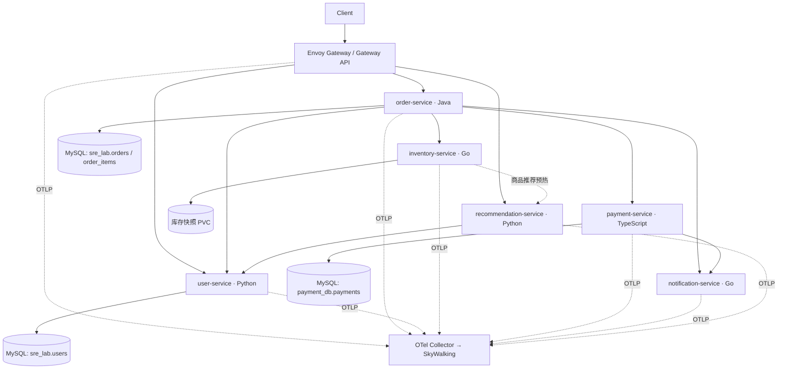

# SRE Lab Architecture

本轮保留六个服务的既有语言、目录、Service 名称和独立 GitOps 发布流程。Agent 平台仍使用原来的命名空间和数据模型。



Prometheus 抓取 `/metrics`（Java 使用 `/actuator/prometheus`），JSON 日志沿用 Filebeat → Logstash → Elasticsearch。
Python 和 Node 使用 OTel SDK；Java 沿用 OTel Java Agent；Go 使用有界异步 OTLP/HTTP 导出。
Envoy 的采样决策与请求 ID 格式分离，避免自定义非 UUID 请求 ID 导致断链。
请求传播 W3C `traceparent` / `tracestate` 与 `x-request-id`；Python 不再同时启动另一套原生 SkyWalking 追踪，避免断链和重复 span。

## 本地启动

```bash
docker compose up -d --build
# 入口 http://127.0.0.1:18080
# 可选观测栈
docker compose --profile observability up -d
# 同时运行 Agent 平台与观测栈
docker compose --profile platform --profile observability up -d --build
```

默认运行 MySQL、六个业务服务和 Envoy 数据面。Kubernetes 才运行 Envoy Gateway 控制器。
外部入口仅包含 `/api/orders`、`/api/users`、`/api/recommendations`，去掉 `/api` 后转发。
库存、支付、通知、metrics、health、debug 和 internal 故障管理端点都不在公开路由中。
本地开发密码仅用于合成 Lab 数据；Kubernetes 密码通过已有 Secret 注入。

已有 MySQL 卷不会自动重跑初始化目录。升级时保留原卷并执行新增 SQL：

```powershell
Get-Content sre-broken-system/sre-lab-infra/mysql/init/002-commerce.sql -Raw |
  docker compose exec -T lab-mysql sh -c 'mysql -uroot -p"$MYSQL_ROOT_PASSWORD"'
```

脚本只新建 `payment_db`、支付表和专用账户，不删除 `sre_lab` 中的旧实验数据。
Kubernetes 的 `deploy-lab.ps1 -InfrastructureOnly` 会依次应用两个幂等 SQL 文件。

## 业务契约与状态

```bash
curl -X POST http://127.0.0.1:18080/api/orders \
  -H 'Content-Type: application/json' -H 'X-Request-ID: example-order-1' \
  -d '{"userId":1,"customerEmail":"user1@example.com","items":[{"productId":1,"sku":"SKU-1","quantity":2,"unitPrice":12.25},{"productId":2,"sku":"SKU-2","quantity":1,"unitPrice":10}]}'
curl http://127.0.0.1:18080/api/recommendations/1
```

* 订单先读取 `/users/{id}/status`，仅 ACTIVE 用户可以下单。不存在、冻结、禁用、封禁均拒绝。
* 先保存订单号，再使用 `order-{id}-{sku}` 逐项预占库存；一个请求不允许重复 SKU，应合并数量。
* 支付使用 `order-{id}` 幂等键；MySQL 唯一约束同时约束订单号和支付键，跨进程重试不会重复扣款。
* 支付 AUTHORIZED → CAPTURED，库存 RESERVED → COMMITTED，订单最终 PAID。
* 预占失败尝试释放；无法确认补偿结果时保留 REVIEW_REQUIRED，不能把不确定状态误报为成功。
* 支付或库存确认超时保留 PAYMENT_PENDING；`POST /orders/{id}/reconcile` 使用同一个支付和库存键继续完成，不创建第二笔支付。
* `POST /orders` 本身不提供客户请求幂等；客户端遇到不确定响应应先查订单、再对已有订单核对，不能盲目重复创建。
* 通知失败记为次要依赖故障，已支付订单不回滚。通知记录和队列为单 Pod 内存数据，Pod 重启不保证投递，未引入消息中间件或持久化 outbox。
* 库存快照使用单写者、原子替换和磁盘同步。Helm 强制单副本 + Recreate + PVC；不能直接扩容成多副本内存库存。
* 库存保留 `/inventory/reservations` 和 DELETE 别名；新接口为 `/inventory/reserve`、`/inventory/release`、`/inventory/commit`，body 使用 `reservation_id`。
* 支付保留查询和退款接口；同键不同金额/订单返回 409，退款后的支付不能重新确认。
* 订单取消只允许未进入支付流程的 CREATED 状态；已支付订单不能仅修改一个数据库字段假装完成退款。

跨服务只通过 API 访问业务数据，订单不直接读取支付或用户表。旧共享库外键与种子表仍保留以兼容历史诊断，不新增跨服务 SQL 查询。

## 超时与重试预算

| 边界 | 连接超时 | 单次请求预算 |
|---|---:|---:|
| Gateway → 公开服务 | 200ms（Compose） | 5s |
| order → user | 200ms | 500ms |
| order → inventory | 200ms | 800ms |
| order → payment | 200ms | 2s |
| order → notification | 200ms | 500ms |
| recommendation → user | 200ms | 500ms |
| inventory → recommendation | 200ms | 500ms |
| payment → notification | 200ms | 500ms |
| payment → MySQL | 500ms | 排队最多 1s；普通 SQL 1s |

正常模式不盲目重试 POST。`retry_amplification`/旧 `retry_storm` 仅对有持久化幂等键的支付调用最多重试两次，间隔 50/100ms；4xx 不重试。
故障模式可故意突破正常总预算以产生 Gateway 超时；不把实验预算误当作生产建议。
多商品调用逐项有界，Gateway 仍有统一总截止时间；超时不代表下游一定未写入，因此保留可核对的订单状态。

## Kubernetes / Helm / GitOps

继续使用 `deploy/gitops-template/charts/sre-lab`，不另建重复 Chart。命名空间为 `sre-lab`，六个业务 Service 均为 ClusterIP。
首次准备控制器（独立基础设施操作）：

```bash
helm install eg oci://docker.io/envoyproxy/gateway-helm --version v1.9.1 -n envoy-gateway-system --create-namespace
```

Gateway API CRD 随官方 Chart 安装。Lab Chart 创建 GatewayClass、Gateway、HTTPRoute、EnvoyProxy 和本地限流策略；三条路径默认每个代理 50 req/s。
MySQL、OTel Collector、Prometheus、ELK 和 SkyWalking 继续由已有基础设施管理。Collector 的 4317 Service 端口声明 h2c。

Secret `sre-lab-database` 需要：`order-password`、`user-database-url`、新增 `payment-password`。
`payment-password` 必须与 `payment_app` 数据库账户一致；示例初始化值为 `payment_app_dev_only`，自行修改账户密码时同步更新 Secret。
先应用新增 SQL、补 Secret、安装控制器，再发布新版业务镜像并同步 Lab 应用。已有 Argo CD AppProject 需同步新增资源允许列表。
`releaseReady=false` 与完整 SHA + 扫描后 digest 门禁继续保留，不用本地临时镜像覆盖 GitOps desired state。

每个服务 liveness 只检查进程；Python 用户和支付 readiness 检查自身数据库。故障控制按 Pod 保存，Python 使用一个 worker，副本扩容仍由 Kubernetes 管理。

## Fault Scenarios

所有服务统一支持内部 `GET/POST /internal/faults` 和 `DELETE /internal/faults/{fault}`。
POST 示例：`{"fault":"high_latency","duration_seconds":120,"parameters":{"delay_ms":2000,"error_rate":0.3}}`。
TTL 为 1–300 秒，默认 120 秒，delay 上限 10000ms，error_rate 为 0–1。到期恢复 normal；已经开始的有界操作可能稍后完成。
旧 `/debug/fault` 接口保留，也使用默认 TTL。

Kubernetes 脚本逐个 Pod 注入，避免通过 Service 随机命中一个副本：

```powershell
./sre-broken-system/sre-lab-infra/scripts/set-runtime-fault.ps1 -Service payment-service -Mode connection_pool_exhaustion -DurationSeconds 120 -DelayMs 4000
./sre-broken-system/sre-lab-infra/scripts/set-runtime-fault.ps1 -Service payment-service -Mode normal
```

| 场景 | 注入方式 | 预期指标 / Trace | 根因 |
|---|---|---|---|
| Payment DB Pool Exhaustion | payment `connection_pool_exhaustion`，4s，并发请求 > 3 | db_pool_active=3、pending 增加；支付 DB span 与订单耗时增加，入口 504 | 支付数据库连接池被慢 SQL 占用 |
| Inventory High CPU | inventory `high_cpu`，1.5s | Go CPU 增加，reserve span 变长，订单超时 | 库存 CPU 密集计算 |
| Notification Partial Failure | notification `random_error`，error_rate=1 | 通知 5xx/ERROR 日志，支付和订单仍成功 | 非主交易依赖故障 |
| User Service Timeout | user `high_latency`，3s | 用户 span 长于 order 500ms 预算，订单 DEPENDENCY_TIMEOUT | 用户状态校验超时 |
| Retry Amplification | order `retry_amplification` + payment `high_latency`/`random_500` | 最多三个支付 client span，同一个支付键，重试计数最多 +2 | 支付故障被有界重试放大 |
| Gateway Timeout Misconfiguration | Gateway requestTimeout=1s，order 环境 ORDER_PROCESSING_DELAY_MS=1500，所有 faults=normal | Gateway 1s 504，内部订单随后完成约 1.5s；下游无异常 | 入口截止时间过短 |

第六场景通过专门的环境配置模拟固定业务耗时，不能用“下游故障”冒充 Gateway 配置错误。
Kubernetes 在实验 values 中修改 `gateway.requestTimeout: 1s` 和 `services.order-service.config.ORDER_PROCESSING_DELAY_MS: '1500'`；结束恢复 5s 和 0。

其它模式：payment slow_sql、cpu_high、memory_leak、promise_backlog、event_loop_blocking；inventory lock_contention、inventory_timeout、random_error、goroutine_leak；user cpu_saturation、event_loop_blocking、database_latency；notification queue_backlog、external_unstable、goroutine_leak、slow_downstream、timeout；recommendation cache_miss、large_scan、quadratic_ranking、cpu_high、slow_algorithm、user_dependency_timeout；order slow_sql、pool_exhaustion、single_pod_slow、thread_pool_saturation、downstream_timeout 等旧模式。
故障只在显式打开时生效；正常搜索使用索引，推荐正常使用分类索引，正常用户数据库调用在线程池执行。

## 验证

```bash
# 每个 Dockerfile 内运行对应语言单元 / HTTP 契约测试
# 完整场景：独立临时网络、数据库、库存卷、Collector，结束自动清理
python scripts/ci/lab_commerce_check.py --build
```

脚本验证真实双 SKU 下单、支付跨进程幂等、库存重启持久化、公开路由隔离、推荐调用用户、六个故障场景和 OTel span 父子关系；Trace 证据保存在 `.cache/sre-commerce-test-*/traces.json`。
普通 CI 继续按 changed paths 只构建被修改服务，`lab_runtime_check.py` 增加提供方接口契约检查。
完整多服务场景由独立 `Lab commerce scenarios` workflow_dispatch 显式触发，不使一次 payment 修改自动重建其余五个镜像。

### 本地验证记录（2026-09-28）

| 验证项 | 结果 |
|---|---|
| 六个服务 Docker 构建及镜像内测试 | 通过；Java 5 项、Payment 3 项、User/Recommendation 各 3 项，两个 Go 服务相关测试包通过 |
| CI 工具回归 | `python -m pytest scripts/ci/tests -q`：26 项通过 |
| Lab Helm | lint、六服务渲染、探针、内部 DNS、Secret 引用、镜像来源约束和可选 canary 校验通过 |
| Gateway API 资源 | 渲染出的 8 个资源通过 Envoy Gateway v1.9.1 官方 CRD schema 校验 |
| 隔离 Compose 端到端 | 双 SKU 下单、支付/库存重启持久化、幂等冲突、推荐依赖、公开路由隔离通过 |
| 分布式 Trace | 同一 Trace 中包含 Envoy 与订单、用户、库存、支付、通知，父子 span 引用连续 |
| 六种故障场景 | 全部通过；包含连接池 active=3/pending=1、最多两次重试、TTL 恢复，以及 Gateway 504 后内部订单仍 PAID |

验证使用一次性 Compose 项目和独立数据卷，结束自动清理。没有修改现有运行数据库、推送镜像或同步 Argo CD。
Kubernetes 控制器、真实集群流量及完整 ELK/SkyWalking UI 尚未做部署验收；上述 CRD 校验属于静态配置验证。
Python 测试目前有一条 FastAPI TestClient 对底层 httpx 的弃用提示，不影响测试通过。

参考：[Envoy Gateway tracing](https://gateway.envoyproxy.io/docs/tasks/observability/proxy-trace/)、[local rate limit](https://gateway.envoyproxy.io/docs/tasks/traffic/local-rate-limit/)。
