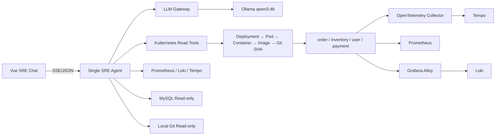

# Architecture

边界原则：Agent 不使用 Provider SDK，只依赖 GatewayClient；Tool 层硬限制读操作；运行源码必须先从 Deployment 注解取得 SHA；VERIFY 至少需要两个独立证据源。

数据路径：应用 Prometheus endpoint 被抓取；CRI 日志由 Alloy 送 Loki；Java 自动插桩和 Go 手工 OTLP 送 Collector/Tempo；MySQL 同时写 FILE 与 `mysql.slow_log` 表。
